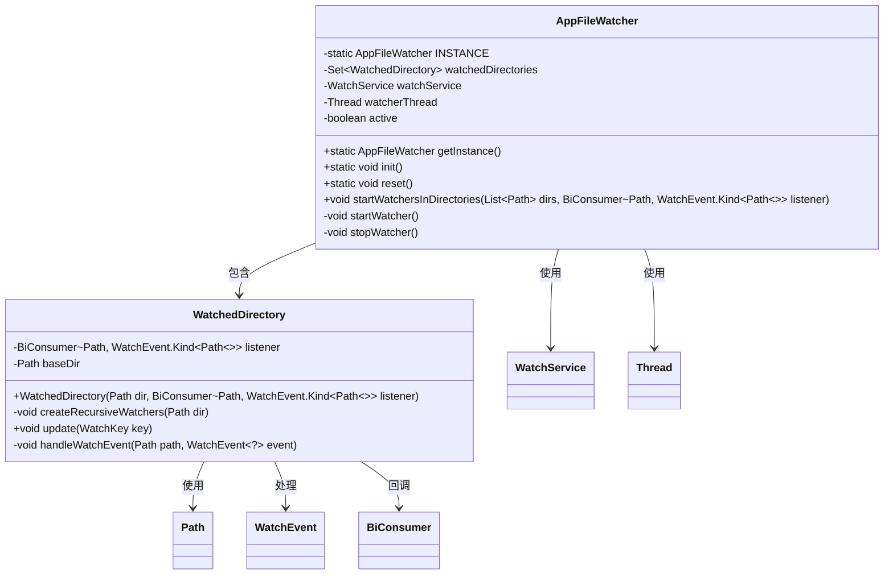
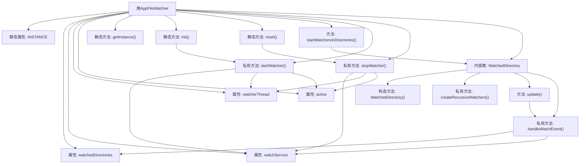

# 基础信息

|      |      |
|------|------|
| 名称 | AppFileWatcher |
| 编码语言 | .java |
| 代码路径 | xpipe/app/src/main/java/io/xpipe/app/core/AppFileWatcher.java |
| 包名 | io.xpipe.app.core |
| 依赖项 | ['io.xpipe.app.issue.ErrorEvent', 'io.xpipe.app.issue.TrackEvent', 'io.xpipe.app.util.ThreadHelper', 'lombok.Getter', 'java.io.IOException', 'java.nio.file', 'java.util.HashSet', 'java.util.List', 'java.util.Set', 'java.util.concurrent.CopyOnWriteArraySet', 'java.util.concurrent.TimeUnit', 'java.util.function.BiConsumer', 'java.nio.file.StandardWatchEventKinds'] |
| 概述说明 | 单例文件监视器，支持多目录递归监听文件增删改事件，异步处理异常。 |

# 说明

这是一个文件监视类AppFileWatcher的实现，采用单例模式管理。主要功能包括：初始化监视服务、启动/停止监视线程、管理被监视目录集合。核心组件包含WatchService监视服务、后台监视线程、线程安全目录集合。支持递归监视子目录，处理文件创建、修改、删除事件，并通过回调通知监听者。包含错误处理机制，确保线程稳定性。内部类WatchedDirectory封装单个目录的监视逻辑，处理事件转发和子目录自动注册。整个设计注重线程安全和异常处理，适合长期运行的文件监控场景。

# 类列表 Class Summary

| 名称   | 类型  | 说明 |
|-------|------|-------------|
| AppFileWatcher | class | 单例文件监视器，监控目录变化并触发回调。 |

## 类 AppFileWatcher

|      |      |
|------|------|
| 访问范围 | public |
| 类型 | class |
| 名称 | AppFileWatcher |
| 说明 | 单例文件监视器，监控目录变化并触发回调。 |

### UML类图

这段代码实现了一个单例模式的文件监控系统，核心类AppFileWatcher通过WatchService监控目录变化，内部类WatchedDirectory处理具体目录的递归监控和事件回调。主要功能包括：初始化监控服务、添加监控目录、处理文件创建/修改/删除事件，并通过BiConsumer回调通知监听者。采用线程安全设计，使用CopyOnWriteArraySet存储监控目录，支持优雅停止服务。

### 内部方法调用关系图

该流程图展示了AppFileWatcher类的完整结构和工作流程。这个单例模式的文件监视器类包含静态实例管理、目录监视服务启动/停止、以及内部WatchedDirectory类处理具体文件事件。核心流程包括：通过init()初始化实例并启动监视线程，使用startWatchersInDirectories()添加监视目录，内部线程持续轮询文件变化并触发回调，最后通过reset()清理资源。WatchedDirectory类负责递归注册子目录监视并处理文件创建/修改/删除事件，通过回调通知监听者。

### 字段列表 Field List

| 名称  | 类型  | 说明 |
|-------|-------|------|
| watchedDirectories = new CopyOnWriteArraySet<>() | Set<WatchedDirectory> | 私有线程安全集合，存储监控目录对象。 |
| watcherThread | Thread | 私有线程监视器线程 |
| INSTANCE | AppFileWatcher | 单例模式下的静态实例变量。 |
| active | boolean | 私有布尔变量active |
| watchService | WatchService | 私有监视服务变量watchService |

### 方法列表 Method List

| 名称  | 类型  | 说明 |
|-------|-------|------|
| stopWatcher | void | 停止文件监视服务，清空目录并关闭线程，处理异常。 |
| startWatchersInDirectories | void | 启动目录监视器，监听路径列表，回调处理事件。若服务未初始化则跳过。 |
| startWatcher | void | 启动文件监视服务，异常处理并更新目录状态。 |
| reset | void | 静态方法reset()停止监视器并置空实例。 |
| getInstance | AppFileWatcher | 静态方法返回单例实例。 |
| init | void | 初始化静态实例并启动文件监视器。 |

