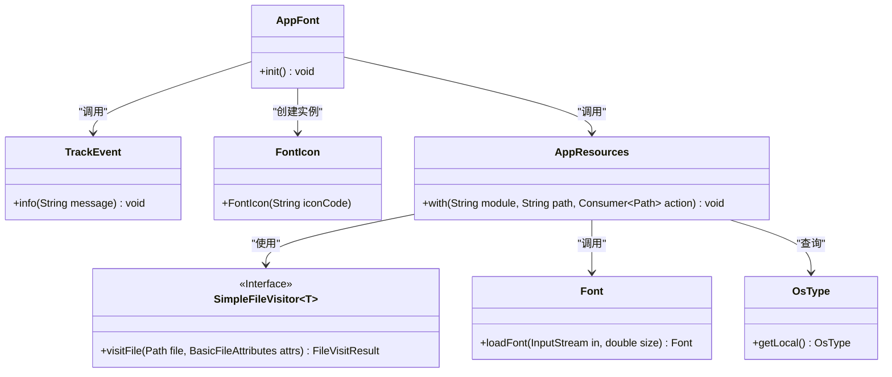
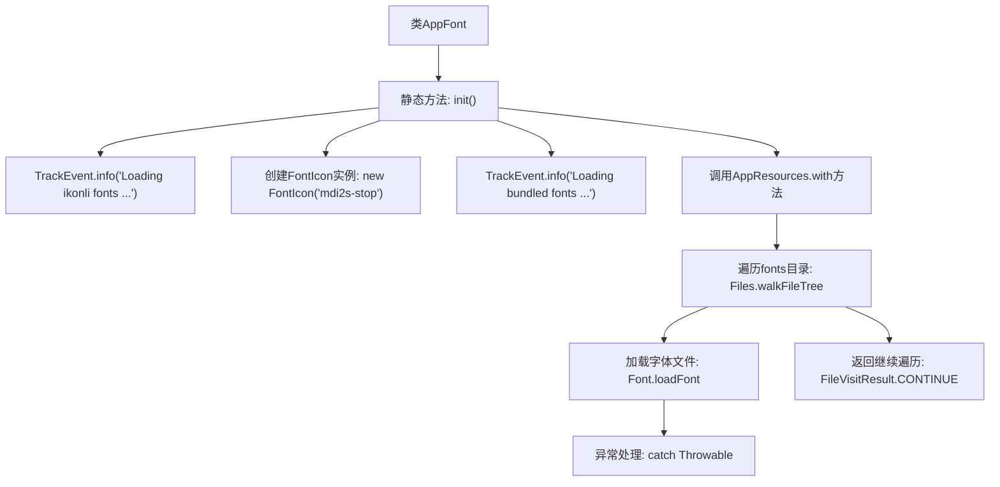

# 基础信息

|      |      |
|------|------|
| 名称 | AppFont |
| 编码语言 | .java |
| 代码路径 | xpipe/app/src/main/java/io/xpipe/app/core/AppFont.java |
| 包名 | io.xpipe.app.core |
| 依赖项 | ['io.xpipe.app.issue.TrackEvent', 'io.xpipe.app.resources.AppResources', 'io.xpipe.core.process.OsType', 'javafx.scene.text.Font', 'org.kordamp.ikonli.javafx.FontIcon', 'java.nio.file.FileVisitResult', 'java.nio.file.Files', 'java.nio.file.Path', 'java.nio.file.SimpleFileVisitor', 'java.nio.file.attribute.BasicFileAttributes'] |
| 概述说明 | 初始化字体加载，包括ikonli和捆绑字体，忽略加载失败。 |

# 说明

AppFont类的init方法负责初始化字体。首先加载ikonli字体并记录日志，然后加载捆绑字体。加载捆绑字体时，通过AppResources访问指定路径，遍历文件树，对每个字体文件尝试加载。字体大小根据操作系统类型调整（Linux为11，其他为12）。加载失败时会忽略错误并继续处理。整个过程包含日志记录和异常处理。

# 类列表 Class Summary

| 名称   | 类型  | 说明 |
|-------|------|-------------|
| AppFont | class | 初始化字体：加载ikonli和捆绑字体，忽略失败情况。 |

## 类 AppFont

|      |      |
|------|------|
| 访问范围 | public |
| 类型 | class |
| 名称 | AppFont |
| 说明 | 初始化字体：加载ikonli和捆绑字体，忽略失败情况。 |

### UML类图

该类图展示了AppFont类的初始化过程及其依赖关系。AppFont通过静态方法init()协调字体加载流程：首先记录日志(TrackEvent)，然后创建图标字体(FontIcon)，最后通过AppResources加载捆绑字体。AppResources使用SimpleFileVisitor遍历字体文件，调用Font.loadFont()加载字体，并根据操作系统类型(OsType)调整字体大小。图中清晰呈现了核心类之间的调用关系和接口实现方式，特别是文件访问和字体加载的协作过程。

### 内部方法调用关系图

这段代码流程图展示了AppFont类的初始化过程。首先记录加载图标字体日志并创建FontIcon实例，然后加载捆绑字体资源。核心流程通过AppResources.with方法遍历fonts目录，对每个字体文件使用Font.loadFont进行加载，采用异常捕获机制处理可能的加载失败，最后返回继续遍历指令。整个过程体现了资源加载的健壮性设计，特别考虑了Linux系统的字体大小差异。

### 字段列表 Field List

| 名称  | 类型  | 说明 |
|-------|-------|------|

### 方法列表 Method List

| 名称  | 类型  | 说明 |
|-------|-------|------|
| init | void | 初始化方法加载图标和字体资源，忽略加载失败情况。 |

