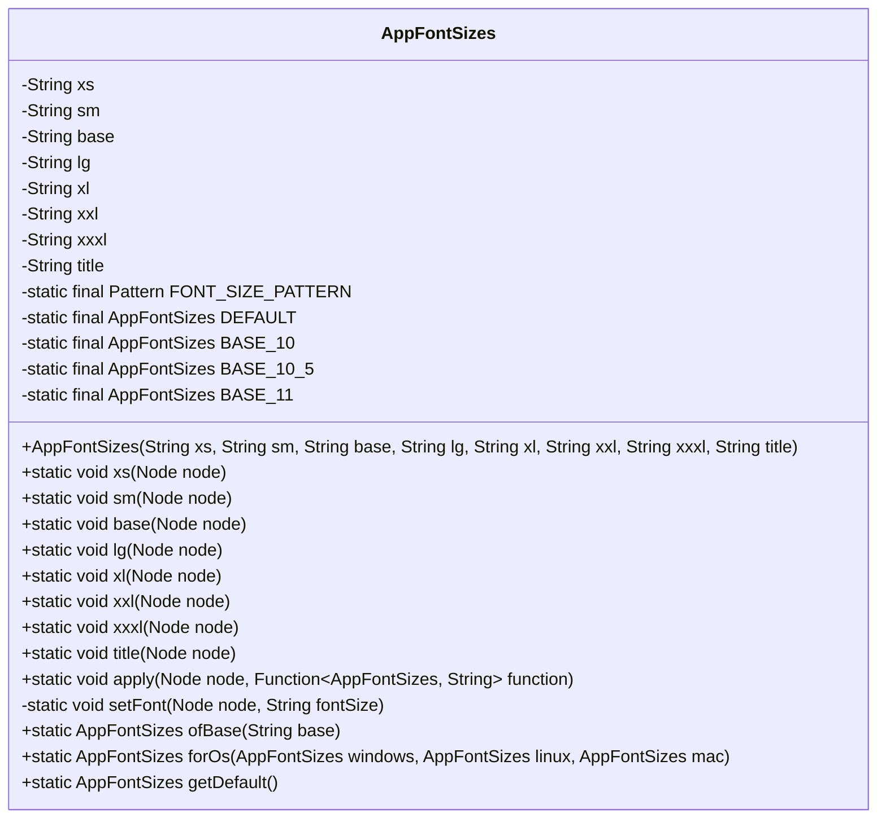
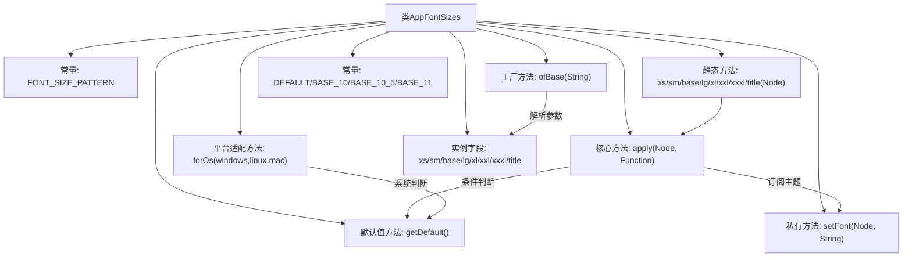

# 基础信息

|      |      |
|------|------|
| 名称 | AppFontSizes |
| 编码语言 | .java |
| 代码路径 | xpipe/app/src/main/java/io/xpipe/app/core/AppFontSizes.java |
| 包名 | io.xpipe.app.core |
| 依赖项 | ['io.xpipe.app.prefs.AppPrefs', 'io.xpipe.core.process.OsType', 'javafx.scene.Node', 'lombok.AllArgsConstructor', 'lombok.Value', 'java.util.function.Function', 'java.util.regex.Pattern'] |
| 概述说明 | Java类AppFontSizes管理字体大小，支持多尺寸和操作系统适配。 |

# 说明

这是一个用于管理应用程序字体大小的Java类AppFontSizes。它提供了多种预设字体大小（xs、sm、base、lg、xl、xxl、xxxl、title），并支持根据操作系统类型（Windows、Linux、Mac）选择默认字体大小配置。类中包含静态方法用于应用特定字体大小到节点，以及处理字体样式字符串的正则表达式匹配和替换逻辑。还提供了基于基础字体大小生成完整字体大小配置的工厂方法，支持整数和小数点格式的输入。该类使用观察者模式监听主题变化并自动更新字体大小。

# 类列表 Class Summary

| 名称   | 类型  | 说明 |
|-------|------|-------------|
| AppFontSizes | class | Java类AppFontSizes定义字体大小常量，提供静态方法设置节点字体，支持不同操作系统默认值。 |

## 类 AppFontSizes

|      |      |
|------|------|
| 访问范围 | @Value;@AllArgsConstructor;public |
| 类型 | class |
| 名称 | AppFontSizes |
| 说明 | Java类AppFontSizes定义字体大小常量，提供静态方法设置节点字体，支持不同操作系统默认值。 |

### UML类图

这段代码定义了一个`AppFontSizes`类，用于管理应用程序中不同级别的字体大小。该类包含多个静态方法用于设置节点字体大小（如xs、sm、base等），通过`apply`方法实现动态字体调整，并支持根据操作系统类型选择默认字体配置。类中定义了8种字体大小级别（从xs到title），提供了基于基准值的字体生成方法`ofBase`，以及根据操作系统选择配置的`forOs`方法。核心功能是通过正则表达式匹配和替换CSS样式来实现字体大小的动态更新。

### 内部方法调用关系图

这段代码定义了一个字体大小管理类AppFontSizes，主要功能包括：1) 通过静态方法(xs/sm等)设置节点字体；2) 使用正则表达式匹配替换样式；3) 支持不同操作系统默认配置；4) 提供基于基准值的字体大小计算。核心逻辑集中在apply方法中处理主题订阅和字体设置，通过工厂方法ofBase生成不同尺寸规格，整体采用函数式编程风格实现样式动态更新。

### 字段列表 Field List

| 名称  | 类型  | 说明 |
|-------|-------|------|
| xxxl | String | 定义字符串变量xxxl |
| lg | String | 字符串变量lg定义 |
| xl | String | 声明字符串变量xl |
| title | String | {{title}} |
| sm | String | 字符串变量sm声明 |
| xxl | String | 变量xxl声明为String类型。 |
| FONT_SIZE_PATTERN = Pattern.compile("-fx-font-size: \\d+(\\.\\d+)?pt;") | Pattern | 匹配CSS字体大小样式字符串的正则表达式。 |
| base | String | 字符串基类 |
| BASE_10_5 = ofBase("10.5") | AppFontSizes | 定义静态常量BASE_10_5，值为10.5基准字体大小。 |
| BASE_11 = ofBase("11") | AppFontSizes | 定义字体大小常量BASE_11，值为11。 |
| xs | String | 声明字符串变量xs。 |
| DEFAULT = getDefault() | AppFontSizes | 默认字体大小常量，通过getDefault方法初始化。 |
| BASE_10 = ofBase("10") | AppFontSizes | 定义静态常量BASE_10，值为基础字号"10"。 |

### 方法列表 Method List

| 名称  | 类型  | 说明 |
|-------|-------|------|
| xl | void | 静态方法xl应用大号字体到节点。 |
| xxxl | void | 静态方法xxxl应用AppFontSizes的getXxl到节点。 |
| lg | void | 静态方法lg调用apply，参数为node和AppFontSizes的getLg方法。 |
| xxl | void | 静态方法xxl对节点应用超大字体尺寸。 |
| base | void | 静态方法base应用节点基础字体大小。 |
| sm | void | 静态方法sm应用小号字体到节点。 |
| xs | void | 静态方法xs调用apply，设置节点字体大小为XS。 |
| title | void | 静态方法title，对节点应用AppFontSizes的标题字体大小。 |
| apply | void | 静态方法根据主题动态设置节点字体，优先使用默认值。 |
| setFont | void | 设置节点字体大小，保留原有样式。 |
| ofBase | AppFontSizes | 静态方法根据输入字符串生成字体大小集合，处理整数和小数情况。 |
| forOs | AppFontSizes | 根据操作系统返回对应字体大小设置。 |
| getDefault | AppFontSizes | 静态方法返回默认字体大小，根据系统选择基准值。 |

