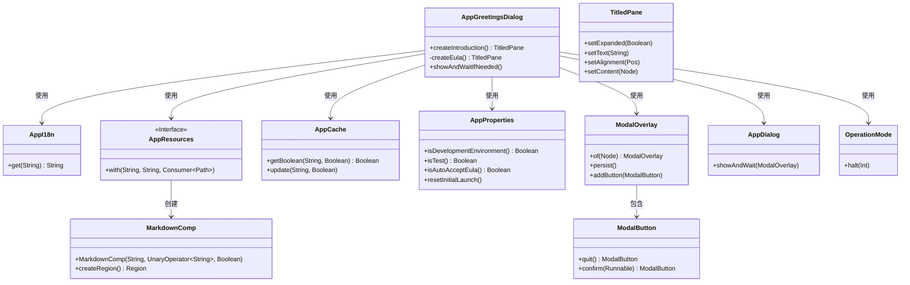
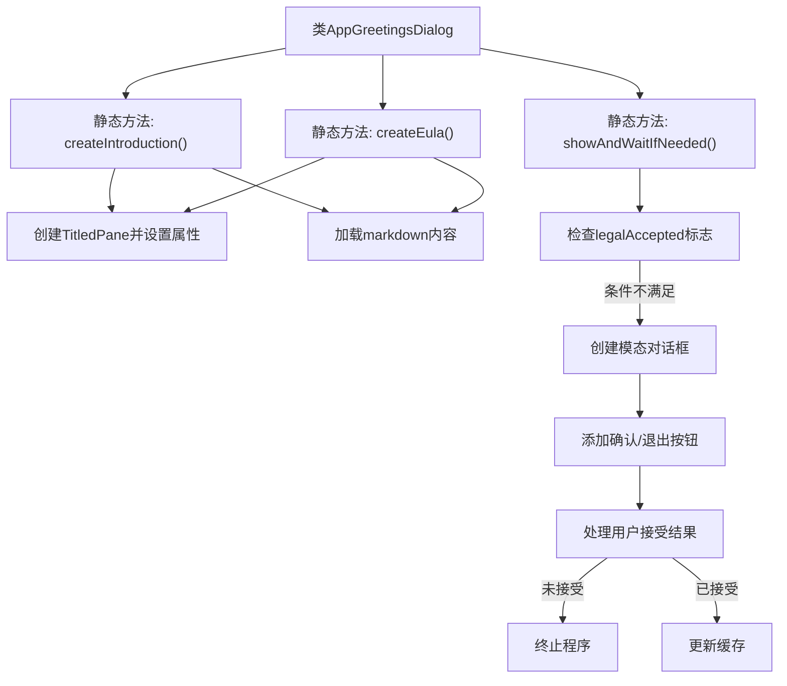
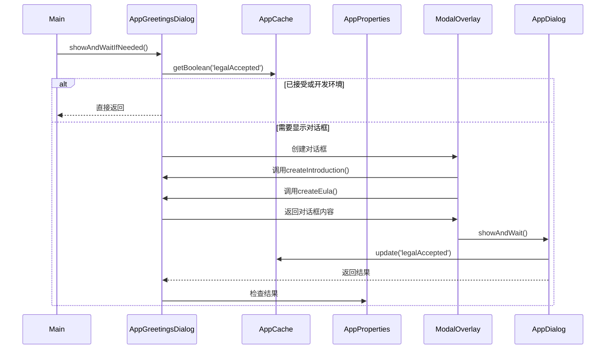

# 基础信息

|      |      |
|------|------|
| 名称 | AppGreetingsDialog |
| 编码语言 | .java |
| 代码路径 | xpipe/app/src/main/java/io/xpipe/app/core/AppGreetingsDialog.java |
| 包名 | io.xpipe.app.core |
| 依赖项 | ['io.xpipe.app.comp.Comp', 'io.xpipe.app.comp.base.MarkdownComp', 'io.xpipe.app.comp.base.ModalButton', 'io.xpipe.app.comp.base.ModalOverlay', 'io.xpipe.app.core.mode.OperationMode', 'io.xpipe.app.core.window.AppDialog', 'io.xpipe.app.resources.AppResources', 'javafx.beans.property.SimpleBooleanProperty', 'javafx.geometry.Insets', 'javafx.geometry.Pos', 'javafx.scene.control', 'javafx.scene.layout.BorderPane', 'java.nio.file.Files', 'java.util.List', 'java.util.function.UnaryOperator'] |
| 概述说明 | 创建欢迎对话框，包含介绍和EULA，需用户同意才能继续。 |

# 说明

该代码定义了一个应用欢迎对话框的实现，包含创建介绍和EULA（最终用户许可协议）两个可折叠面板。介绍面板默认展开，EULA面板默认收起，两者内容均从Markdown文件读取并渲染。主方法showAndWaitIfNeeded会在首次启动时显示模态对话框，要求用户阅读EULA并勾选接受复选框。若在开发或测试环境则自动跳过，支持配置自动接受。用户拒绝接受将终止应用，接受后更新缓存状态。对话框包含退出和确认按钮，确认按钮在未接受时禁用。

# 类列表 Class Summary

| 名称   | 类型  | 说明 |
|-------|------|-------------|
| AppGreetingsDialog | class | 创建欢迎对话框，包含介绍和EULA，需用户同意才能继续使用。 |

## 类 AppGreetingsDialog

|      |      |
|------|------|
| 访问范围 | public |
| 类型 | class |
| 名称 | AppGreetingsDialog |
| 说明 | 创建欢迎对话框，包含介绍和EULA，需用户同意才能继续使用。 |

### UML类图

这段代码实现了一个应用程序欢迎对话框系统，主要功能包括显示介绍信息和最终用户许可协议(EULA)，并处理用户接受协议的逻辑。类图展示了核心类AppGreetingsDialog通过组合多个工具类(如国际化支持AppI18n、资源加载AppResources、缓存管理AppCache等)来实现完整的对话框业务流程，包含内容加载、状态管理和用户交互处理等功能。系统采用分层设计，业务逻辑与UI组件分离，通过ModalOverlay实现模态对话框的展示和控制。

### 内部方法调用关系图

这段代码实现了一个法律协议对话框系统，主要包含三个核心方法：createIntroduction()创建介绍面板，createEula()创建用户协议面板，showAndWaitIfNeeded()控制整个对话框流程。系统会检查缓存标志，在首次启动时显示包含Markdown内容的可折叠面板，要求用户阅读并接受协议。根据用户选择更新缓存或终止程序，确保法律合规性。流程图展示了类方法调用关系，时序图详细描述了对话框的显示和用户交互过程。

### 字段列表 Field List

| 名称  | 类型  | 说明 |
|-------|-------|------|

### 方法列表 Method List

| 名称  | 类型  | 说明 |
|-------|-------|------|
| createIntroduction | TitledPane | 创建可展开的介绍面板，包含欢迎内容，居中左对齐。 |
| createEula | TitledPane | 创建EULA标题面板，默认折叠，居中左对齐，内容从文件读取并渲染为Markdown。 |
| showAndWaitIfNeeded | void | 检查用户协议接受状态，未接受则显示模态窗口要求确认，否则退出程序。 |

