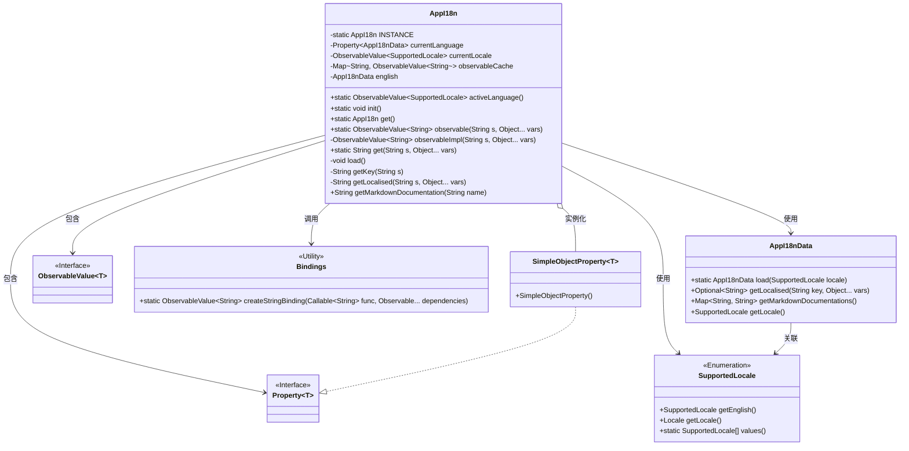
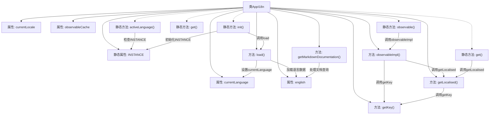

# 基础信息

|      |      |
|------|------|
| 名称 | AppI18n |
| 编码语言 | .java |
| 代码路径 | xpipe/app/src/main/java/io/xpipe/app/core/AppI18n.java |
| 包名 | io.xpipe.app.core |
| 依赖项 | ['io.xpipe.app.issue.ErrorEvent', 'io.xpipe.app.issue.TrackEvent', 'io.xpipe.app.prefs.AppPrefs', 'io.xpipe.app.prefs.SupportedLocale', 'io.xpipe.app.util.BindingsHelper', 'io.xpipe.app.util.PlatformState', 'io.xpipe.app.util.PlatformThread', 'javafx.beans.binding.Bindings', 'javafx.beans.property.Property', 'javafx.beans.property.SimpleObjectProperty', 'javafx.beans.value.ObservableValue', 'java.util'] |
| 概述说明 | 国际化工具类，支持多语言切换和本地化字符串获取。 |

# 说明

这是一个国际化支持类AppI18n，用于管理多语言资源和本地化功能。它采用单例模式，提供静态方法获取当前语言、初始化实例和获取本地化字符串。主要功能包括：通过currentLanguage属性跟踪当前语言设置；使用observableCache缓存本地化字符串；支持带变量的字符串格式化；自动回退到英语资源；提供Markdown文档本地化；监听用户偏好设置变更并更新语言。初始化时会加载英语资源作为默认值，并处理JDK内置区域设置。

# 类列表 Class Summary

| 名称   | 类型  | 说明 |
|-------|------|-------------|
| AppI18n | class | AppI18n类实现多语言支持，管理当前语言、缓存翻译和文档，提供静态方法获取本地化字符串。 |

## 类 AppI18n

|      |      |
|------|------|
| 访问范围 | public |
| 类型 | class |
| 名称 | AppI18n |
| 说明 | AppI18n类实现多语言支持，管理当前语言、缓存翻译和文档，提供静态方法获取本地化字符串。 |

### UML类图

类图描述：
该图展示了国际化工具类AppI18n的核心结构，采用单例模式管理多语言资源。主要包含属性currentLanguage（当前语言数据）、currentLocale（当前地区观察值）和observableCache（翻译键值缓存）。通过Bindings工具类创建动态绑定的字符串观察值，依赖AppI18nData加载具体语言资源，SupportedLocale枚举定义支持的地区。实现了延迟加载、线程安全缓存、动态语言切换等功能，支持普通文本和Markdown文档的国际化处理。

### 内部方法调用关系图

流程图描述：该流程图展示了AppI18n类的完整结构，包括静态实例管理、语言属性绑定、缓存机制和本地化功能。核心流程包含语言初始化(init)、字符串观察值创建(observableImpl)、本地化字符串获取(getLocalised)和文档查询(getMarkdownDocumentation)。类通过currentLanguage属性跟踪当前语言，使用observableCache优化性能，并依赖AppI18nData存储具体语言数据。所有本地化操作最终都会通过getKey方法处理键名格式。

### 字段列表 Field List

| 名称  | 类型  | 说明 |
|-------|-------|------|
| observableCache = new HashMap<>() | Map<String, ObservableValue<String>> | 私有Map缓存ObservableValue<String>对象。 |
| INSTANCE | AppI18n | 私有静态AppI18n实例变量 |
| english | AppI18nData | 私有英语国际化数据变量 |
| currentLocale = BindingsHelper.map(            currentLanguage,            appI18nData -> appI18nData != null ? appI18nData.getLocale() : SupportedLocale.getEnglish()) | ObservableValue<SupportedLocale> | 私有变量currentLocale映射currentLanguage，为空时默认英语。 |
| currentLanguage = new SimpleObjectProperty<>() | Property<AppI18nData> | 私有属性currentLanguage，类型为Property<AppI18nData>，初始化为SimpleObjectProperty。 |

### 方法列表 Method List

| 名称  | 类型  | 说明 |
|-------|-------|------|
| get | AppI18n | 静态方法返回单例实例。 |
| observable | ObservableValue<String> | 公开静态方法返回可观察字符串值，参数为字符串和变长对象数组。 |
| activeLanguage | ObservableValue<SupportedLocale> | 静态方法返回当前语言设置，若未初始化则返回英语。 |
| observableImpl | ObservableValue<String> | 方法根据输入字符串和变量生成可观察值，处理缓存和同步，支持动态本地化。 |
| load | void | 加载多语言资源，初始化默认英语，订阅语言偏好变更并更新当前语言设置。 |
| init | void | 初始化单例实例并加载资源。 |
| getKey | String | 方法getKey截取以特定前缀开头的字符串，移除前缀后返回剩余部分。 |
| getLocalised | String | 方法根据键获取本地化字符串，优先当前语言，其次英语，未找到则返回键并记录警告。 |
| get | String | 静态方法get返回本地化字符串，参数为字符串和可变对象数组。 |
| getMarkdownDocumentation | String | 方法获取本地化Markdown文档，优先当前语言，其次英语，未找到则记录警告并返回空。 |

