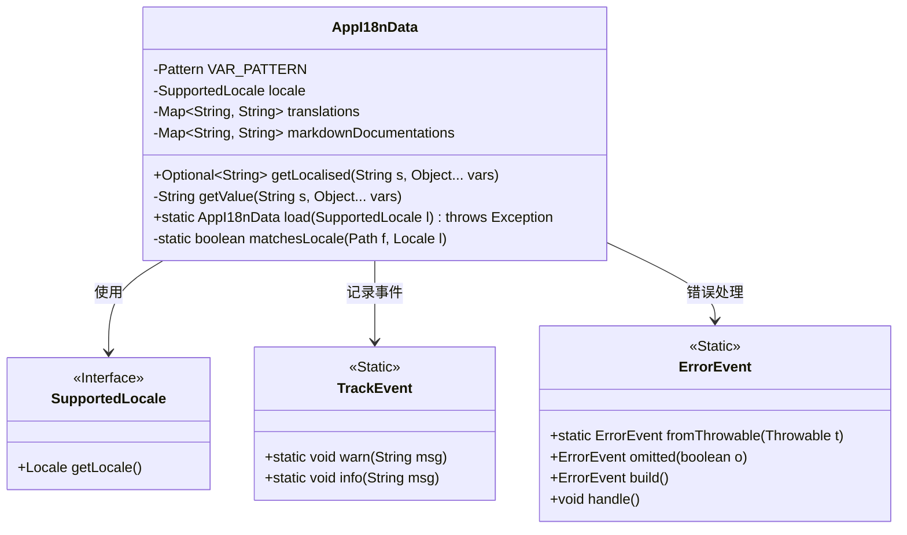
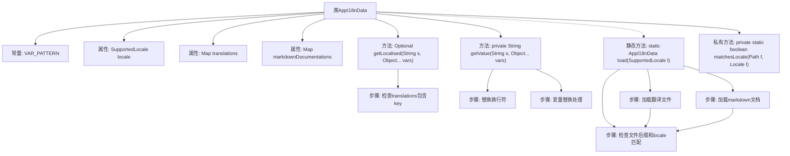

# 基础信息

|      |      |
|------|------|
| 名称 | AppI18nData |
| 编码语言 | .java |
| 代码路径 | xpipe/app/src/main/java/io/xpipe/app/core/AppI18nData.java |
| 包名 | io.xpipe.app.core |
| 依赖项 | ['io.xpipe.app.issue.ErrorEvent', 'io.xpipe.app.issue.TrackEvent', 'io.xpipe.app.prefs.SupportedLocale', 'io.xpipe.core.util.XPipeInstallation', 'lombok.Value', 'org.apache.commons.io.FilenameUtils', 'java.io.IOException', 'java.io.InputStreamReader', 'java.nio.charset.StandardCharsets', 'java.nio.file.FileVisitResult', 'java.nio.file.Files', 'java.nio.file.Path', 'java.nio.file.SimpleFileVisitor', 'java.nio.file.attribute.BasicFileAttributes', 'java.util', 'java.util.concurrent.atomic.AtomicInteger', 'java.util.regex.Pattern'] |
| 概述说明 | 国际化数据类，含翻译和文档加载功能，支持变量替换。 |

# 说明

AppI18nData类用于管理应用程序的国际化数据，包含本地化字符串和Markdown文档。该类支持从properties文件加载翻译字符串，从Markdown文件加载文档内容。getLocalised方法用于获取本地化字符串并替换变量占位符。load方法负责从指定路径加载对应语言环境的翻译和文档数据，支持过滤非目标语言文件。变量替换使用正则表达式匹配占位符格式$var$，未匹配时记录警告。文件加载过程统计文件数量和条目数，异常处理采用静默方式。匹配语言环境通过文件名后缀实现，如_en-US。

# 类列表 Class Summary

| 名称   | 类型  | 说明 |
|-------|------|-------------|
| AppI18nData | class | 国际化数据类，支持本地化字符串和文档加载替换。 |


## 类 AppI18nData

|      |      |
|------|------|
| 访问范围 | @Value;public |
| 类型 | class |
| 名称 | AppI18nData |
| 说明 | 国际化数据类，支持本地化字符串和文档加载替换。 |


### UML类图



这段代码定义了一个国际化数据管理类AppI18nData，主要用于加载和处理本地化字符串及Markdown文档。类中包含翻译文本和文档的映射表，提供根据键名获取本地化字符串的方法，并支持变量替换功能。通过静态方法load从文件系统加载指定语言的数据，依赖SupportedLocale接口获取语言信息，使用TrackEvent和ErrorEvent进行日志记录和错误处理。整个设计实现了国际化资源的动态加载和变量插值功能。


### 内部方法调用关系图



```mermaid
sequenceDiagram
    participant Main
    participant AppI18nData
    participant FileSystem
    participant Properties

    Main->>AppI18nData: load(locale)
    AppI18nData->>FileSystem: walkFileTree(strings路径)
    FileSystem->>AppI18nData: 遍历properties文件
    AppI18nData->>Properties: 加载并解析
    Properties-->>AppI18nData: 填充translations
    AppI18nData->>FileSystem: walkFileTree(texts路径)
    FileSystem->>AppI18nData: 遍历md文件
    AppI18nData->>FileSystem: 读取文件内容
    FileSystem-->>AppI18nData: 填充markdownDocumentations
    AppI18nData-->>Main: 返回AppI18nData实例
```

这段代码实现了一个国际化数据加载器，主要功能包括：1) 通过getLocalised方法获取本地化字符串；2) 使用getValue方法处理字符串中的变量替换；3) 通过静态load方法从文件系统加载翻译文本和markdown文档。流程图展示了类结构和核心方法调用关系，时序图详细描述了加载过程中的系统交互。代码特别注重异常处理和日志跟踪，使用FileVisitor模式递归遍历目录，并实现了基于locale的文件过滤机制。

### 字段列表 Field List

| 名称  | 类型  | 说明 |
|-------|-------|------|
| VAR_PATTERN = Pattern.compile("\\$\\w+?\\$") | Pattern | 匹配形如$var$的变量模式。 |
| markdownDocumentations | Map<String, String> | 存储键值对形式的Markdown文档集合。 |
| translations | Map<String, String> | 存储键值对的翻译映射表。 |
| locale | SupportedLocale | 支持的语言区域设置。 |

### 方法列表 Method List

| 名称  | 类型  | 说明 |
|-------|-------|------|
| getValue | String | 私有方法：替换字符串中的变量，支持空值检查和未匹配警告。 |
| getLocalised | Optional<String> | 方法getLocalised根据键s获取本地化字符串，支持变量替换，返回Optional结果。 |
| load | AppI18nData | 加载指定语言翻译文件和文档。 |
| matchesLocale | boolean | 检查文件名是否以指定语言标签结尾。 |


