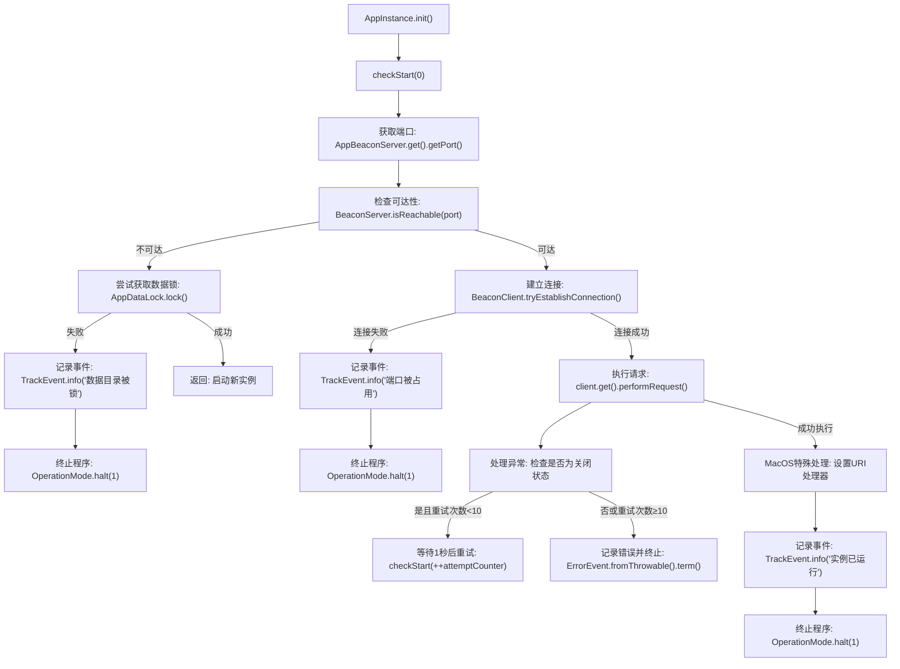

# 基础信息

|      |      |
|------|------|
| 名称 | AppInstance |
| 编码语言 | .java |
| 代码路径 | xpipe/app/src/main/java/io/xpipe/app/core/AppInstance.java |
| 包名 | io.xpipe.app.core |
| 依赖项 | ['io.xpipe.app.beacon.AppBeaconServer', 'io.xpipe.app.core.mode.OperationMode', 'io.xpipe.app.issue.ErrorEvent', 'io.xpipe.app.issue.TrackEvent', 'io.xpipe.app.util.ThreadHelper', 'io.xpipe.beacon.BeaconClient', 'io.xpipe.beacon.BeaconClientInformation', 'io.xpipe.beacon.BeaconServer', 'io.xpipe.beacon.api.DaemonFocusExchange', 'io.xpipe.beacon.api.DaemonOpenExchange', 'io.xpipe.core.process.OsType', 'io.xpipe.core.util.XPipeInstallation', 'java.awt', 'java.util.List'] |
| 概述说明 | 检查应用实例是否运行，锁定数据目录或连接现有实例，失败则退出。 |

# 说明

该代码描述了一个应用程序实例管理类，主要功能是检查并确保同一时间只有一个实例运行。首先通过BeaconServer检测端口是否可用，若不可用则检查数据目录锁定状态。若发现已有实例运行，则通过BeaconClient与现有实例通信，传递启动参数或焦点请求。处理过程中包含错误重试机制，最多尝试10次。针对MACOS系统额外设置了URI打开处理器。若检测到冲突实例，程序会记录日志并退出。整个过程包含详细的错误处理和日志记录机制。

# 类列表 Class Summary

| 名称   | 类型  | 说明 |
|-------|------|-------------|
| AppInstance | class | 检查应用实例是否运行，锁定数据目录或连接现有实例，失败则退出。 |

## 类 AppInstance

|      |      |
|------|------|
| 访问范围 | public |
| 类型 | class |
| 名称 | AppInstance |
| 说明 | 检查应用实例是否运行，锁定数据目录或连接现有实例，失败则退出。 |

### UML类图

```mermaid
classDiagram
    class AppInstance {
        +init()
        -checkStart(int attemptCounter)
    }

    class AppBeaconServer {
        +get() AppBeaconServer
        +getPort() int
    }

    class BeaconServer {
        +isReachable(int port) boolean
    }

    class AppDataLock {
        +lock() boolean
    }

    class TrackEvent {
        +info(String message)
    }

    class AppProperties {
        +get() AppProperties
        +getDataDir() Path
        +getArguments() Arguments
    }

    class Arguments {
        +getOpenArgs() List~String~
    }

    class OperationMode {
        +halt(int code)
    }

    class BeaconClient {
        +tryEstablishConnection(int port, BeaconClientInformation info) Optional~BeaconClient~
        +performRequest(Request request)
    }

    class BeaconClientInformation {
        +Daemon.builder() Builder
    }

    class DaemonFocusExchange {
        +Request.builder() Builder
    }

    class DaemonOpenExchange {
        +Request.builder() Builder
    }

    class XPipeInstallation {
        +getLocalDefaultCliExecutable() String
    }

    class ErrorEvent {
        +fromThrowable(String msg, Throwable t) ErrorEvent
        +fromThrowable(Throwable t) ErrorEvent
        +term() ErrorEvent
        +expected() ErrorEvent
        +omit() ErrorEvent
        +handle()
    }

    class OsType {
        +getLocal() OsType
    }

    class Desktop {
        +getDesktop() Desktop
        +setOpenURIHandler(OpenURIHandler handler)
    }

    class ThreadHelper {
        +sleep(long millis)
    }

    AppInstance --> AppBeaconServer : 使用
    AppInstance --> BeaconServer : 使用
    AppInstance --> AppDataLock : 使用
    AppInstance --> TrackEvent : 使用
    AppInstance --> AppProperties : 使用
    AppInstance --> OperationMode : 使用
    AppInstance --> BeaconClient : 使用
    AppInstance --> XPipeInstallation : 使用
    AppInstance --> ErrorEvent : 使用
    AppInstance --> OsType : 使用
    AppInstance --> Desktop : 使用
    AppInstance --> ThreadHelper : 使用
    BeaconClient --> BeaconClientInformation : 使用
    BeaconClient --> DaemonFocusExchange : 使用
    BeaconClient --> DaemonOpenExchange : 使用
    AppProperties --> Arguments : 包含
```

这段代码主要实现了一个应用程序实例检查机制，通过检测端口可达性、数据目录锁定状态等方式确保单实例运行。当检测到已有实例运行时，会通过BeaconClient进行通信（如传递打开参数），否则会初始化新实例。类图展示了核心类及其依赖关系，包括Beacon服务管理、属性配置、事件跟踪、错误处理等模块，形成一个完整的实例控制体系。

### 内部方法调用关系图

该流程图展示了AppInstance类的初始化流程，主要控制单实例应用的启动逻辑。首先检查端口可达性，若不可达则尝试获取数据锁启动新实例；若可达则建立连接与现有实例通信，处理文件打开请求或URI事件。包含异常重试机制（最多10次）、跨用户实例检测、MacOS特殊处理等分支逻辑，最终确保同一时间只有一个应用实例运行。关键步骤通过TrackEvent记录日志，异常时调用OperationMode.halt终止程序。

### 字段列表 Field List

| 名称  | 类型  | 说明 |
|-------|-------|------|

### 方法列表 Method List

| 名称  | 类型  | 说明 |
|-------|-------|------|
| init | void | 静态方法init调用checkStart(0)。 |
| checkStart | void | 检查端口占用，锁定数据目录，连接现有实例或启动新进程。 |

