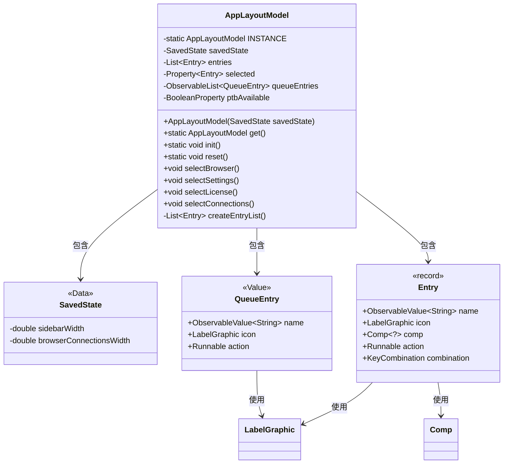
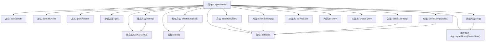

# 基础信息

|      |      |
|------|------|
| 名称 | AppLayoutModel |
| 编码语言 | .java |
| 代码路径 | xpipe/app/src/main/java/io/xpipe/app/core/AppLayoutModel.java |
| 包名 | io.xpipe.app.core |
| 依赖项 | ['io.xpipe.app.browser.BrowserFullSessionComp', 'io.xpipe.app.browser.BrowserFullSessionModel', 'io.xpipe.app.comp.Comp', 'io.xpipe.app.comp.store.StoreLayoutComp', 'io.xpipe.app.prefs.AppPrefsComp', 'io.xpipe.app.util.Hyperlinks', 'io.xpipe.app.util.LabelGraphic', 'io.xpipe.app.util.LicenseProvider', 'io.xpipe.app.util.PlatformThread', 'javafx.beans.property.BooleanProperty', 'javafx.beans.property.Property', 'javafx.beans.property.SimpleBooleanProperty', 'javafx.beans.property.SimpleObjectProperty', 'javafx.beans.value.ObservableValue', 'javafx.collections.FXCollections', 'javafx.collections.ObservableList', 'javafx.scene.input.KeyCode', 'javafx.scene.input.KeyCodeCombination', 'javafx.scene.input.KeyCombination', 'lombok.Builder', 'lombok.Data', 'lombok.Getter', 'lombok.Value', 'lombok.extern.jackson.Jacksonized', 'java.util.ArrayList', 'java.util.List'] |
| 概述说明 | 单例模式管理应用布局，包含状态、条目列表和选择属性。 |

# 说明

AppLayoutModel是一个单例类，用于管理应用程序布局状态。它包含SavedState保存侧边栏和浏览器连接宽度，entries列表存储不同功能入口（如连接、浏览器、设置、许可证等），selected属性跟踪当前选中项，queueEntries是观察列表。提供静态方法get、init和reset管理实例。通过selectXxx方法切换选中项，createEntryList创建带图标、快捷键和操作的入口列表。SavedState记录布局尺寸，Entry和QueueEntry分别表示功能入口和队列项。

# 类列表 Class Summary

| 名称   | 类型  | 说明 |
|-------|------|-------------|
| AppLayoutModel | class | 应用布局模型类，管理界面状态、条目列表和选择项，支持初始化、重置和导航功能。 |

## 类 AppLayoutModel

|      |      |
|------|------|
| 访问范围 | @Getter;public |
| 类型 | class |
| 名称 | AppLayoutModel |
| 说明 | 应用布局模型类，管理界面状态、条目列表和选择项，支持初始化、重置和导航功能。 |

### UML类图

类图描述：该图展示了AppLayoutModel类的结构及其关联类。AppLayoutModel采用单例模式，包含SavedState配置数据、Entry导航条目列表和QueueEntry队列条目列表。Entry记录类型定义了导航项的结构，包含名称、图标、组件和动作；QueueEntry值对象表示队列项。类之间通过组合关系关联，体现了JavaFX应用的典型UI模型设计模式。

### 内部方法调用关系图

该流程图展示了AppLayoutModel类的完整结构，包含静态实例管理、状态保存、条目列表操作和选择控制等功能。类通过单例模式管理实例，包含初始化/重置方法，维护可观察的条目列表和选择状态，并提供多个选择导航方法。内部类SavedState用于持久化布局状态，Entry和QueueEntry分别表示导航条目和队列项。createEntryList()方法动态构建包含多种功能入口的列表，支持国际化文本和图标显示。

### 字段列表 Field List

| 名称  | 类型  | 说明 |
|-------|-------|------|
| ptbAvailable = new SimpleBooleanProperty() | BooleanProperty | 私有布尔属性ptbAvailable初始化为SimpleBooleanProperty。 |
| entries | List<Entry> | 私有条目列表 |
| selected | Property<Entry> | 私有属性selected，类型为Property<Entry>。 |
| INSTANCE | AppLayoutModel | 私有静态单例实例AppLayoutModel |
| queueEntries | ObservableList<QueueEntry> | 私有队列条目可观察列表。 |
| savedState | SavedState | 私有不可变SavedState实例。 |

### 方法列表 Method List

| 名称  | 类型  | 说明 |
|-------|-------|------|
| createEntryList | List<Entry> | 创建条目列表，包含连接、浏览器、设置、文档等选项，支持快捷键和外部链接。 |
| reset | void | 静态方法reset()：若INSTANCE非空，保存状态至AppCache后置空INSTANCE。 |
| selectLicense | void | 方法selectLicense设置选中值为entries的第4项。 |
| get | AppLayoutModel | 获取AppLayoutModel单例实例。 |
| selectSettings | void | 方法selectSettings异步设置选中项为entries的第3个元素。 |
| selectConnections | void | 方法selectConnections异步设置首个条目为选中值。 |
| init | void | 初始化AppLayoutModel，从缓存获取或新建SavedState实例。 |
| selectBrowser | void | 方法selectBrowser在平台线程中设置选中值为entries的第二项。 |

