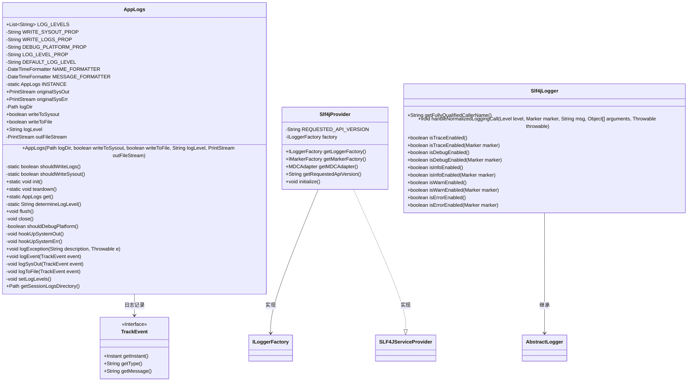

# 基础信息

|      |      |
|------|------|
| 名称 | AppLogs |
| 编码语言 | .java |
| 代码路径 | xpipe/app/src/main/java/io/xpipe/app/core/AppLogs.java |
| 包名 | io.xpipe.app.core |
| 依赖项 | ['io.xpipe.app.issue.ErrorEvent', 'io.xpipe.app.issue.TrackEvent', 'io.xpipe.core.util.Deobfuscator', 'lombok.Getter', 'org.apache.commons.io.FileUtils', 'org.slf4j.ILoggerFactory', 'org.slf4j.IMarkerFactory', 'org.slf4j.Logger', 'org.slf4j.Marker', 'org.slf4j.event.Level', 'org.slf4j.helpers.AbstractLogger', 'org.slf4j.helpers.NOPLogger', 'org.slf4j.spi.MDCAdapter', 'org.slf4j.spi.SLF4JServiceProvider', 'java.io', 'java.nio.file.Files', 'java.nio.file.Path', 'java.time.Instant', 'java.time.ZoneId', 'java.time.format.DateTimeFormatter', 'java.time.temporal.ChronoField', 'java.util.List', 'java.util.Map', 'java.util.Objects', 'java.util.concurrent.ConcurrentHashMap'] |
| 概述说明 | AppLogs类管理日志记录，支持文件和控制台输出，提供日志级别控制和异常处理。 |

# 说明

AppLogs类是一个日志管理工具，支持多种日志级别（error、warn、info、debug、trace），可配置输出到系统标准输出或文件。它通过系统属性控制日志行为，包括是否写入日志文件、是否输出到标准输出、日志级别及平台调试模式。初始化时会清理旧日志并创建带时间戳的新日志目录，支持多实例并发处理。提供异常记录、事件日志功能，并集成SLF4J接口。日志内容包含时间戳和级别信息，支持动态调整日志级别和平台调试参数。

# 类列表 Class Summary

| 名称   | 类型  | 说明 |
|-------|------|-------------|
| AppLogs | class | AppLogs类管理日志记录，支持文件和控制台输出，提供日志级别控制和异常处理。 |

## 类 AppLogs

|      |      |
|------|------|
| 访问范围 | public |
| 类型 | class |
| 名称 | AppLogs |
| 说明 | AppLogs类管理日志记录，支持文件和控制台输出，提供日志级别控制和异常处理。 |

### UML类图

这段代码实现了一个完整的日志管理系统AppLogs，包含日志级别控制、文件/控制台输出切换、系统流重定向等功能。核心类AppLogs通过单例模式管理日志配置，支持动态日志级别调整和异常记录。Slf4jProvider和Slf4jLogger提供了SLF4J接口的实现，TrackEvent作为日志事件接口。系统通过属性配置决定输出目标和日志级别，并自动清理旧日志文件，具备线程安全的日志记录能力。

### 内部方法调用关系图

```mermaid
graph TD
    A["类AppLogs"]
    B["静态常量: LOG_LEVELS, WRITE_SYSOUT_PROP等"]
    C["静态方法: shouldWriteLogs()"]
    D["静态方法: shouldWriteSysout()"]
    E["静态方法: init()"]
    F["静态方法: teardown()"]
    G["静态方法: get()"]
    H["静态方法: determineLogLevel()"]
    I["实例方法: flush()"]
    J["实例方法: close()"]
    K["实例方法: shouldDebugPlatform()"]
    L["实例方法: hookUpSystemOut()"]
    M["实例方法: hookUpSystemErr()"]
    N["实例方法: logException()"]
    O["实例方法: logEvent()"]
    P["实例方法: logSysOut()"]
    Q["实例方法: logToFile()"]
    R["实例方法: setLogLevels()"]
    S["实例方法: getSessionLogsDirectory()"]
    T["内部类: Slf4jProvider"]
    U["内部类: Slf4jLogger"]

    A --> B
    A --> C
    A --> D
    A --> E
    A --> F
    A --> G
    A --> H
    A --> I
    A --> J
    A --> K
    A --> L
    A --> M
    A --> N
    A --> O
    O --> P
    O --> Q
    A --> R
    A --> S
    A --> T
    A --> U

    E --> C
    E --> D
    E --> H
    E --> L
    E --> M
    E --> R
    F --> J
    O --> H
    T --> U
```

这段代码实现了一个完整的日志管理系统，包含日志级别控制、输出目标选择（文件/控制台）、日志格式化和SLF4J兼容接口。流程图展示了核心类AppLogs的结构，包含静态配置方法、实例操作方法以及两个内部类Slf4jProvider和Slf4jLogger。系统通过init()方法初始化日志环境，支持动态调整日志级别，能同时处理系统输出流和错误流的重定向，并提供了完善的异常记录和事件跟踪功能。所有日志操作都经过严格的级别过滤和同步控制，确保线程安全。

### 字段列表 Field List

| 名称  | 类型  | 说明 |
|-------|-------|------|
| DEBUG_PLATFORM_PROP = "io.xpipe.app.debugPlatform" | String | 私有静态常量DEBUG_PLATFORM_PROP用于调试平台属性。 |
| writeToFile | boolean | 私有布尔变量writeToFile，使用Getter注解。 |
| WRITE_LOGS_PROP = "io.xpipe.app.writeLogs" | String | 私有静态常量WRITE_LOGS_PROP用于控制日志写入。 |
| originalSysErr | PrintStream | 私有终态PrintStream变量originalSysErr，带Getter方法。 |
| logLevel | String | 私有终态字符串logLevel，带Getter方法。 |
| outFileStream | PrintStream | 私有打印流输出文件 |
| NAME_FORMATTER =            DateTimeFormatter.ofPattern("yyyy-MM-dd_HH-mm-ss").withZone(ZoneId.systemDefault()) | DateTimeFormatter | 定义私有静态日期格式化器，格式为"年-月-日_时-分-秒"，使用系统默认时区。 |
| WRITE_SYSOUT_PROP = "io.xpipe.app.writeSysOut" | String | 私有静态常量字符串WRITE_SYSOUT_PROP，值为"io.xpipe.app.writeSysOut"。 |
| DEFAULT_LOG_LEVEL = "info" | String | 私有常量DEFAULT_LOG_LEVEL默认值为"info"。 |
| MESSAGE_FORMATTER =            DateTimeFormatter.ofPattern("HH:mm:ss:SSS").withZone(ZoneId.systemDefault()) | DateTimeFormatter | 定义私有静态时间格式化器，格式为时分秒毫秒，使用系统默认时区。 |
| logDir | Path | 私有日志目录路径变量 |
| LOG_LEVELS = List.of("error", "warn", "info", "debug", "trace") | List<String> | 定义日志级别常量列表：error、warn、info、debug、trace。 |
| INSTANCE | AppLogs | 单例模式下的静态AppLogs实例 |
| originalSysOut | PrintStream | 私有终态PrintStream变量originalSysOut的Getter方法。 |
| LOG_LEVEL_PROP = "io.xpipe.app.logLevel" | String | 私有静态常量LOG_LEVEL_PROP定义日志级别属性键 |
| writeToSysout | boolean | 私有只读布尔变量writeToSysout |

### 方法列表 Method List

| 名称  | 类型  | 说明 |
|-------|-------|------|
| teardown | void | 静态方法teardown()用于清理资源：检查并关闭AppLogs实例，重置INSTANCE为null。 |
| flush | void | 刷新输出文件流缓冲区。 |
| shouldDebugPlatform | boolean | 检查系统属性DEBUG_PLATFORM_PROP是否为真，否则返回假。 |
| logSysOut | void | 私有同步方法，格式化并输出事件日志到系统输出流。 |
| get | AppLogs | 获取AppLogs单例实例。 |
| close | void | 关闭输出文件流（若存在）。 |
| determineLogLevel | String | 静态方法根据系统属性确定日志级别，缺省返回默认值。 |
| logException | void | 记录异常信息，包括描述和解混淆后的堆栈跟踪。 |
| logEvent | void | 同步方法logEvent根据日志级别决定是否输出或写入文件。 |
| hookUpSystemErr | void | 重定向System.err到自定义流，捕获换行时的事件并处理。 |
| shouldWriteLogs | boolean | 检查系统属性WRITE_LOGS_PROP决定是否写日志，默认允许。 |
| hookUpSystemOut | void | Java方法hookUpSystemOut重定向System.out，捕获换行输出并发送为TrackEvent事件。 |
| init | void | 初始化日志系统：检查实例，清理旧日志，创建新日志目录，设置输出流和日志级别。 |
| shouldWriteSysout | boolean | 检查系统属性决定是否输出日志 |
| logToFile | void | 私有方法：记录事件到文件，含时间、类型和内容。 |
| setLogLevels | void | 设置调试日志级别，启用平台调试输出。 |
| getSessionLogsDirectory | Path | 获取会话日志目录路径的方法。 |

