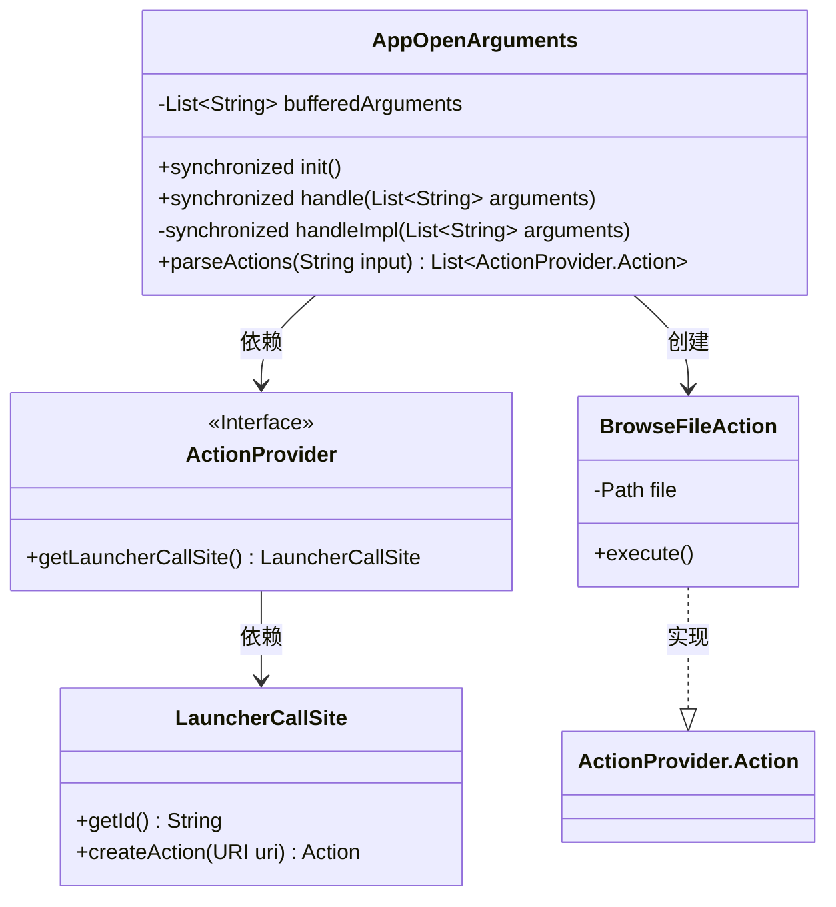
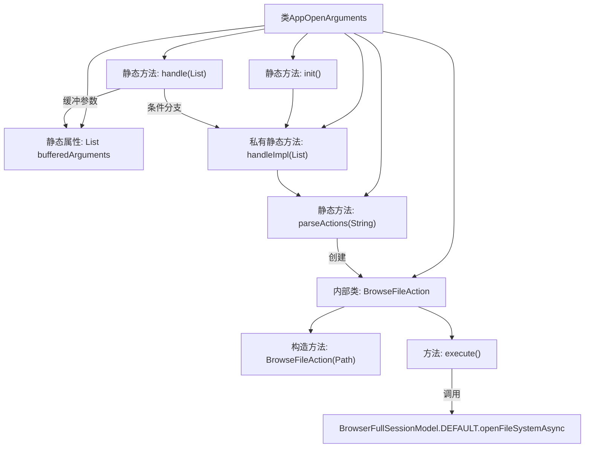
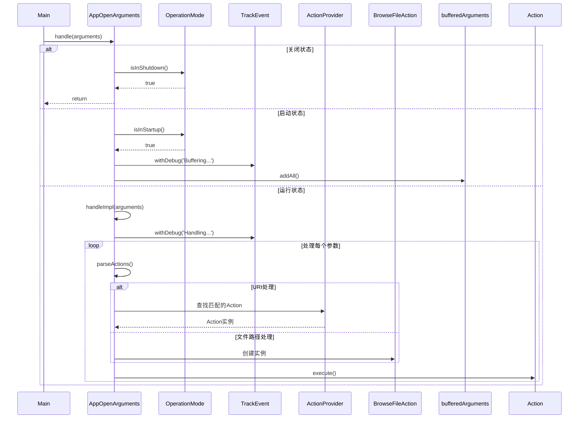

# 基础信息

|      |      |
|------|------|
| 名称 | AppOpenArguments |
| 编码语言 | .java |
| 代码路径 | xpipe/app/src/main/java/io/xpipe/app/core/AppOpenArguments.java |
| 包名 | io.xpipe.app.core |
| 依赖项 | ['io.xpipe.app.browser.BrowserFullSessionModel', 'io.xpipe.app.core.mode.OperationMode', 'io.xpipe.app.ext.ActionProvider', 'io.xpipe.app.issue.ErrorEvent', 'io.xpipe.app.issue.TrackEvent', 'io.xpipe.app.storage.DataStorage', 'io.xpipe.core.store.FilePath', 'lombok.Value', 'java.net.URI', 'java.nio.file.Files', 'java.nio.file.InvalidPathException', 'java.nio.file.Path', 'java.util.ArrayList', 'java.util.List'] |
| 概述说明 | 处理应用启动参数，支持缓冲、解析和执行文件浏览等操作。 |

# 说明

该代码定义了一个处理应用程序启动参数的类AppOpenArguments。主要功能包括：初始化时处理预存参数，根据运行模式缓冲或立即处理参数，解析参数生成对应操作并执行。支持文件路径和URI格式参数，能识别文件操作和自定义协议操作。包含BrowseFileAction内部类用于处理文件浏览操作，会检查文件存在性并触发浏览器会话打开文件系统。所有操作都包含错误处理和事件跟踪机制。

# 类列表 Class Summary

| 名称   | 类型  | 说明 |
|-------|------|-------------|
| AppOpenArguments | class | 处理应用启动参数，支持缓冲和执行文件浏览等操作。 |

## 类 AppOpenArguments

|      |      |
|------|------|
| 访问范围 | public |
| 类型 | class |
| 名称 | AppOpenArguments |
| 说明 | 处理应用启动参数，支持缓冲和执行文件浏览等操作。 |

### UML类图

这段代码描述了一个处理应用程序启动参数的类`AppOpenArguments`，它能够缓冲、解析和执行不同类型的启动参数。主要功能包括：在启动阶段缓冲参数，在运行阶段处理参数，解析URI或文件路径生成对应的动作（如浏览文件动作），并通过`ActionProvider`接口实现多态执行。`BrowseFileAction`是具体动作实现，用于处理文件浏览操作。整个设计采用同步方法保证线程安全，并通过事件跟踪和错误处理机制增强健壮性。

### 内部方法调用关系图

这段代码实现了一个应用程序参数处理器，主要功能包括：1) 在启动阶段缓冲参数；2) 解析URI或文件路径参数；3) 执行对应的操作动作。核心逻辑采用双重缓冲机制，通过handleImpl方法统一处理参数，支持文件浏览和自定义协议动作。流程图展示了类结构和主要方法调用关系，时序图详细描述了不同运行模式下的参数处理流程，包括关闭状态的快速返回、启动状态的参数缓冲以及运行状态的实际执行过程。

### 字段列表 Field List

| 名称  | 类型  | 说明 |
|-------|-------|------|
| bufferedArguments = new ArrayList<>() | List<String> | 私有静态字符串列表bufferedArguments初始化。 |

### 方法列表 Method List

| 名称  | 类型  | 说明 |
|-------|-------|------|
| handleImpl | void | 处理参数列表，解析并执行动作，捕获异常记录错误。 |
| parseActions | List<ActionProvider.Action> | 解析输入字符串生成动作列表，处理URI和文件路径，返回对应动作或空列表。 |
| handle | void | 静态同步方法处理参数列表，启动时缓存，关闭时忽略，否则执行处理。 |
| init | void | 静态同步方法init处理参数并清空缓冲。 |

