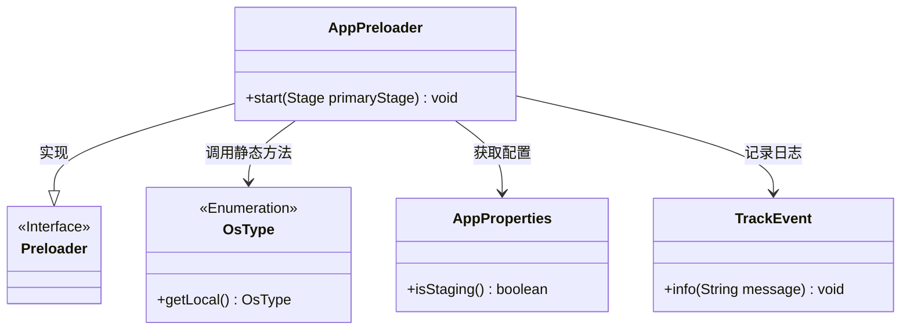
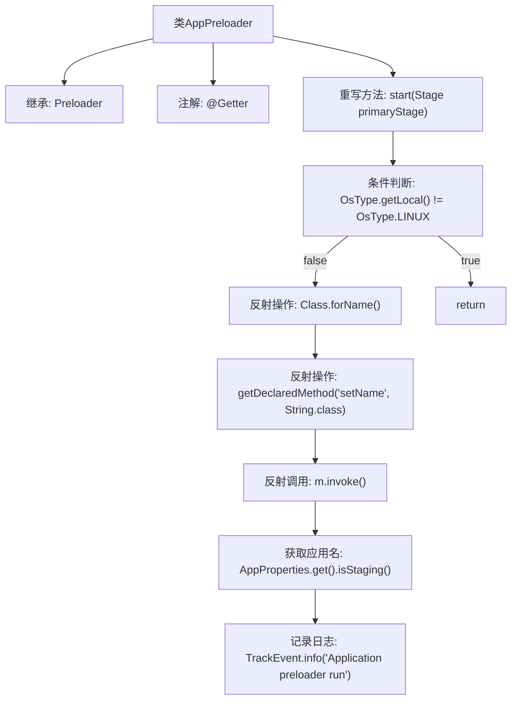

# 基础信息

|      |      |
|------|------|
| 名称 | AppPreloader |
| 编码语言 | .java |
| 代码路径 | xpipe/app/src/main/java/io/xpipe/app/core/AppPreloader.java |
| 包名 | io.xpipe.app.core |
| 依赖项 | ['io.xpipe.app.issue.TrackEvent', 'io.xpipe.core.process.OsType', 'javafx.application.Preloader', 'javafx.stage.Stage', 'lombok.Getter', 'lombok.SneakyThrows'] |
| 概述说明 | AppPreloader类在非Linux系统跳过，Linux下设置JavaFX应用名称并记录事件。 |

# 说明

这段代码描述了一个名为AppPreloader的Java类，继承自Preloader类。它重写了start方法，仅在非Linux系统上直接返回。在Linux系统下，通过反射机制动态加载并调用JavaFX内部API，设置应用程序名称（根据是否为测试版本选择"XPipe PTB"或"XPipe"）。最后记录一条应用程序预加载器运行的信息事件。整个过程使用了Lombok的@Getter注解和@SneakyThrows异常处理机制。

# 类列表 Class Summary

| 名称   | 类型  | 说明 |
|-------|------|-------------|
| AppPreloader | class | AppPreloader类在非Linux系统跳过，Linux下设置JavaFX应用名称并记录事件。 |

## 类 AppPreloader

|      |      |
|------|------|
| 访问范围 | @Getter;public |
| 类型 | class |
| 名称 | AppPreloader |
| 说明 | AppPreloader类在非Linux系统跳过，Linux下设置JavaFX应用名称并记录事件。 |

### UML类图

类图描述：
该图展示了AppPreloader类继承自Preloader接口，并依赖OsType、AppProperties和TrackEvent三个辅助类。AppPreloader的核心方法start()会检查操作系统类型，通过反射机制动态调用JavaFX内部API设置应用名称，并根据配置区分正式版和测试版，最后记录运行日志。整个设计体现了对系统环境的严格检查、灵活的反射调用和配置驱动的行为控制。

### 内部方法调用关系图

该流程图描述了AppPreloader类的核心逻辑流程。这是一个JavaFX预加载器，仅在Linux系统下执行特定操作。主要流程包括：检查操作系统类型，通过反射机制动态加载javafx.graphics模块中的Application类，调用setName方法设置应用程序名称（根据是否为测试版选择不同名称），最后记录运行日志。流程中特别突出了反射操作链和条件分支，展示了如何绕过IDE检查实现动态调用。

### 字段列表 Field List

| 名称  | 类型  | 说明 |
|-------|-------|------|

### 方法列表 Method List

| 名称  | 类型  | 说明 |
|-------|-------|------|
| start | void | 覆盖启动方法，检查系统为Linux后设置应用名称并记录日志。 |

