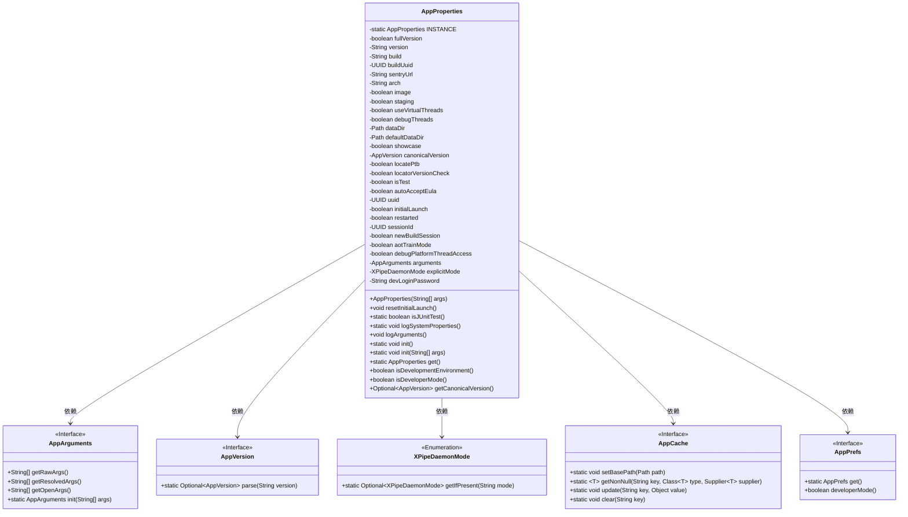

# 基础信息

|      |      |
|------|------|
| 名称 | AppProperties |
| 编码语言 | .java |
| 代码路径 | xpipe/app/src/main/java/io/xpipe/app/core/AppProperties.java |
| 包名 | io.xpipe.app.core |
| 依赖项 | ['io.xpipe.app.core.check.AppUserDirectoryCheck', 'io.xpipe.app.issue.ErrorEvent', 'io.xpipe.app.issue.TrackEvent', 'io.xpipe.app.prefs.AppPrefs', 'io.xpipe.core.util.XPipeDaemonMode', 'lombok.Getter', 'lombok.Value', 'java.io.IOException', 'java.nio.file.Files', 'java.nio.file.Path', 'java.util'] |
| 概述说明 | 应用配置类，包含版本、构建、数据目录等属性，支持开发和生产环境设置。 |

# 说明

AppProperties类是一个单例配置类，用于管理应用程序的全局属性和运行时状态。它通过系统属性和配置文件初始化各种参数，包括版本信息、构建标识、数据目录路径、线程调试标志、开发者模式开关等。该类会从dev.properties文件加载额外配置，并处理命令行参数。它还负责生成唯一会话ID、检测单元测试环境、管理用户目录验证，并通过事件跟踪记录系统属性和启动参数。类提供了静态方法获取实例，并包含开发环境检测逻辑。

# 类列表 Class Summary

| 名称   | 类型  | 说明 |
|-------|------|-------------|
| AppProperties | class | 应用属性类，包含版本、构建、数据目录等配置信息，支持开发环境检测和系统属性加载。 |


## 类 AppProperties

|      |      |
|------|------|
| 访问范围 | @Value;public |
| 类型 | class |
| 名称 | AppProperties |
| 说明 | 应用属性类，包含版本、构建、数据目录等配置信息，支持开发环境检测和系统属性加载。 |


### UML类图



该代码定义了一个AppProperties类，用于管理应用程序的配置属性。它包含多个私有字段存储各种配置信息，如版本号、构建信息、数据目录路径等。类提供了静态方法初始化单例实例，以及获取配置信息的方法。AppProperties依赖于多个其他类，包括AppArguments处理命令行参数，AppVersion管理版本信息，XPipeDaemonMode表示守护进程模式，AppCache提供缓存功能，AppPrefs处理用户偏好设置。整个设计采用单例模式，确保全局配置的一致性。


### 内部方法调用关系图

```mermaid
graph TD
    A["类AppProperties"]
    B["静态属性: INSTANCE"]
    C["布尔属性: fullVersion/image/staging..."]
    D["字符串属性: version/build/sentryUrl..."]
    E["UUID属性: buildUuid/uuid/sessionId"]
    F["路径属性: dataDir/defaultDataDir"]
    G["构造方法: AppProperties(String[] args)"]
    H["方法: resetInitialLaunch()"]
    I["方法: isJUnitTest()"]
    J["静态方法: logSystemProperties()"]
    K["方法: logArguments()"]
    L["静态方法: init()/init(String[] args)"]
    M["静态方法: get()"]
    N["方法: isDevelopmentEnvironment()"]
    O["方法: isDeveloperMode()"]
    P["方法: getCanonicalVersion()"]

    A --> B
    A --> C
    A --> D
    A --> E
    A --> F
    A --> G
    G -->|读取| "dev.properties"
    G -->|初始化| "arguments/fullVersion/version..."
    G -->|检查| "AppUserDirectoryCheck"
    G -->|设置| "AppCache"
    A --> H
    A --> I
    A --> J
    A --> K
    A --> L
    L --> G
    A --> M
    A --> N
    N --> O
    N -->|依赖| "AppPrefs"
    A --> P
```

这段代码流程图展示了AppProperties类的完整结构，它是一个单例模式的配置管理类，负责处理应用程序的各种属性和设置。流程图从类定义开始，详细展示了所有属性字段（包括静态实例、布尔标志、字符串值、UUID标识符和路径对象），然后重点描述了构造函数的复杂初始化流程（包括读取属性文件、参数解析、目录检查和缓存设置），最后列出了各类方法（包括实例方法、静态工具方法和环境检查方法）。特别值得注意的是构造函数与其他组件（如AppArguments、AppCache）的交互关系，以及开发环境检测时与AppPrefs的依赖关系。

### 字段列表 Field List

| 名称  | 类型  | 说明 |
|-------|-------|------|
| dataDir | Path | 路径变量dataDir |
| INSTANCE | AppProperties | 私有静态AppProperties实例 |
| version | String | 获取版本号的Getter方法。 |
| sentryUrl | String | 字符串变量sentryUrl声明。 |
| image | boolean | 获取布尔值image的方法 |
| newBuildSession | boolean | 新建构建会话标志 |
| devLoginPassword | String | 字符串类型开发登录密码变量。 |
| debugPlatformThreadAccess | boolean | 调试平台线程访问标志 |
| initialLaunch | boolean | 布尔变量初始启动标志 |
| locatePtb | boolean | 声明布尔变量locatePtb |
| explicitMode | XPipeDaemonMode | XPipeDaemonMode显式模式声明 |
| autoAcceptEula | boolean | 自动接受EULA协议。 |
| isTest | boolean | 定义布尔变量isTest。 |
| buildUuid | UUID | 构建唯一标识符UUID。 |
| arguments | AppArguments | 应用参数变量声明 |
| debugThreads | boolean | 布尔型变量debugThreads，用于线程调试。 |
| arch | String | 字符串类型变量arch。 |
| aotTrainMode | boolean | 布尔型变量aotTrainMode |
| restarted | boolean | 布尔变量restarted |
| useVirtualThreads | boolean | 使用虚拟线程的布尔标志。 |
| build | String | 生成Getter方法，返回String类型build变量。 |
| uuid | UUID | UUID是通用唯一标识符，用于唯一标识信息。 |
| sessionId | UUID | 会话ID标识符 |
| showcase | boolean | 布尔展示 |
| canonicalVersion | AppVersion | 应用版本规范号。 |
| locatorVersionCheck | boolean | 布尔变量locatorVersionCheck |
| staging | boolean | 布尔型变量staging |
| defaultDataDir | Path | 定义默认数据目录路径变量。 |
| fullVersion | boolean | 布尔型变量fullVersion |

### 方法列表 Method List

| 名称  | 类型  | 说明 |
|-------|-------|------|
| logArguments | void | 记录版本、构建、参数及系统属性信息。 |
| init | void | 静态方法初始化单例实例，若存在则直接返回。 |
| init | void | 静态方法init，无参调用带参初始化方法。 |
| resetInitialLaunch | void | 清除应用缓存的最后构建ID。 |
| isJUnitTest | boolean | 检查当前代码是否在JUnit测试中运行。 |
| logSystemProperties | void | 打印系统属性user.dir的值。 |
| get | AppProperties | 获取AppProperties单例实例。 |
| isDevelopmentEnvironment | boolean | 检查是否为开发环境：非镜像且开发者模式开启。 |
| isDeveloperMode | boolean | 检查开发者模式状态，为空返回false，否则返回设定值。 |
| getCanonicalVersion | Optional<AppVersion> | 方法返回可选的应用规范版本对象。 |


