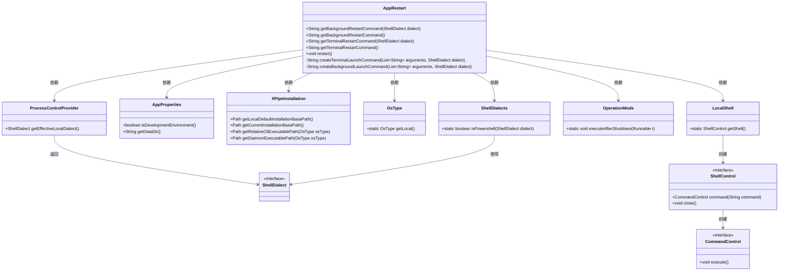
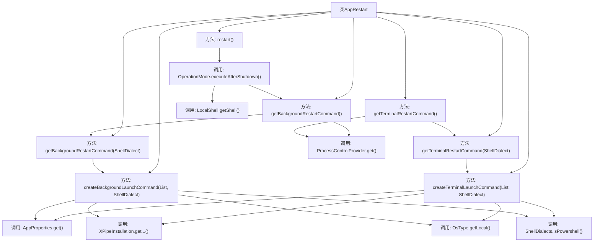

# 基础信息

|      |      |
|------|------|
| 名称 | AppRestart |
| 编码语言 | .java |
| 代码路径 | xpipe/app/src/main/java/io/xpipe/app/core/AppRestart.java |
| 包名 | io.xpipe.app.core |
| 依赖项 | ['io.xpipe.app.core.mode.OperationMode', 'io.xpipe.app.ext.ProcessControlProvider', 'io.xpipe.app.util.LocalShell', 'io.xpipe.core.process.OsType', 'io.xpipe.core.process.ShellDialect', 'io.xpipe.core.process.ShellDialects', 'io.xpipe.core.util.XPipeInstallation', 'java.util.List'] |
| 概述说明 | 生成应用重启命令，支持终端和后台模式，适配不同操作系统和Shell方言。 |

# 说明

该代码定义了一个AppRestart类，主要用于生成应用程序重启命令。包含两个核心方法：createTerminalLaunchCommand和createBackgroundLaunchCommand，分别生成终端和后台重启命令。方法根据操作系统类型（Linux、MacOS、Windows）和Shell方言（如PowerShell）动态构建不同的命令行字符串。重启命令包含应用程序模式、数据目录、EULA接受状态等参数。类还提供了getTerminalRestartCommand和getBackgroundRestartCommand方法获取对应命令，以及直接执行重启的restart方法。

# 类列表 Class Summary

| 名称   | 类型  | 说明 |
|-------|------|-------------|
| AppRestart | class | AppRestart类提供终端和后台重启命令生成方法，支持不同系统和Shell方言。 |

## 类 AppRestart

|      |      |
|------|------|
| 访问范围 | public |
| 类型 | class |
| 名称 | AppRestart |
| 说明 | AppRestart类提供终端和后台重启命令生成方法，支持不同系统和Shell方言。 |

### UML类图

该代码实现了一个应用程序重启功能，主要包含终端和后台两种重启方式。AppRestart类通过调用XPipeInstallation获取安装路径，结合AppProperties配置和ShellDialect方言设置，生成不同操作系统下的重启命令。核心方法createTerminalLaunchCommand和createBackgroundLaunchCommand根据操作系统类型和shell方言构造对应的命令行字符串，支持Linux、MacOS和Windows平台，并能处理Powershell和普通cmd的语法差异。最后通过LocalShell执行生成的命令实现重启功能。

### 内部方法调用关系图

这段代码流程图展示了AppRestart类的核心功能结构。该类主要用于生成不同环境下的应用程序重启命令，包含终端模式和后台模式两种启动方式。流程从7个公共方法出发，逐步展开内部调用关系，涉及操作系统类型判断、Shell方言处理、安装路径获取等关键操作。其中createTerminalLaunchCommand和createBackgroundLaunchCommand是核心私有方法，根据不同操作系统和Shell类型生成对应的命令行字符串。公共方法最终通过OperationMode和LocalShell实现实际的应用程序重启功能。

### 字段列表 Field List

| 名称  | 类型  | 说明 |
|-------|-------|------|

### 方法列表 Method List

| 名称  | 类型  | 说明 |
|-------|-------|------|
| getBackgroundRestartCommand | String | 获取后台重启命令的方法，调用本地方言参数。 |
| getBackgroundRestartCommand | String | 生成后台重启命令，包含GUI模式、数据目录和重启标志。 |
| getTerminalRestartCommand | String | 生成终端重启命令，包含GUI模式、EULA接受、数据目录和重启标志参数。 |
| createBackgroundLaunchCommand | String | 生成后台启动命令，根据操作系统和参数选择不同执行方式。 |
| createTerminalLaunchCommand | String | 生成终端启动命令，根据系统和参数调整路径与语法。 |
| getTerminalRestartCommand | String | 获取终端重启命令的方法，调用本地方言参数。 |
| restart | void | 静态方法restart()执行关机后操作，调用后台重启命令。 |

