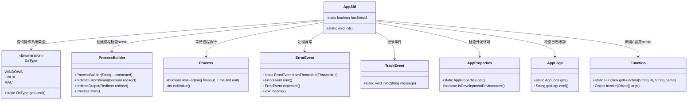

# 基础信息

|      |      |
|------|------|
| 名称 | AppSid |
| 编码语言 | .java |
| 代码路径 | xpipe/app/src/main/java/io/xpipe/app/core/AppSid.java |
| 包名 | io.xpipe.app.core |
| 依赖项 | ['io.xpipe.app.issue.ErrorEvent', 'io.xpipe.app.issue.TrackEvent', 'io.xpipe.core.process.OsType', 'com.sun.jna.Function', 'lombok.Getter', 'java.util.concurrent.TimeUnit'] |
| 概述说明 | 检查系统setsid命令，若无则尝试调用c函数设置进程sid，开发环境除外。 |

# 说明

AppSid类用于检测和设置进程会话ID。首先检查操作系统是否为Windows，若是则直接返回。非Windows系统会尝试查找setsid命令，若存在则标记hasSetsid为true并记录事件。开发或调试模式下不执行后续操作。若未找到setsid命令，则通过本地函数调用setsid来设置进程会话ID，防止命令访问父终端，成功时记录事件，失败则处理异常。整个过程注重错误处理和日志记录。

# 类列表 Class Summary

| 名称   | 类型  | 说明 |
|-------|------|-------------|
| AppSid | class | 检查setsid命令可用性，非Windows环境初始化进程会话ID，开发模式跳过。 |

## 类 AppSid

|      |      |
|------|------|
| 访问范围 | public |
| 类型 | class |
| 名称 | AppSid |
| 说明 | 检查setsid命令可用性，非Windows环境初始化进程会话ID，开发模式跳过。 |

### UML类图

这段代码实现了一个跨平台的进程会话ID管理工具，主要功能是检测并设置进程的会话ID(sid)。类图展示了核心类AppSid及其依赖关系，它通过ProcessBuilder检查系统是否存在setsid命令，若不存在则尝试通过JNI调用C库的setsid函数。整个过程考虑了操作系统类型判断、异常处理、环境检测和日志记录等关键环节，体现了对Windows/Linux/Mac的兼容性处理和安全防护机制。

### 内部方法调用关系图

这段代码流程图展示了AppSid类的初始化过程，主要功能是检测和设置进程会话ID(setsid)。首先检查操作系统类型，如果是Windows则直接返回。对于非Windows系统，会尝试查找setsid命令，若存在则记录日志。在非开发环境下，会尝试通过本地函数调用setsid来创建新会话。整个过程包含完善的错误处理机制，通过TrackEvent和ErrorEvent记录执行状态和异常情况。

### 字段列表 Field List

| 名称  | 类型  | 说明 |
|-------|-------|------|
| hasSetsid | boolean | 私有静态布尔变量hasSetsid |

### 方法列表 Method List

| 名称  | 类型  | 说明 |
|-------|-------|------|
| init | void | 检查系统是否支持setsid命令，不支持时尝试调用c函数设置进程sid。 |

