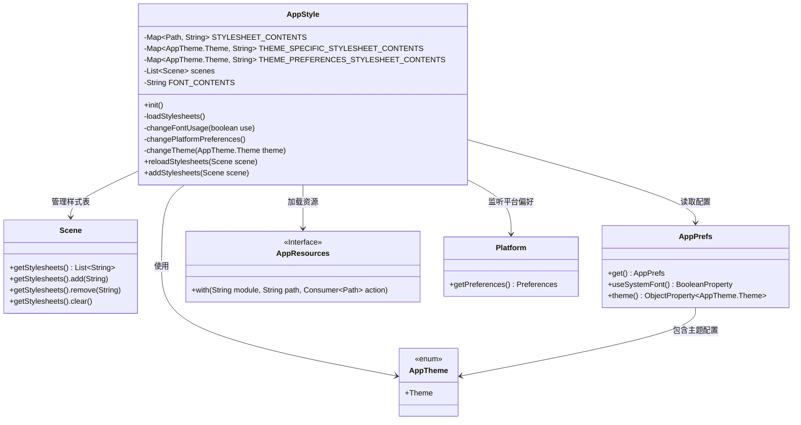
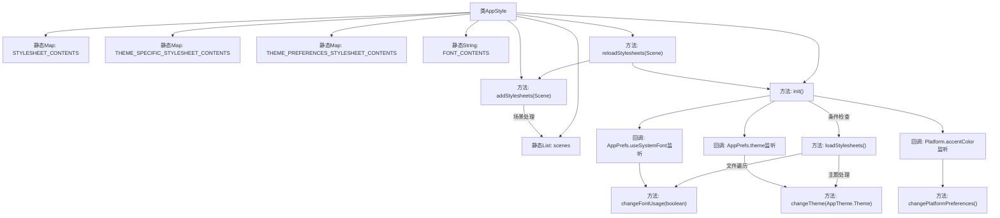

# 基础信息

|      |      |
|------|------|
| 名称 | AppStyle |
| 编码语言 | .java |
| 代码路径 | xpipe/app/src/main/java/io/xpipe/app/core/AppStyle.java |
| 包名 | io.xpipe.app.core |
| 依赖项 | ['io.xpipe.app.issue.ErrorEvent', 'io.xpipe.app.issue.TrackEvent', 'io.xpipe.app.prefs.AppPrefs', 'io.xpipe.app.resources.AppResources', 'javafx.application.Platform', 'javafx.scene.Scene', 'atlantafx.base.theme.Styles', 'java.io.IOException', 'java.nio.file.FileVisitResult', 'java.nio.file.Files', 'java.nio.file.Path', 'java.nio.file.SimpleFileVisitor', 'java.nio.file.attribute.BasicFileAttributes', 'java.util'] |
| 概述说明 | 管理样式表、字体和主题的JavaFX工具类。 |

# 说明

AppStyle类管理应用程序样式表，包含静态映射存储样式表内容、主题特定样式和主题偏好样式。初始化时加载样式表，监听字体和主题变化。loadStylesheets方法加载字体配置和模块样式，使用Base64编码数据URL存储。changeFontUsage和changeTheme方法根据用户偏好更新场景样式。reloadStylesheets和addStylesheets方法用于重新加载和添加样式表到场景。

# 类列表 Class Summary

| 名称   | 类型  | 说明 |
|-------|------|-------------|
| AppStyle | class | 管理样式表、字体和主题的JavaFX应用工具类。 |

## 类 AppStyle

|      |      |
|------|------|
| 访问范围 | public |
| 类型 | class |
| 名称 | AppStyle |
| 说明 | 管理样式表、字体和主题的JavaFX应用工具类。 |

### UML类图

这段代码描述了一个JavaFX样式管理类AppStyle，它负责加载、缓存和应用CSS样式表。通过静态Map存储不同模块和主题的样式内容，提供字体切换、主题变更和平台偏好设置变更的响应式处理。核心功能包括初始化加载样式表、动态切换字体/主题、场景样式表管理，并与AppPrefs配置系统深度集成。类图中展示了与AppTheme枚举、Scene场景类、AppPrefs配置类及资源加载接口的关键交互关系。

### 内部方法调用关系图

该流程图展示了AppStyle类的核心结构和交互逻辑。类通过静态Map存储样式表内容，包含初始化、样式加载、字体/主题变更处理三大功能模块。初始化时会注册三个监听器，分别响应字体设置、主题切换和平台颜色偏好变化。样式加载过程采用文件遍历方式处理CSS/BSS文件，并转换为Base64数据URL。主题切换时会同步更新所有场景的样式表，维护了场景列表以实现批量操作。整体设计体现了观察者模式和资源集中管理的思想。

### 字段列表 Field List

| 名称  | 类型  | 说明 |
|-------|-------|------|
| scenes = new ArrayList<>() | List<Scene> | 私有静态场景列表初始化。 |
| THEME_PREFERENCES_STYLESHEET_CONTENTS = new LinkedHashMap<>() | Map<AppTheme.Theme, String> | 私有静态最终映射表，存储主题与样式表内容的关联。 |
| THEME_SPECIFIC_STYLESHEET_CONTENTS = new LinkedHashMap<>() | Map<AppTheme.Theme, String> | 私有静态映射，存储主题与样式表内容的对应关系。 |
| STYLESHEET_CONTENTS = new LinkedHashMap<>() | Map<Path, String> | 私有静态常量映射表，存储路径与样式表内容的关联。 |
| FONT_CONTENTS = "" | String | 私有静态字符串变量FONT_CONTENTS初始化为空。 |

### 方法列表 Method List

| 名称  | 类型  | 说明 |
|-------|-------|------|
| changeTheme | void | 私有方法changeTheme切换场景主题，移除旧样式并添加新主题样式。 |
| reloadStylesheets | void | 清空样式表并重新加载场景样式。 |
| addStylesheets | void | 静态方法为场景添加样式表，检查偏好设置并加载字体、主题相关样式。记录调试信息并保存场景引用。 |
| init | void | 初始化方法：检查样式表，加载并监听字体、主题和平台偏好设置变化。 |
| loadStylesheets | void | 加载字体和样式表，使用Base64编码数据URL存储。遍历模块处理CSS和BSS文件，并管理主题特定样式。 |
| changeFontUsage | void | 切换字体使用状态：根据参数添加或移除场景字体样式表。 |
| changePlatformPreferences | void | 私有方法修改平台主题偏好，检查并更新场景样式表。 |

