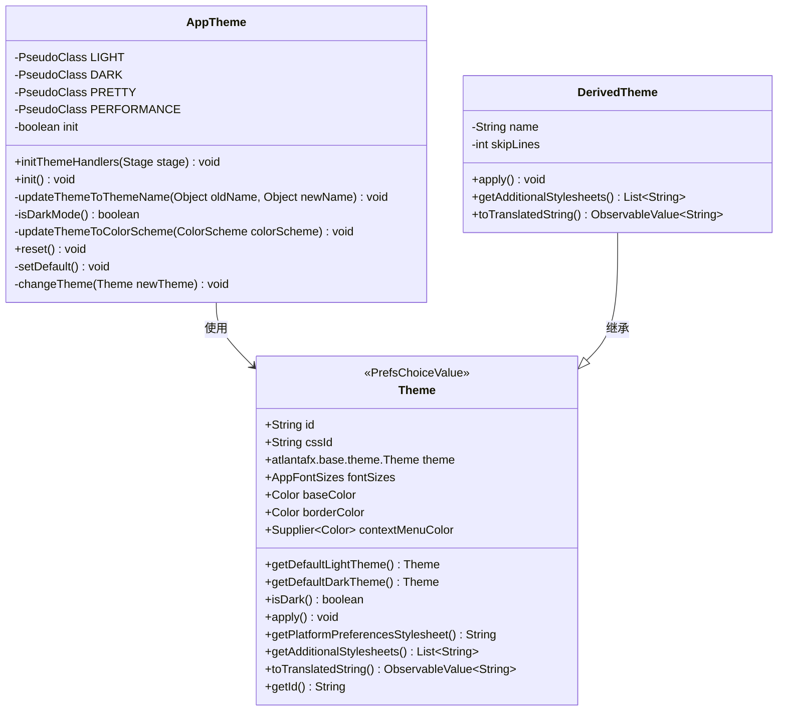
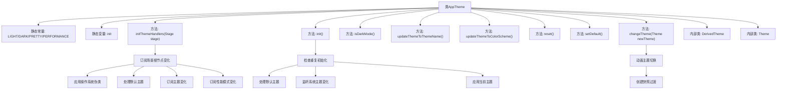
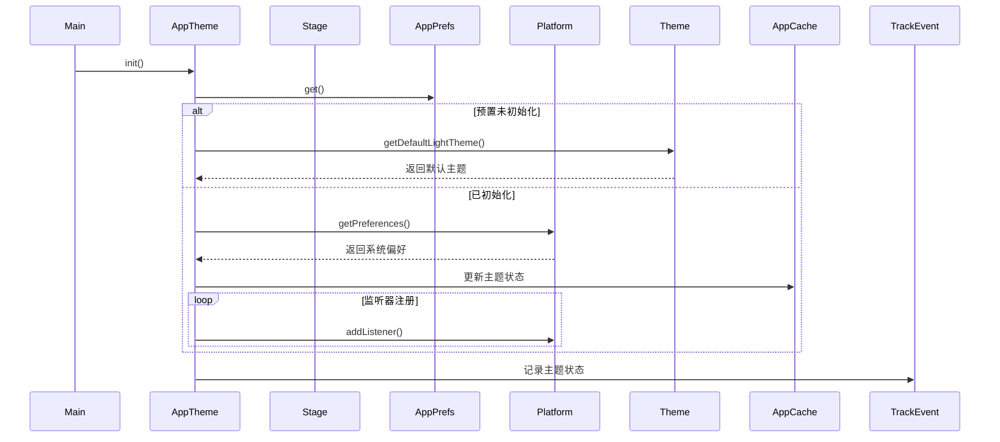

# 基础信息

|      |      |
|------|------|
| 名称 | AppTheme |
| 编码语言 | .java |
| 代码路径 | xpipe/app/src/main/java/io/xpipe/app/core/AppTheme.java |
| 包名 | io.xpipe.app.core |
| 依赖项 | ['io.xpipe.app.core.window.AppMainWindow', 'io.xpipe.app.ext.PrefsChoiceValue', 'io.xpipe.app.issue.ErrorEvent', 'io.xpipe.app.issue.TrackEvent', 'io.xpipe.app.prefs.AppPrefs', 'io.xpipe.app.resources.AppResources', 'io.xpipe.app.util.ColorHelper', 'io.xpipe.app.util.PlatformThread', 'io.xpipe.core.process.OsType', 'javafx.animation.Interpolator', 'javafx.animation.KeyFrame', 'javafx.animation.KeyValue', 'javafx.animation.Timeline', 'javafx.application.Application', 'javafx.application.ColorScheme', 'javafx.application.Platform', 'javafx.beans.property.SimpleStringProperty', 'javafx.beans.value.ObservableValue', 'javafx.collections.MapChangeListener', 'javafx.css.PseudoClass', 'javafx.scene.image.Image', 'javafx.scene.image.ImageView', 'javafx.scene.layout.Pane', 'javafx.scene.paint.Color', 'javafx.stage.Stage', 'javafx.util.Duration', 'atlantafx.base.theme', 'lombok.AllArgsConstructor', 'lombok.Getter', 'lombok.SneakyThrows', 'java.nio.file.Files', 'java.util.List', 'java.util.function.Supplier', 'java.util.stream.Collectors'] |
| 概述说明 | 应用主题管理类，支持亮暗模式切换及自定义主题。 |

# 说明

该代码定义了一个应用主题管理类AppTheme，包含主题初始化、切换和动态更新功能。主要特性包括：支持亮暗主题切换（LIGHT/DARK）、性能模式（PERFORMANCE/PRETTY）和多种预设主题（如PRIMER、NORD、CUPERTINO等）；自动检测系统颜色方案并同步；提供主题动画过渡效果；通过DerivedTheme支持自定义主题扩展。核心方法包括initThemeHandlers初始化主题处理器、init执行主题初始化逻辑、changeTheme处理主题切换。主题类Theme封装了样式表、字体大小、基础颜色等属性，并支持跨平台默认主题适配。

# 类列表 Class Summary

| 名称   | 类型  | 说明 |
|-------|------|-------------|
| AppTheme | class | 应用主题管理类，支持深浅模式切换，包含多种预设主题和自定义主题功能。 |

## 类 AppTheme

|      |      |
|------|------|
| 访问范围 | public |
| 类型 | class |
| 名称 | AppTheme |
| 说明 | 应用主题管理类，支持深浅模式切换，包含多种预设主题和自定义主题功能。 |

### UML类图

类图描述：该图展示了AppTheme主题管理类的核心结构，包含静态初始化方法和主题切换逻辑。Theme类作为基础主题抽象，定义了明暗模式、字体大小等通用属性，并通过DerivedTheme实现具体主题扩展。AppTheme通过监听系统偏好设置和平台事件来动态调整主题，支持平滑过渡动画和性能模式切换，体现了完整的主题管理系统架构。

### 内部方法调用关系图

这段代码实现了一个复杂的主题管理系统，主要功能包括：1) 初始化阶段处理系统主题与用户偏好；2) 动态响应系统主题变化；3) 提供平滑的主题切换动画；4) 支持多种预置主题和自定义主题。核心类AppTheme通过静态方法管理主题状态，内部类Theme和DerivedTheme定义了具体主题实现，使用观察者模式监听系统偏好变化，并通过JavaFX的PseudoClass机制实现主题切换。系统会优先使用用户设置的主题，当未设置时自动匹配操作系统当前主题，并支持亮色/暗色模式自动切换。

### 字段列表 Field List

| 名称  | 类型  | 说明 |
|-------|-------|------|
| init | boolean | 私有静态布尔初始化标志 |
| DARK = PseudoClass.getPseudoClass("dark") | PseudoClass | 定义私有静态常量DARK，值为伪类"dark"。 |
| PERFORMANCE = PseudoClass.getPseudoClass("performance") | PseudoClass | 私有静态常量PERFORMANCE通过PseudoClass获取"performance"伪类。 |
| PRETTY = PseudoClass.getPseudoClass("pretty") | PseudoClass | 定义静态常量PRETTY，值为伪类"pretty"。 |
| LIGHT = PseudoClass.getPseudoClass("light") | PseudoClass | 定义静态常量LIGHT，值为伪类"light"。 |

### 方法列表 Method List

| 名称  | 类型  | 说明 |
|-------|-------|------|
| updateThemeToThemeName | void | Linux系统下根据主题名更新颜色方案，暗亮模式切换。 |
| initThemeHandlers | void | 初始化主题处理器，设置根节点样式和伪类状态，响应主题和性能模式变化。 |
| init | void | 初始化主题设置，检查系统偏好，监听主题变化并应用。 |
| isDarkMode | boolean | 检查系统是否启用暗色模式。 |
| updateThemeToColorScheme | void | 根据颜色方案更新主题：暗色时设为默认暗主题，否则设为默认亮主题。 |
| reset | void | 静态方法reset检查初始化状态，若未初始化则返回；否则在UI线程中更新暗黑模式缓存。 |
| setDefault | void | 设置默认主题：根据系统颜色方案选择暗色或亮色主题，异常时默认亮色。 |
| changeTheme | void | 切换主题方法：检查空值后，根据性能模式决定是否动画过渡应用新主题。 |

