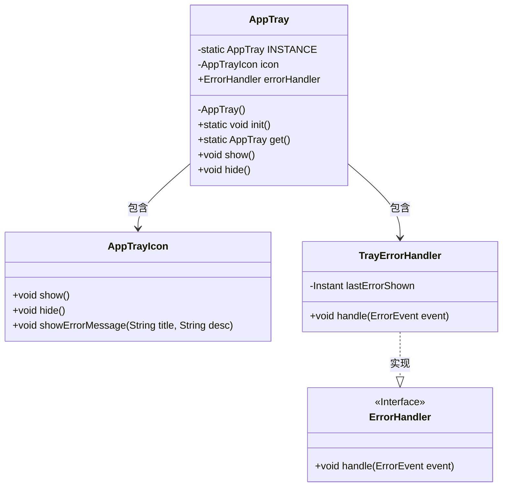
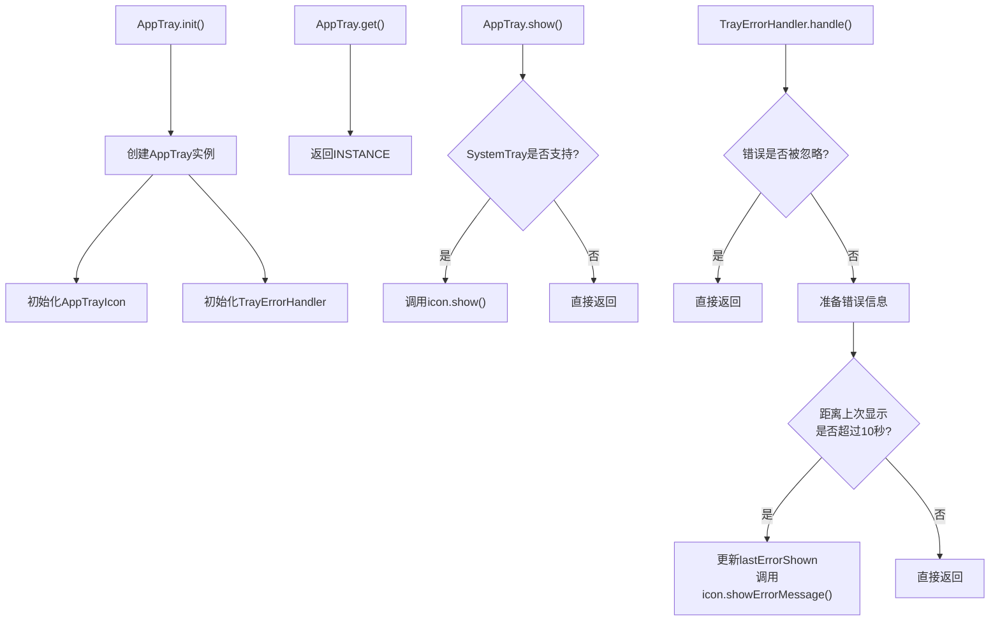
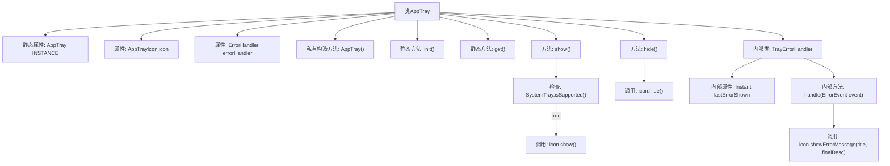
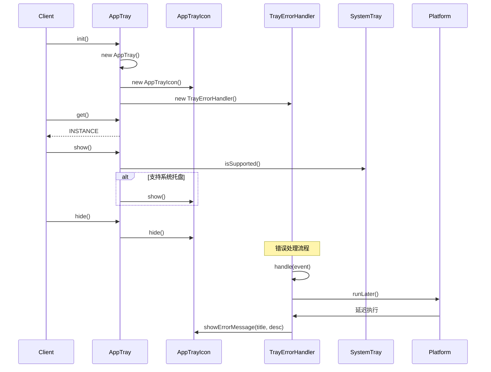

# 基础信息

|      |      |
|------|------|
| 名称 | AppTray |
| 编码语言 | .java |
| 代码路径 | xpipe/app/src/main/java/io/xpipe/app/core/AppTray.java |
| 包名 | io.xpipe.app.core |
| 依赖项 | ['io.xpipe.app.issue.ErrorEvent', 'io.xpipe.app.issue.ErrorHandler', 'javafx.application.Platform', 'lombok.Getter', 'lombok.SneakyThrows', 'java.awt', 'java.time.Duration', 'java.time.Instant'] |
| 概述说明 | AppTray类实现系统托盘图标管理，包含错误处理和显示控制功能。 |

# 说明

该代码定义了一个单例类AppTray，用于管理系统托盘图标和错误处理。类中包含私有静态实例INSTANCE、托盘图标icon和错误处理器errorHandler。构造函数初始化这两个成员，其中错误处理器使用内部类TrayErrorHandler实现。提供静态方法init初始化实例，get获取实例。show和hide方法控制图标显示隐藏，会检查系统托盘支持。TrayErrorHandler处理错误事件，过滤已忽略错误，生成错误标题和描述，限制10秒内不重复显示，最终通过托盘图标展示错误信息。

# 类列表 Class Summary

| 名称   | 类型  | 说明 |
|-------|------|-------------|
| AppTray | class | AppTray单例类，管理托盘图标和错误处理，支持显示/隐藏及错误提示。 |

## 类 AppTray

|      |      |
|------|------|
| 访问范围 | public |
| 类型 | class |
| 名称 | AppTray |
| 说明 | AppTray单例类，管理托盘图标和错误处理，支持显示/隐藏及错误提示。 |

### UML类图

这段代码实现了一个系统托盘应用的单例管理类，包含错误处理功能。AppTray通过静态方法提供单例访问，内部维护AppTrayIcon用于托盘图标显示，以及TrayErrorHandler实现ErrorHandler接口处理错误事件。流程图展示了初始化、获取实例、显示托盘和错误处理的完整流程，特别注意了错误显示的频率控制（10秒间隔）和系统托盘支持的运行时检查。

### 内部方法调用关系图

这段代码实现了一个系统托盘应用的单例模式，包含图标显示/隐藏功能和错误处理机制。流程图展示了类结构关系，其中核心是AppTray单例类，通过内部类TrayErrorHandler处理错误事件，并依赖AppTrayIcon实现托盘图标操作。时序图则演示了初始化、显示/隐藏托盘以及错误处理的完整调用链，特别注意错误处理采用了Platform.runLater()实现线程安全的消息延迟展示。

### 字段列表 Field List

| 名称  | 类型  | 说明 |
|-------|-------|------|
| icon | AppTrayIcon | 私有成员变量icon，类型为AppTrayIcon。 |
| INSTANCE | AppTray | 单例模式下的静态实例变量。 |
| errorHandler | ErrorHandler | 私有终态错误处理器，通过Getter访问。 |

### 方法列表 Method List

| 名称  | 类型  | 说明 |
|-------|-------|------|
| hide | void | 隐藏图标。 |
| init | void | 静态方法初始化应用托盘实例。 |
| get | AppTray | 获取AppTray单例实例。 |
| show | void | 方法检查系统托盘支持，不支持则退出，支持则显示图标。 |

