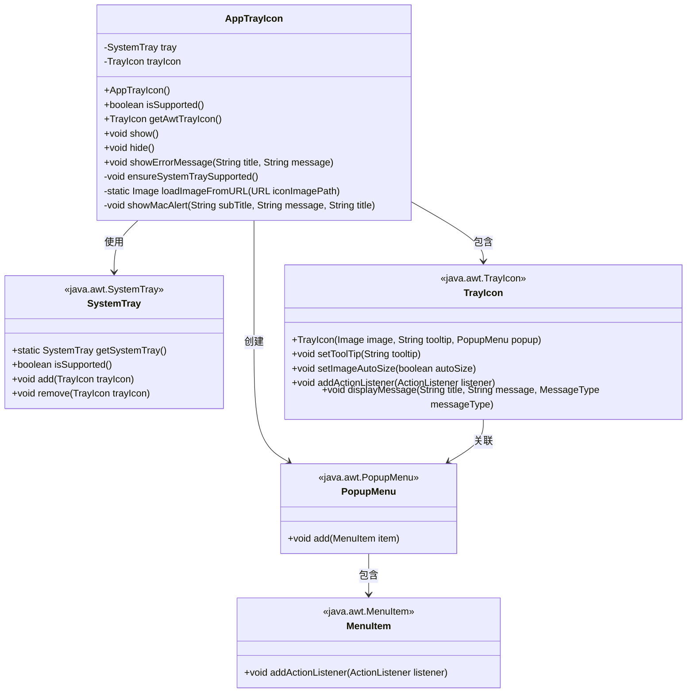

# 基础信息

|      |      |
|------|------|
| 名称 | AppTrayIcon |
| 编码语言 | .java |
| 代码路径 | xpipe/app/src/main/java/io/xpipe/app/core/AppTrayIcon.java |
| 包名 | io.xpipe.app.core |
| 依赖项 | ['io.xpipe.app.core.mode.OperationMode', 'io.xpipe.app.issue.ErrorEvent', 'io.xpipe.app.resources.AppImages', 'io.xpipe.app.resources.AppResources', 'io.xpipe.core.process.OsType', 'java.awt', 'java.io.IOException', 'java.net.URL', 'javax.imageio.ImageIO'] |
| 概述说明 | AppTrayIcon类实现系统托盘图标功能，支持不同操作系统图标、菜单操作及错误提示。 |

# 说明

AppTrayIcon类实现了系统托盘图标功能，支持Windows、Linux和MacOS平台。它根据操作系统类型加载不同尺寸的图标资源，并创建包含打开和退出选项的右键菜单。打开菜单会切换到GUI模式，退出菜单会关闭应用。双击托盘图标在非Mac系统上也会触发打开操作。类提供了显示/隐藏图标、显示错误消息的方法，其中MacOS使用系统通知而非托盘消息。包含对系统托盘支持的检查，以及图标加载失败时的默认处理。所有GUI操作都通过EventQueue异步执行以确保线程安全。

# 类列表 Class Summary

| 名称   | 类型  | 说明 |
|-------|------|-------------|
| AppTrayIcon | class | 创建系统托盘图标，支持不同操作系统，含打开和退出功能。 |

## 类 AppTrayIcon

|      |      |
|------|------|
| 访问范围 | public |
| 类型 | class |
| 名称 | AppTrayIcon |
| 说明 | 创建系统托盘图标，支持不同操作系统，含打开和退出功能。 |

### UML类图

这段代码实现了一个系统托盘图标功能类AppTrayIcon，它封装了不同操作系统下的托盘图标创建、显示/隐藏、错误消息提示等功能。该类通过SystemTray和TrayIcon与系统托盘交互，支持Windows、Linux和MacOS系统，能根据操作系统类型加载不同尺寸的图标，提供打开应用和退出应用的菜单项，并处理了各种异常情况如Linux系统下的图标添加失败等。

### 内部方法调用关系图

这段代码实现了一个系统托盘图标功能，主要包含图标初始化、右键菜单管理和跨平台错误消息显示。流程图展示了从构造方法开始的完整初始化流程，包括系统托盘支持检查、图标资源加载、菜单项创建等关键步骤，以及后续的显示/隐藏控制和错误处理机制。特别注意处理了不同操作系统(Windows/Linux/MacOS)的差异化实现，特别是MacOS的特殊消息通知方式。

### 字段列表 Field List

| 名称  | 类型  | 说明 |
|-------|-------|------|
| trayIcon | TrayIcon | 私有托盘图标变量trayIcon |
| tray | SystemTray | 私有系统托盘对象tray |

### 方法列表 Method List

| 名称  | 类型  | 说明 |
|-------|-------|------|
| showErrorMessage | void | 显示错误信息，Mac用弹窗，其他系统用托盘通知。 |
| loadImageFromURL | Image | 从URL加载图像，失败时返回默认图像。 |
| isSupported | boolean | 检查桌面和系统托盘是否支持。 |
| getAwtTrayIcon | TrayIcon | 获取AWT托盘图标对象的方法。 |
| show | void | Java方法：异步添加系统托盘图标，捕获Linux异常并处理。 |
| hide | void | 隐藏托盘图标：通过事件队列异步移除。 |
| ensureSystemTraySupported | void | 检查系统托盘支持，不支持则抛出异常。 |
| showMacAlert | void | Mac弹窗方法：通过osascript显示通知，含标题、副标题和消息，异常时抛出错误。 |

