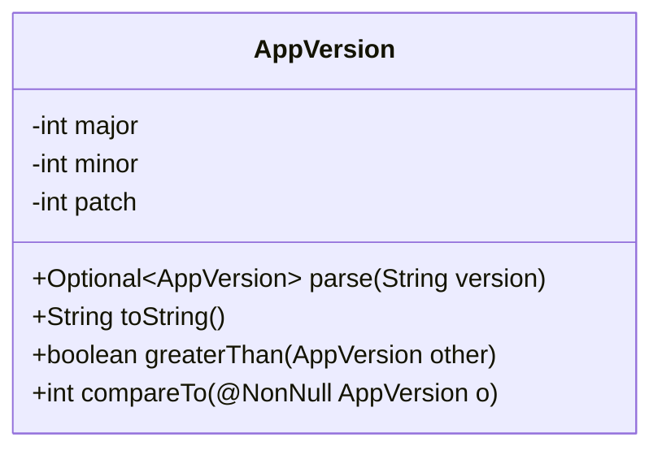
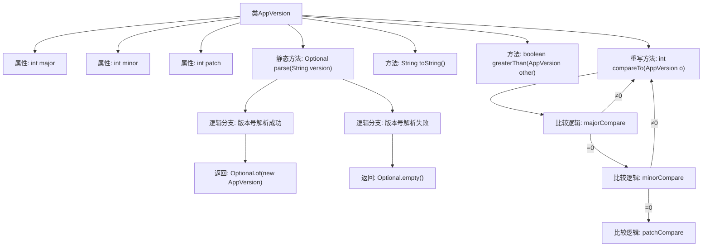

# 基础信息

|      |      |
|------|------|
| 名称 | AppVersion |
| 编码语言 | .java |
| 代码路径 | xpipe/app/src/main/java/io/xpipe/app/core/AppVersion.java |
| 包名 | io.xpipe.app.core |
| 依赖项 | ['lombok.NonNull', 'lombok.Value', 'java.util.Optional'] |
| 概述说明 | AppVersion类实现版本号解析、比较和字符串化，支持主次补丁号。 |

# 说明

这是一个名为AppVersion的Java类，用于表示和比较应用程序版本号。该类包含三个整型字段：major（主版本号）、minor（次版本号）和patch（补丁版本号）。提供了静态方法parse，用于从字符串解析版本号，支持"X.Y.Z"格式，解析失败返回Optional.empty。实现了Comparable接口，通过compareTo方法比较版本号大小，依次比较主、次、补丁版本号。还提供了greaterThan方法判断版本是否更高，以及toString方法输出"X.Y.Z"格式的版本字符串。

# 类列表 Class Summary

| 名称   | 类型  | 说明 |
|-------|------|-------------|
| AppVersion | class | AppVersion类实现版本号解析、比较和字符串化，支持主次修订号比较。 |

## 类 AppVersion

|      |      |
|------|------|
| 访问范围 | @Value;public |
| 类型 | class |
| 名称 | AppVersion |
| 说明 | AppVersion类实现版本号解析、比较和字符串化，支持主次修订号比较。 |

### UML类图

该代码定义了一个表示应用程序版本的`AppVersion`类，包含主版本号(major)、次版本号(minor)和修订号(patch)三个私有字段。主要功能包括：1) 从字符串解析版本号(parse方法)；2) 比较两个版本号的大小(compareTo和greaterThan方法)；3) 将版本号转换为字符串表示(toString方法)。该类实现了`Comparable`接口，支持版本号的比较操作，并提供了静态工厂方法`parse`来创建对象实例。当输入字符串格式不正确时，parse方法会返回空的Optional对象。

### 内部方法调用关系图

该流程图展示了AppVersion类的完整结构，重点描述了版本号解析和比较的核心逻辑。静态方法parse通过try-catch实现健壮的版本号解析，成功时返回包含AppVersion的Optional对象，失败时返回空Optional。compareTo方法采用三级比较策略（主版本号→次版本号→补丁号），任何层级比较出结果即终止后续比较。greaterThan方法通过compareTo实现版本号大小判断，toString方法生成标准语义化版本字符串。整体设计体现了防御式编程思想和清晰的版本控制逻辑。

### 字段列表 Field List

| 名称  | 类型  | 说明 |
|-------|-------|------|
| patch | int | 定义整型变量patch。 |
| major | int | 声明整型变量major |
| minor | int | 声明整型变量minor |

### 方法列表 Method List

| 名称  | 类型  | 说明 |
|-------|-------|------|
| parse | Optional<AppVersion> | 解析版本字符串为AppVersion对象，失败返回空。 |
| toString | String | Java方法：返回版本号字符串，格式为"主版本.次版本.修订号"。 |
| greaterThan | boolean | 比较版本号，当前大于参数返回真。 |
| compareTo | int | 比较应用版本号，按主次补丁顺序逐级对比。 |

