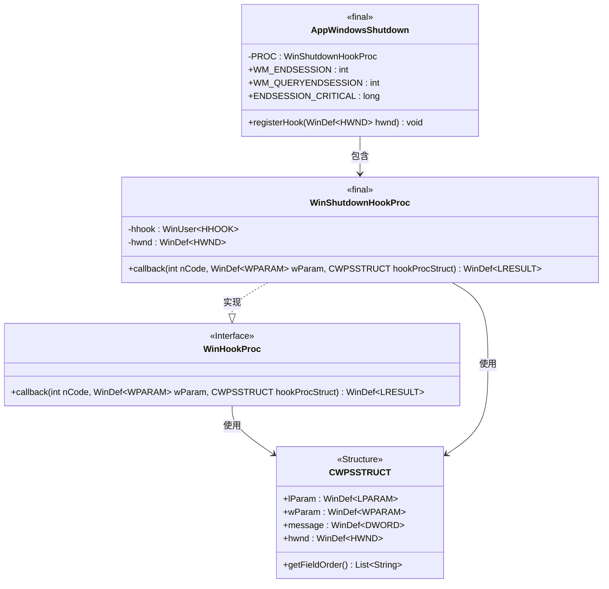
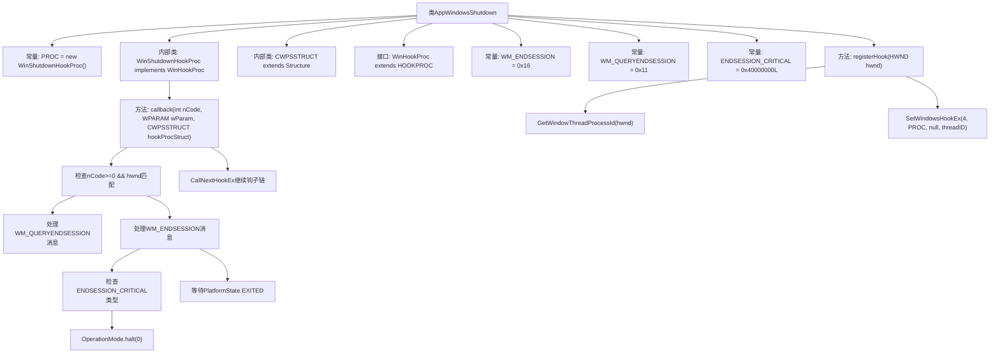

# 基础信息

|      |      |
|------|------|
| 名称 | AppWindowsShutdown |
| 编码语言 | .java |
| 代码路径 | xpipe/app/src/main/java/io/xpipe/app/core/AppWindowsShutdown.java |
| 包名 | io.xpipe.app.core |
| 依赖项 | ['io.xpipe.app.core.mode.OperationMode', 'io.xpipe.app.issue.TrackEvent', 'io.xpipe.app.util.PlatformState', 'io.xpipe.app.util.ThreadHelper', 'com.sun.jna', 'com.sun.jna.platform.win32.User32', 'com.sun.jna.platform.win32.WinDef', 'com.sun.jna.platform.win32.WinUser', 'lombok.RequiredArgsConstructor', 'lombok.Setter', 'java.util.List'] |
| 概述说明 | Windows关机钩子注册与处理，监听WM_QUERYENDSESSION和WM_ENDSESSION消息，支持关键关机即时退出。 |

# 说明

该代码定义了一个Windows关机钩子处理类AppWindowsShutdown，用于监听系统关机事件。主要功能包括：通过registerHook方法注册窗口线程钩子；定义CWPSSTRUCT结构体存储窗口消息参数；实现WinShutdownHookProc类处理WM_QUERYENDSESSION和WM_ENDSESSION消息。当收到关键关机事件(ENDSESSION_CRITICAL)时立即终止程序，否则等待平台退出状态。整个过程通过TrackEvent记录事件日志，最终调用系统API传递钩子链。

# 类列表 Class Summary

| 名称   | 类型  | 说明 |
|-------|------|-------------|
| AppWindowsShutdown | class | Windows关机钩子注册与处理，监听WM_QUERYENDSESSION和WM_ENDSESSION消息，支持关键关机即时退出。 |

## 类 AppWindowsShutdown

|      |      |
|------|------|
| 访问范围 | public |
| 类型 | class |
| 名称 | AppWindowsShutdown |
| 说明 | Windows关机钩子注册与处理，监听WM_QUERYENDSESSION和WM_ENDSESSION消息，支持关键关机即时退出。 |

### UML类图

类图描述：该代码实现了Windows系统关机事件的钩子处理机制。核心类`AppWindowsShutdown`通过静态内部类`WinShutdownHookProc`实现`WinHookProc`接口，处理`WM_QUERYENDSESSION`和`WM_ENDSESSION`消息。`CWPSSTRUCT`结构体封装了Windows消息参数，包含LPARAM、WPARAM等字段。当收到关键关机事件时，会触发系统立即终止，否则等待平台状态变为EXITED后返回。整个设计通过JNA与Windows API交互，实现了优雅的关机处理流程。

### 内部方法调用关系图

流程图描述了Windows关机钩子的处理流程。核心是WinShutdownHookProc类的callback方法，它处理WM_QUERYENDSESSION和WM_ENDSESSION两种系统消息。当收到关机请求时，首先记录事件，对于关键关机立即终止程序，否则等待平台完全退出。整个过程通过Windows钩子机制实现，最后调用CallNextHookEx保证钩子链的正常传递。结构上分为注册钩子和消息处理两大模块，体现了对Windows系统关机流程的精细控制。

### 字段列表 Field List

| 名称  | 类型  | 说明 |
|-------|-------|------|
| WM_ENDSESSION = 0x16 | int | Windows消息：会话结束信号0x16 |
| PROC = new WinShutdownHookProc() | WinShutdownHookProc | 私有静态常量PROC，类型为WinShutdownHookProc。 |
| ENDSESSION_CRITICAL = 0x40000000L | long | 常量ENDSESSION_CRITICAL值为0x40000000L |
| WM_QUERYENDSESSION = 0x11 | int | 常量WM_QUERYENDSESSION值为0x11，用于查询会话结束。 |

### 方法列表 Method List

| 名称  | 类型  | 说明 |
|-------|-------|------|
| registerHook | void | 注册Windows钩子，绑定窗口线程ID。 |

