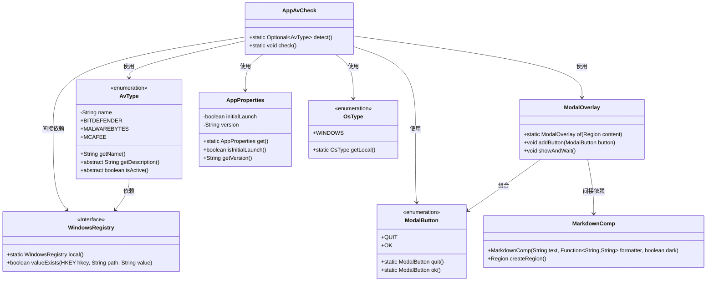
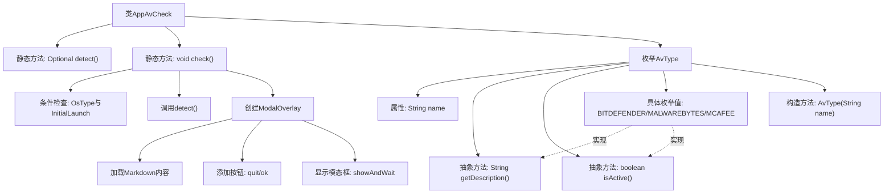

# 基础信息

|      |      |
|------|------|
| 名称 | AppAvCheck |
| 编码语言 | .java |
| 代码路径 | xpipe/app/src/main/java/io/xpipe/app/core/check/AppAvCheck.java |
| 包名 | io.xpipe.app.core.check |
| 依赖项 | ['io.xpipe.app.comp.Comp', 'io.xpipe.app.comp.base.MarkdownComp', 'io.xpipe.app.comp.base.ModalButton', 'io.xpipe.app.comp.base.ModalOverlay', 'io.xpipe.app.core.AppProperties', 'io.xpipe.app.resources.AppResources', 'io.xpipe.app.util.WindowsRegistry', 'io.xpipe.core.process.OsType', 'javafx.scene.layout.Region', 'lombok.Getter', 'java.nio.file.Files', 'java.util.Optional', 'java.util.concurrent.atomic.AtomicReference'] |
| 概述说明 | 检测Windows首次启动时的杀毒软件，显示警告信息。支持Bitdefender、Malwarebytes、McAfee。 |

# 说明

该代码定义了一个名为AppAvCheck的类，用于检测Windows系统上特定杀毒软件的存在，并在首次启动时显示警告信息。类包含detect方法遍历AvType枚举检查活动杀毒软件，check方法仅在Windows首次启动时执行检测。检测到杀毒软件后会显示模态窗口，展示格式化后的警告信息。AvType枚举定义了Bitdefender、Malwarebytes和McAfee三种杀毒软件，每个类型包含名称、描述和检测活动状态的方法，通过检查Windows注册表键值判断软件是否存在。

# 类列表 Class Summary

| 名称   | 类型  | 说明 |
|-------|------|-------------|
| AppAvCheck | class | 检测Windows首次启动时的杀毒软件，显示警告信息。支持Bitdefender、Malwarebytes、McAfee。 |

## 类 AppAvCheck

|      |      |
|------|------|
| 访问范围 | public |
| 类型 | class |
| 名称 | AppAvCheck |
| 说明 | 检测Windows首次启动时的杀毒软件，显示警告信息。支持Bitdefender、Malwarebytes、McAfee。 |

### UML类图

这段代码主要实现了一个Windows平台上的杀毒软件检测功能。AppAvCheck类通过检测注册表来判断是否安装了特定杀毒软件(Bitdefender/Malwarebytes/McAfee)，如果是首次启动且在Windows平台，会显示一个包含警告信息的模态对话框。AvType枚举定义了不同杀毒软件的特性检测逻辑，WindowsRegistry接口提供了注册表操作能力，ModalOverlay负责构建和显示警告界面。整个设计采用了工厂模式、策略模式和依赖注入等设计模式，具有良好的扩展性和可维护性。

### 内部方法调用关系图

流程图描述：该流程图展示了AppAvCheck类的核心结构，包含检测杀毒软件的静态方法和枚举定义。主要流程从check()方法开始，先进行操作系统和首次启动条件检查，然后调用detect()遍历AvType枚举检测活动杀软，最后通过ModalOverlay展示警告信息。枚举类型定义了三种杀软的具体实现，每个枚举值需实现获取描述和检测状态的抽象方法。模态框创建过程包含Markdown内容加载和按钮添加等步骤。

### 字段列表 Field List

| 名称  | 类型  | 说明 |
|-------|-------|------|

### 方法列表 Method List

| 名称  | 类型  | 说明 |
|-------|-------|------|
| check | void | 检查首次Windows启动时是否检测到杀毒软件，若有则显示警告弹窗并提供退出或继续选项。 |
| detect | Optional<AvType> | 检测活跃AvType并返回首个匹配项，无则返回空。 |

