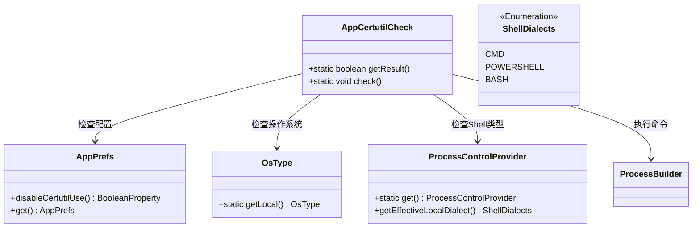
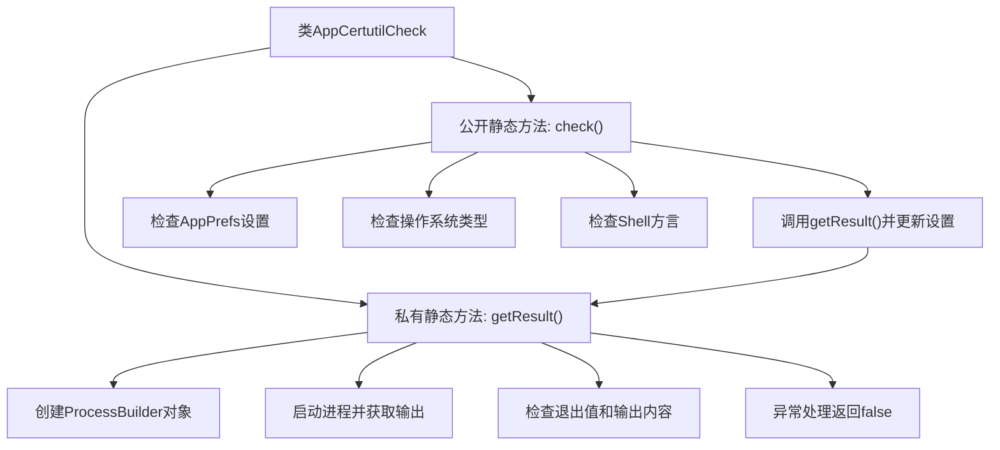

# 基础信息

|      |      |
|------|------|
| 名称 | AppCertutilCheck |
| 编码语言 | .java |
| 代码路径 | xpipe/app/src/main/java/io/xpipe/app/core/check/AppCertutilCheck.java |
| 包名 | io.xpipe.app.core.check |
| 依赖项 | ['io.xpipe.app.ext.ProcessControlProvider', 'io.xpipe.app.prefs.AppPrefs', 'io.xpipe.core.process.OsType', 'io.xpipe.core.process.ShellDialects', 'java.util.concurrent.TimeUnit'] |
| 概述说明 | 检查Windows系统certutil工具可用性，不可用则禁用相关功能。 |

# 说明

该代码定义了一个名为AppCertutilCheck的类，主要用于检查Windows系统中certutil工具是否可用。核心逻辑包含一个私有方法getResult，通过启动certutil进程并分析其输出和退出码来判断工具是否正常。公开方法check会依次检查四个条件：用户是否禁用certutil检查、当前操作系统是否为Windows、当前Shell是否为CMD、以及getResult的返回结果。若任一条件不满足，则通过AppPrefs禁用certutil使用。整个过程包含异常处理，遇到错误时默认返回false。

# 类列表 Class Summary

| 名称   | 类型  | 说明 |
|-------|------|-------------|
| AppCertutilCheck | class | 检查Windows系统certutil工具可用性，不可用则禁用相关功能。 |

## 类 AppCertutilCheck

|      |      |
|------|------|
| 访问范围 | public |
| 类型 | class |
| 名称 | AppCertutilCheck |
| 说明 | 检查Windows系统certutil工具可用性，不可用则禁用相关功能。 |

### UML类图

这段代码实现了一个Windows系统下certutil工具可用性检查的功能。AppCertutilCheck类通过静态方法check()协调多个模块：首先检查用户配置(AppPrefs)是否禁用该功能，然后验证操作系统类型(OsType)是否为Windows，再确认当前Shell环境(ProcessControlProvider)是CMD模式，最后通过ProcessBuilder执行certutil命令并解析输出结果。所有检查条件满足且命令执行成功时才会保持功能启用状态，否则会更新配置禁用该功能。类图清晰地展示了这些类之间的依赖关系和主要方法调用路径。

### 内部方法调用关系图

这段代码流程图展示了AppCertutilCheck类的完整逻辑流程。首先通过getResult()方法执行系统命令并验证结果，该方法会创建certutil进程、读取输出并检查退出状态。check()方法作为主入口，依次执行四个条件检查：应用偏好设置、操作系统类型、Shell方言类型，最后调用getResult()并根据结果更新设置。整个流程体现了严谨的条件验证链和错误处理机制。

### 字段列表 Field List

| 名称  | 类型  | 说明 |
|-------|-------|------|

### 方法列表 Method List

| 名称  | 类型  | 说明 |
|-------|-------|------|
| check | void | 检查条件：非禁用、Windows系统、CMD环境，失败则禁用certutil。 |
| getResult | boolean | 检查系统certutil工具是否可用，返回执行结果状态。 |

