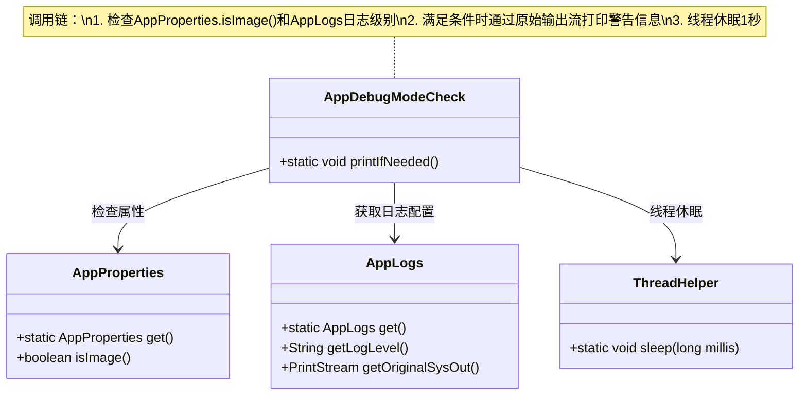
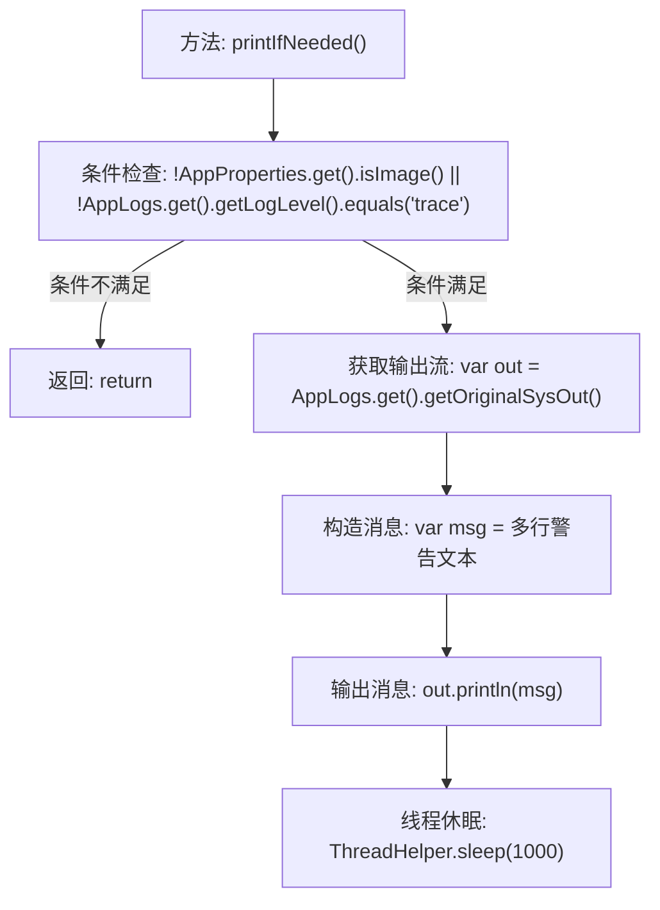

# 基础信息

|      |      |
|------|------|
| 名称 | AppDebugModeCheck |
| 编码语言 | .java |
| 代码路径 | xpipe/app/src/main/java/io/xpipe/app/core/check/AppDebugModeCheck.java |
| 包名 | io.xpipe.app.core.check |
| 依赖项 | ['io.xpipe.app.core.AppLogs', 'io.xpipe.app.core.AppProperties', 'io.xpipe.app.util.ThreadHelper'] |
| 概述说明 | 检查调试模式并输出警告信息，提示敏感数据风险。 |

# 说明

这段代码定义了一个名为AppDebugModeCheck的类，包含一个静态方法printIfNeeded。该方法首先检查应用属性是否为镜像模式且日志级别是否为trace，若不符合条件则直接返回。若条件满足，则获取原始系统输出流，打印一条醒目的警告信息，提示用户当前处于调试模式，调试控制台输出可能包含敏感信息和秘密，警告不要通过不受信任的网站或服务共享此输出。最后让线程休眠1000毫秒。

# 类列表 Class Summary

| 名称   | 类型  | 说明 |
|-------|------|-------------|
| AppDebugModeCheck | class | 检查调试模式并输出警告信息，提示敏感数据风险。 |

## 类 AppDebugModeCheck

|      |      |
|------|------|
| 访问范围 | public |
| 类型 | class |
| 名称 | AppDebugModeCheck |
| 说明 | 检查调试模式并输出警告信息，提示敏感数据风险。 |

### UML类图

这段代码描述了一个调试模式检查类AppDebugModeCheck，它通过组合AppProperties、AppLogs和ThreadHelper三个工具类实现功能。当检测到非镜像模式且日志级别为trace时，会通过原始系统输出流打印敏感警告信息并暂停1秒。类图清晰展示了四个类之间的依赖关系，其中AppDebugModeCheck作为主控类，协调其他三个工具类完成调试模式检测和警告输出功能。

### 内部方法调用关系图

该流程图描述了`AppDebugModeCheck`类中`printIfNeeded()`方法的执行逻辑。方法首先检查两个条件：应用是否处于非镜像模式且日志级别是否为trace。若任一条件不满足则直接返回；若都满足则获取系统输出流，构造包含敏感信息警告的多行文本消息，输出该消息后让线程休眠1秒。该流程主要用于在调试模式下向用户显示安全警告提示。

### 字段列表 Field List

| 名称  | 类型  | 说明 |
|-------|-------|------|

### 方法列表 Method List

| 名称  | 类型  | 说明 |
|-------|-------|------|
| printIfNeeded | void | 检查调试模式并打印警告信息，提醒勿泄露敏感数据。 |

