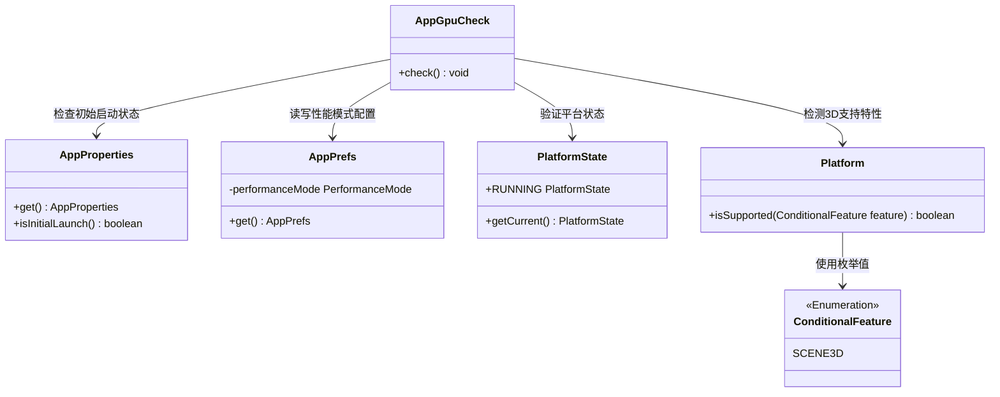
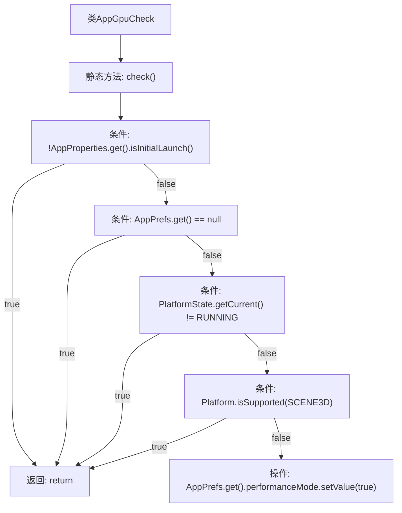

# 基础信息

|      |      |
|------|------|
| 名称 | AppGpuCheck |
| 编码语言 | .java |
| 代码路径 | xpipe/app/src/main/java/io/xpipe/app/core/check/AppGpuCheck.java |
| 包名 | io.xpipe.app.core.check |
| 依赖项 | ['io.xpipe.app.core.AppProperties', 'io.xpipe.app.prefs.AppPrefs', 'io.xpipe.app.util.PlatformState', 'javafx.application.ConditionalFeature', 'javafx.application.Platform'] |
| 概述说明 | 检查GPU支持，若首次启动且不支持3D场景则启用性能模式。 |

# 说明

该代码定义了一个名为AppGpuCheck的类，包含静态方法check用于检查GPU支持情况。方法首先检查是否为应用首次启动，若非则直接返回。接着检查应用偏好设置是否存在，若不存在也返回。然后确认当前平台状态是否为运行中，否则返回。最后检查平台是否支持3D场景功能，若支持则返回。若所有条件均不满足，则将性能模式设置为true。整个过程用于在首次启动时检测GPU功能并自动启用性能模式。

# 类列表 Class Summary

| 名称   | 类型  | 说明 |
|-------|------|-------------|
| AppGpuCheck | class | 检查GPU支持，若首次启动且不支持3D场景则启用性能模式。 |

## 类 AppGpuCheck

|      |      |
|------|------|
| 访问范围 | public |
| 类型 | class |
| 名称 | AppGpuCheck |
| 说明 | 检查GPU支持，若首次启动且不支持3D场景则启用性能模式。 |

### UML类图

这段代码展示了一个GPU检查模块的类结构，核心是`AppGpuCheck`类通过协调多个系统组件（配置管理、平台状态、硬件特性）来决定是否启用性能模式。当满足首次启动、配置可用、平台运行中且不支持3D场景时，会自动开启性能模式。类图清晰地呈现了各组件间的依赖关系，其中`ConditionalFeature`作为枚举类型限定硬件特性检测范围。

### 内部方法调用关系图

这段代码流程图展示了AppGpuCheck类中check()方法的执行逻辑。该方法通过四个连续的条件检查来决定是否启用性能模式：首先验证是否为初始启动，然后检查应用偏好设置是否存在，接着确认平台是否处于运行状态，最后检测3D场景功能支持情况。只有当所有条件均不满足时，才会执行性能模式设置操作。每个条件为真时都会直接返回，形成严格的防御性编程结构。

### 字段列表 Field List

| 名称  | 类型  | 说明 |
|-------|-------|------|

### 方法列表 Method List

| 名称  | 类型  | 说明 |
|-------|-------|------|
| check | void | 检查初始启动条件，满足时启用性能模式。 |

