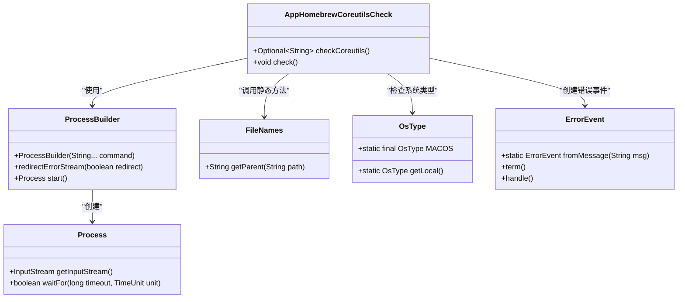
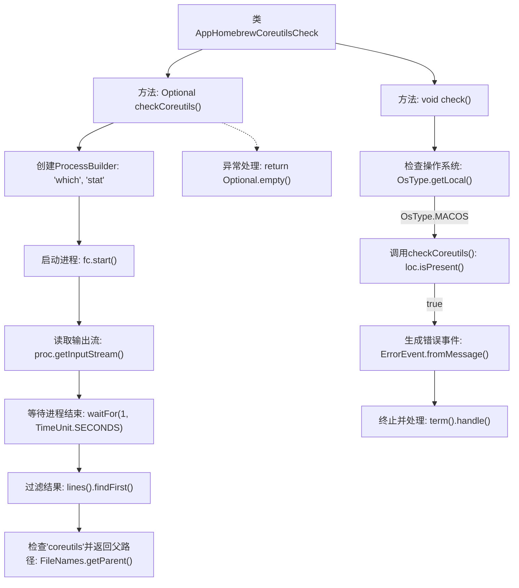

# 基础信息

|      |      |
|------|------|
| 名称 | AppHomebrewCoreutilsCheck |
| 编码语言 | .java |
| 代码路径 | xpipe/app/src/main/java/io/xpipe/app/core/check/AppHomebrewCoreutilsCheck.java |
| 包名 | io.xpipe.app.core.check |
| 依赖项 | ['io.xpipe.app.issue.ErrorEvent', 'io.xpipe.core.process.OsType', 'io.xpipe.core.store.FileNames', 'java.util.Optional', 'java.util.concurrent.TimeUnit'] |
| 概述说明 | 检查MacOS系统是否安装homebrew coreutils包，若存在则提示移除以避免与XPipe冲突。 |

# 说明

该代码定义了一个检查工具类，主要用于检测macOS系统中是否安装了Homebrew的coreutils工具包。核心功能分为两部分：checkCoreutils方法通过执行which stat命令查找coreutils路径，若发现路径中包含coreutils则返回其父目录；check方法首先判断当前操作系统是否为macOS，若是则调用checkCoreutils检查，若发现存在coreutils会生成错误事件，提示用户该工具包会覆盖原生macOS命令并与XPipe冲突，要求用户从PATH中移除coreutils后再启动XPipe。整个检查过程包含异常处理，遇到错误时返回空值。

# 类列表 Class Summary

| 名称   | 类型  | 说明 |
|-------|------|-------------|
| AppHomebrewCoreutilsCheck | class | 检查MacOS系统是否安装了homebrew coreutils包，若存在则提示移除以避免与XPipe冲突。 |

## 类 AppHomebrewCoreutilsCheck

|      |      |
|------|------|
| 访问范围 | public |
| 类型 | class |
| 名称 | AppHomebrewCoreutilsCheck |
| 说明 | 检查MacOS系统是否安装了homebrew coreutils包，若存在则提示移除以避免与XPipe冲突。 |

### UML类图

这段代码主要实现了一个检查Homebrew coreutils包是否安装并添加到PATH路径中的功能。AppHomebrewCoreutilsCheck类包含两个方法：checkCoreutils()通过执行"which stat"命令检查coreutils路径，check()方法在检测到macOS系统且存在coreutils时抛出错误提示。代码涉及进程构建、流处理、路径操作、系统类型判断和错误处理等多个模块的协作，通过Optional优雅处理空值情况，并针对macOS系统进行特定兼容性检查。

### 内部方法调用关系图

该流程图展示了AppHomebrewCoreutilsCheck类的两个主要方法逻辑。checkCoreutils()方法通过执行which stat命令检测coreutils安装路径，包含进程创建、输出读取和路径过滤处理链；check()方法在检测到macOS系统时调用前者，若发现coreutils则生成包含路径详情的错误事件并终止程序。异常处理和操作系统验证作为关键分支点清晰呈现，完整反映了代码的防御性编程逻辑。

### 字段列表 Field List

| 名称  | 类型  | 说明 |
|-------|-------|------|

### 方法列表 Method List

| 名称  | 类型  | 说明 |
|-------|-------|------|
| check | void | 检查是否为macOS，若安装homebrew coreutils且PATH包含其路径，则报错需移除以避免与XPipe冲突。 |
| checkCoreutils | Optional<String> | 检查coreutils路径，返回父目录或无。 |

