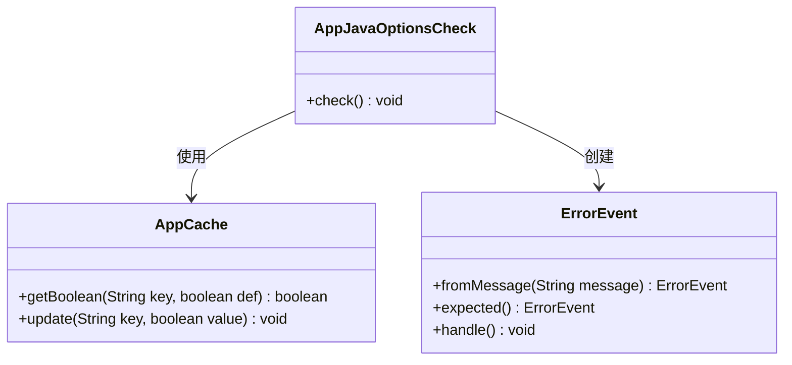
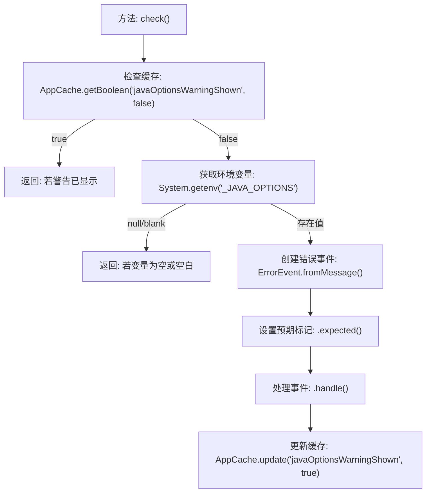

# 基础信息

|      |      |
|------|------|
| 名称 | AppJavaOptionsCheck |
| 编码语言 | .java |
| 代码路径 | xpipe/app/src/main/java/io/xpipe/app/core/check/AppJavaOptionsCheck.java |
| 包名 | io.xpipe.app.core.check |
| 依赖项 | ['io.xpipe.app.core.AppCache', 'io.xpipe.app.issue.ErrorEvent'] |
| 概述说明 | 检查全局环境变量_JAVA_OPTIONS，若存在则提示用户移除以避免问题。 |

# 说明

该代码定义了一个名为AppJavaOptionsCheck的类，包含静态方法check用于检查系统环境变量_JAVA_OPTIONS。若检测到该变量非空且未显示过警告，则生成错误事件提示用户移除全局环境变量以避免影响XPipe运行，建议改用本地配置。最后标记警告已显示防止重复提示。

# 类列表 Class Summary

| 名称   | 类型  | 说明 |
|-------|------|-------------|
| AppJavaOptionsCheck | class | 检查全局_JAVA_OPTIONS环境变量，若存在则警告并建议移除。 |

## 类 AppJavaOptionsCheck

|      |      |
|------|------|
| 访问范围 | public |
| 类型 | class |
| 名称 | AppJavaOptionsCheck |
| 说明 | 检查全局_JAVA_OPTIONS环境变量，若存在则警告并建议移除。 |

### UML类图

类图描述：该图展示了AppJavaOptionsCheck类通过调用AppCache的缓存操作方法和ErrorEvent的错误处理机制，实现Java环境变量检查功能。当检测到全局_JAVA_OPTIONS变量时，会生成预期错误提示并更新缓存状态，防止重复警告。核心类包含静态检查方法和两个依赖的服务类，形成清晰的职责分离结构。

### 内部方法调用关系图

该流程图描述了Java环境变量检查的完整流程。首先检查是否已显示过警告，若否则继续检查系统环境变量_JAVA_OPTIONS。当检测到该变量存在有效值时，会创建包含详细警告信息的错误事件，标记为预期行为后处理，最后更新缓存状态。整个过程实现了对全局Java环境变量的安全检测和用户提醒机制。

### 字段列表 Field List

| 名称  | 类型  | 说明 |
|-------|-------|------|

### 方法列表 Method List

| 名称  | 类型  | 说明 |
|-------|-------|------|
| check | void | 检查并警告全局_JAVA_OPTIONS环境变量可能引发问题，建议改用本地配置。 |

