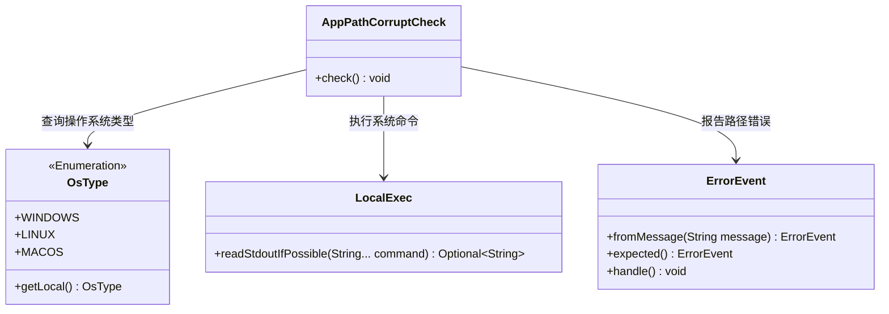
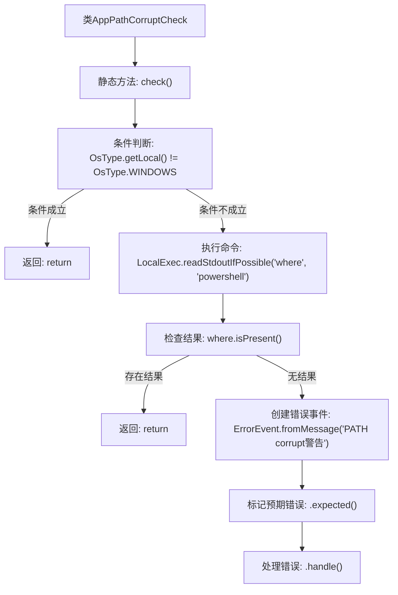

# 基础信息

|      |      |
|------|------|
| 名称 | AppPathCorruptCheck |
| 编码语言 | .java |
| 代码路径 | xpipe/app/src/main/java/io/xpipe/app/core/check/AppPathCorruptCheck.java |
| 包名 | io.xpipe.app.core.check |
| 依赖项 | ['io.xpipe.app.issue.ErrorEvent', 'io.xpipe.app.util.LocalExec', 'io.xpipe.core.process.OsType'] |
| 概述说明 | 检查Windows系统PATH是否损坏，缺少关键工具则提示修复。 |

# 说明

该代码定义了一个名为AppPathCorruptCheck的类，包含一个静态方法check，用于检查Windows系统PATH环境变量是否损坏。方法首先判断当前操作系统是否为Windows，若不是则直接返回。若是则尝试通过执行where命令查找powershell工具，若成功找到则返回。若未找到，则生成一个错误事件，提示用户系统PATH可能损坏导致XPipe无法正常工作，建议修复PATH环境变量以包含基本Windows工具。错误事件标记为预期错误并进行处理。

# 类列表 Class Summary

| 名称   | 类型  | 说明 |
|-------|------|-------------|
| AppPathCorruptCheck | class | 检查Windows系统PATH是否损坏，缺失关键工具则提示修复。 |

## 类 AppPathCorruptCheck

|      |      |
|------|------|
| 访问范围 | public |
| 类型 | class |
| 名称 | AppPathCorruptCheck |
| 说明 | 检查Windows系统PATH是否损坏，缺失关键工具则提示修复。 |

### UML类图

该代码实现了一个Windows系统PATH环境变量完整性检查功能。当检测到当前系统为Windows且无法定位powershell.exe时，会通过ErrorEvent发出警告。类图中包含核心检查类AppPathCorruptCheck，它依赖OsType枚举判断操作系统类型，使用LocalExec执行命令行操作，并通过ErrorEvent处理异常情况。整个设计采用分层结构，各模块职责明确，通过方法调用链完成环境检测流程。

### 内部方法调用关系图

这段代码流程图展示了Windows系统PATH环境变量损坏检测逻辑。首先检查操作系统类型，非Windows系统直接退出。对于Windows系统，尝试定位powershell工具路径，若成功找到则退出。若无法找到系统工具路径，则生成一个预期错误事件，提示用户PATH损坏可能导致功能异常，并建议修复环境变量。整个过程体现了防御性编程思想，对关键系统依赖进行预检。

### 字段列表 Field List

| 名称  | 类型  | 说明 |
|-------|-------|------|

### 方法列表 Method List

| 名称  | 类型  | 说明 |
|-------|-------|------|
| check | void | 检查Windows系统PATH是否包含必要工具，缺失则报错提示修复。 |

