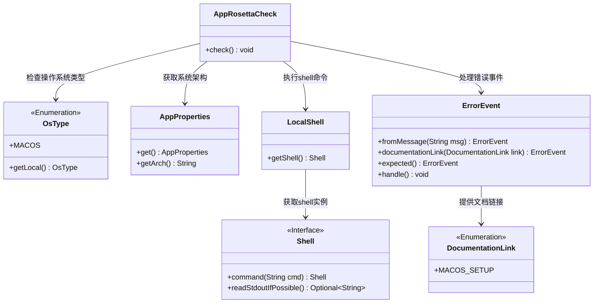
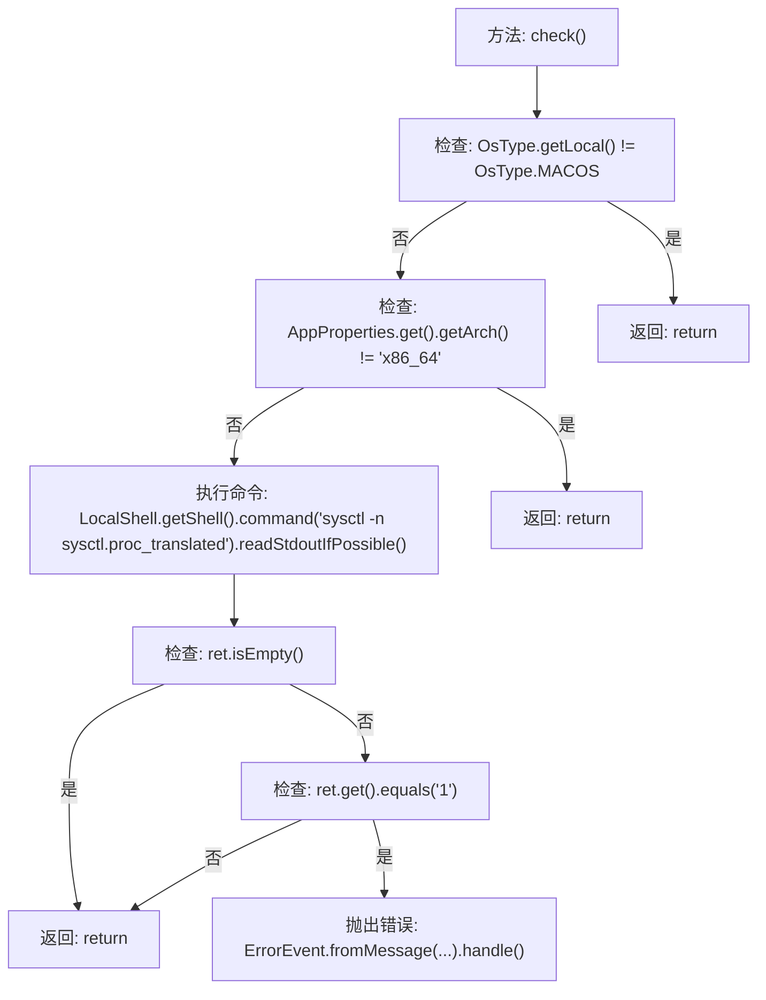

# 基础信息

|      |      |
|------|------|
| 名称 | AppRosettaCheck |
| 编码语言 | .java |
| 代码路径 | xpipe/app/src/main/java/io/xpipe/app/core/check/AppRosettaCheck.java |
| 包名 | io.xpipe.app.core.check |
| 依赖项 | ['io.xpipe.app.core.AppProperties', 'io.xpipe.app.issue.ErrorEvent', 'io.xpipe.app.util.DocumentationLink', 'io.xpipe.app.util.LocalShell', 'io.xpipe.core.process.OsType'] |
| 概述说明 | 检查MacOS系统是否为Apple Silicon运行Intel版XPipe，提示性能问题并推荐安装原生版本。 |

# 说明

该代码定义了一个名为AppRosettaCheck的类，包含一个静态方法check用于检查运行环境。方法首先判断当前操作系统是否为MacOS且架构为x86_64。若满足条件，则通过shell命令查询处理器翻译状态。若返回值为1，表明当前在Apple Silicon系统上运行Intel版本XPipe，会触发错误事件提示用户安装性能更优的原生版本，并提供相关文档链接。整个过程包含环境检测、命令执行和错误处理逻辑。

# 类列表 Class Summary

| 名称   | 类型  | 说明 |
|-------|------|-------------|
| AppRosettaCheck | class | 检查MacOS系统是否为Apple Silicon运行Intel版XPipe，提示安装原生版本以提升性能。 |

## 类 AppRosettaCheck

|      |      |
|------|------|
| 访问范围 | public |
| 类型 | class |
| 名称 | AppRosettaCheck |
| 说明 | 检查MacOS系统是否为Apple Silicon运行Intel版XPipe，提示安装原生版本以提升性能。 |

### UML类图

该代码主要用于检测在Apple Silicon系统上是否错误地运行了Intel版本的XPipe应用。首先检查操作系统是否为macOS且架构为x86_64，然后通过shell命令检测是否运行在Rosetta转译模式下。如果是，则生成错误提示建议用户安装原生版本。类图展示了核心组件间的交互关系，包括系统检测、命令执行和错误处理模块。

### 内部方法调用关系图

这段代码流程图描述了AppRosettaCheck.check()方法的执行逻辑。该方法首先检查操作系统是否为MacOS，然后验证架构是否为x86_64，接着通过shell命令检测是否运行在Apple Silicon的Rosetta转译模式下。如果检测到转译模式，会抛出提示用户安装原生版本的建议错误。流程图清晰地展示了从初始检查到最终错误处理或退出的完整控制流，包含4个可能的提前返回点和1个错误处理路径。

### 字段列表 Field List

| 名称  | 类型  | 说明 |
|-------|-------|------|

### 方法列表 Method List

| 名称  | 类型  | 说明 |
|-------|-------|------|
| check | void | 检查是否为MacOS Intel版在Apple Silicon运行，提示性能更优的原生版本。 |

