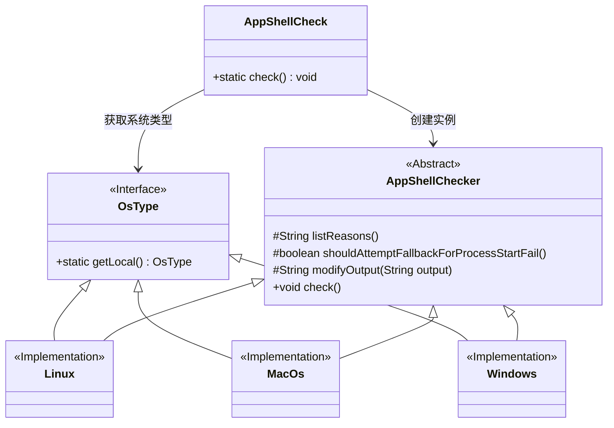
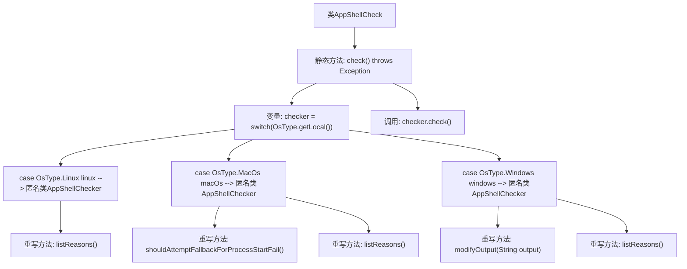

# 基础信息

|      |      |
|------|------|
| 名称 | AppShellCheck |
| 编码语言 | .java |
| 代码路径 | xpipe/app/src/main/java/io/xpipe/app/core/check/AppShellCheck.java |
| 包名 | io.xpipe.app.core.check |
| 依赖项 | ['io.xpipe.core.process.OsType'] |
| 概述说明 | 检查系统shell问题的工具类，支持Linux、MacOS和Windows，列出常见错误原因。 |

# 说明

该代码定义了一个AppShellCheck类，包含静态方法check用于检查不同操作系统下的shell环境问题。针对Linux和MacOs系统，列出了权限问题、系统shell限制、PATH环境变量损坏及命令行工具缺失等常见原因。MacOs版本特别禁用了进程启动失败的回退机制。Windows版本额外处理了命令识别错误的情况，并增加了杀毒软件拦截、Applocker限制等特有问题的检测。所有检查最终通过checker.check()方法执行。

# 类列表 Class Summary

| 名称   | 类型  | 说明 |
|-------|------|-------------|
| AppShellCheck | class | 检查系统shell问题的工具类，支持Linux、MacOS和Windows，列出常见问题原因。 |

## 类 AppShellCheck

|      |      |
|------|------|
| 访问范围 | public |
| 类型 | class |
| 名称 | AppShellCheck |
| 说明 | 检查系统shell问题的工具类，支持Linux、MacOS和Windows，列出常见问题原因。 |

### UML类图

这段代码展示了一个跨平台的Shell检查工具架构。核心类AppShellCheck通过工厂模式创建不同操作系统(Windows/Linux/MacOs)的检查器实例，每个检查器继承自抽象类AppShellChecker并实现了特定平台的错误处理逻辑。OsType接口及其实现类提供了系统类型判断功能，整个设计体现了策略模式的思想，能够针对不同操作系统提供差异化的Shell环境检查方案。

### 内部方法调用关系图

这段代码流程图展示了AppShellCheck类的核心结构，主要描述了一个跨平台的shell检查器实现。通过switch语句根据操作系统类型(Linux/MacOS/Windows)创建不同的匿名AppShellChecker子类，每个子类都重写了listReasons()方法来提供特定平台的错误原因列表。Windows平台还额外重写了modifyOutput()方法处理特殊错误信息。最后统一调用check()方法执行检查。流程图清晰呈现了多态实现和平台特定逻辑的分支处理过程。

### 字段列表 Field List

| 名称  | 类型  | 说明 |
|-------|-------|------|

### 方法列表 Method List

| 名称  | 类型  | 说明 |
|-------|-------|------|
| check | void | 检查系统shell问题的静态方法，针对Linux、MacOs和Windows不同系统列出可能原因。 |

