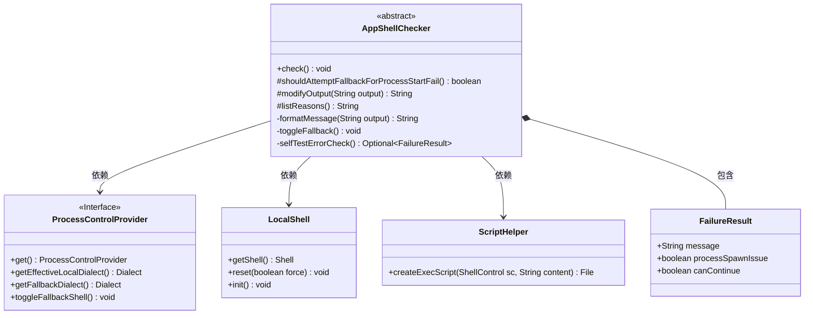
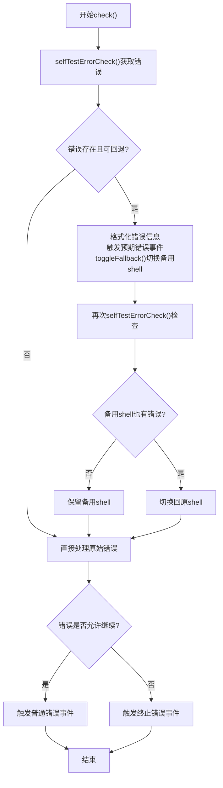
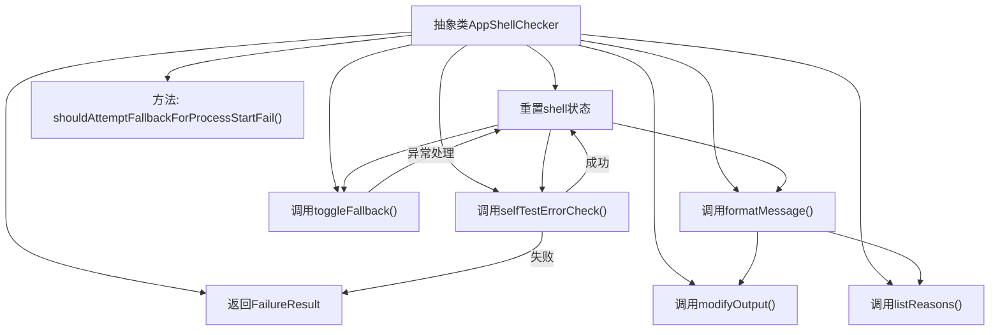

# 基础信息

|      |      |
|------|------|
| 名称 | AppShellChecker |
| 编码语言 | .java |
| 代码路径 | xpipe/app/src/main/java/io/xpipe/app/core/check/AppShellChecker.java |
| 包名 | io.xpipe.app.core.check |
| 依赖项 | ['io.xpipe.app.ext.ProcessControlProvider', 'io.xpipe.app.issue.ErrorEvent', 'io.xpipe.app.util.LocalShell', 'io.xpipe.app.util.ScriptHelper', 'io.xpipe.core.process.ProcessOutputException', 'io.xpipe.core.process.ShellSpawnException', 'lombok.Value', 'java.util.Optional'] |
| 概述说明 | AppShellChecker检查shell自测错误，支持回退处理，失败时输出错误信息。 |

# 说明

AppShellChecker是一个抽象类，用于检查shell功能是否正常。其核心方法check会执行自检，若发现错误且满足回退条件（非回退方言且允许回退），则切换至备用shell再次检查。若备用shell也有问题则切换回原shell。错误处理会根据错误类型决定是否终止程序，并通过ErrorEvent记录。自检通过运行测试脚本验证输出，捕获各类异常并封装为FailureResult。formatMessage方法生成包含错误详情、可能原因及回退提示的格式化信息。抽象方法listReasons需子类实现以提供具体错误原因。toggleFallback方法用于切换主备shell。

# 类列表 Class Summary

| 名称   | 类型  | 说明 |
|-------|------|-------------|
| AppShellChecker | class | AppShellChecker检查shell自测错误，支持回退处理，失败时输出错误信息。 |

## 类 AppShellChecker

|      |      |
|------|------|
| 访问范围 | public abstract |
| 类型 | class |
| 名称 | AppShellChecker |
| 说明 | AppShellChecker检查shell自测错误，支持回退处理，失败时输出错误信息。 |

### UML类图

这段代码实现了一个抽象的shell检查器，主要功能包括：执行shell自检、处理检测失败时的回退逻辑、格式化错误信息以及控制错误处理流程。核心类AppShellChecker通过ProcessControlProvider和LocalShell进行shell环境管理，使用FailureResult封装错误详情，并通过多层次的错误判断实现健壮的故障处理机制。流程图展示了从初始检测到最终错误处理的完整控制流，包含主备shell切换的关键决策点。

### 内部方法调用关系图

这段代码展示了一个抽象类AppShellChecker，主要用于检查shell环境的可用性并进行故障转移处理。核心流程包括：通过selfTestErrorCheck方法执行shell测试，根据测试结果决定是否触发fallback机制，使用formatMessage生成错误信息，并通过toggleFallback方法切换备用shell。流程图清晰展示了类的方法调用关系和异常处理路径，特别是fallback机制的条件判断和状态重置过程。

### 字段列表 Field List

| 名称  | 类型  | 说明 |
|-------|-------|------|

### 方法列表 Method List

| 名称  | 类型  | 说明 |
|-------|-------|------|
| toggleFallback | void | 私有方法切换备用Shell，重置并初始化本地Shell。 |
| selfTestErrorCheck | Optional<FailureResult> | 方法检查脚本输出是否为"test"，否则返回错误结果。 |
| modifyOutput | String | Java方法：修改输出字符串，直接返回输入。 |
| formatMessage | String | Shell自检失败，功能异常，可能原因需排查，尝试回退备用Shell。 |
| shouldAttemptFallbackForProcessStartFail | boolean | 方法返回true，允许处理启动失败时尝试回退。 |
| listReasons | String | 抽象方法，返回保护类型字符串，列出原因。 |
| check | void | 检查错误并处理回退逻辑：存在错误且可回退时切换配置，回退失败则恢复原状；最终处理错误或终止。 |

