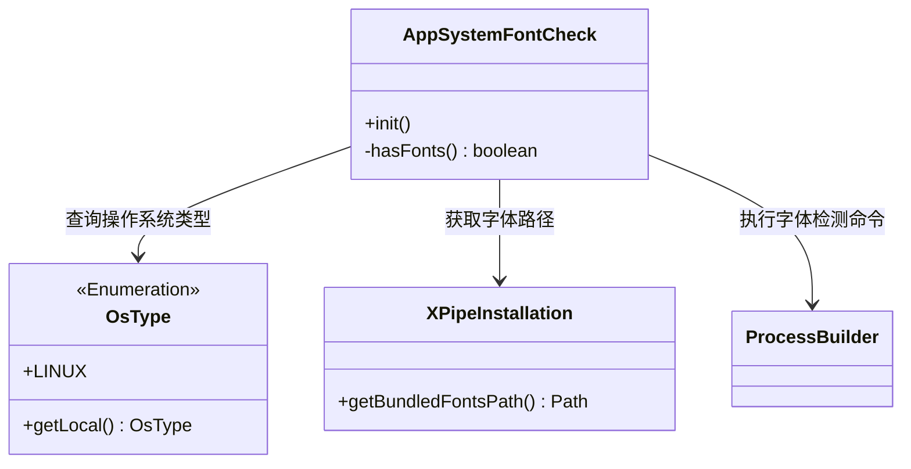
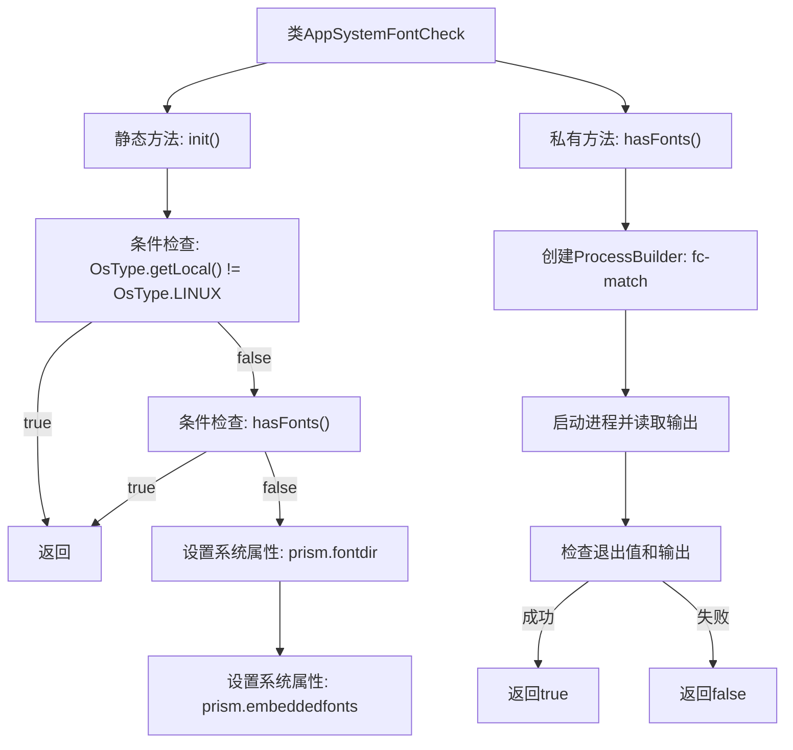

# 基础信息

|      |      |
|------|------|
| 名称 | AppSystemFontCheck |
| 编码语言 | .java |
| 代码路径 | xpipe/app/src/main/java/io/xpipe/app/core/check/AppSystemFontCheck.java |
| 包名 | io.xpipe.app.core.check |
| 依赖项 | ['io.xpipe.core.process.OsType', 'io.xpipe.core.util.XPipeInstallation', 'java.util.concurrent.TimeUnit'] |
| 概述说明 | 检查Linux系统字体，若无则设置默认字体路径。 |

# 说明

该代码定义了一个名为AppSystemFontCheck的类，主要用于检查Linux系统上的字体配置情况。其核心功能通过静态方法init实现：首先判断当前操作系统是否为Linux，若非则直接返回；若系统已安装字体（通过hasFonts方法检测）也直接返回。若未检测到字体，则设置两个系统属性，指定使用捆绑的字体路径并启用嵌入式字体。hasFonts方法通过执行fc-match命令检测系统字体，若命令成功执行且输出非空则返回true，否则返回false。整个过程包含异常处理，确保检测失败时安全返回false。

# 类列表 Class Summary

| 名称   | 类型  | 说明 |
|-------|------|-------------|
| AppSystemFontCheck | class | 检查Linux系统字体，若无则设置默认字体路径。 |

## 类 AppSystemFontCheck

|      |      |
|------|------|
| 访问范围 | public |
| 类型 | class |
| 名称 | AppSystemFontCheck |
| 说明 | 检查Linux系统字体，若无则设置默认字体路径。 |

### UML类图

该代码实现了一个Linux系统字体检查机制，通过OsType判断操作系统类型，使用ProcessBuilder执行fc-match命令检测字体是否存在。若缺少字体，则通过XPipeInstallation获取内置字体路径并设置JavaFX字体相关系统属性。类图展示了核心类AppSystemFontCheck与OsType枚举、XPipeInstallation工具类及ProcessBuilder的交互关系，体现了跨平台字体检测和备用方案加载的逻辑流程。

### 内部方法调用关系图

这段代码流程图描述了`AppSystemFontCheck`类的执行逻辑。主要功能是检查Linux系统字体配置，若未检测到有效字体则设置JavaFX的字体路径为捆绑字体目录。`init()`方法首先验证操作系统类型，仅在Linux环境下继续执行；随后调用`hasFonts()`方法通过`fc-match`命令检测系统字体，若无有效字体则配置系统属性使用备用字体。`hasFonts()`方法通过进程调用和输出分析实现字体检测，包含异常处理和超时控制。整个流程体现了条件分支、系统命令调用和属性配置的完整逻辑链。

### 字段列表 Field List

| 名称  | 类型  | 说明 |
|-------|-------|------|

### 方法列表 Method List

| 名称  | 类型  | 说明 |
|-------|-------|------|
| hasFonts | boolean | 检查系统字体是否存在，通过执行fc-match命令并验证输出结果。 |
| init | void | 初始化方法，仅Linux系统且无字体时设置字体路径和嵌入字体属性。 |

