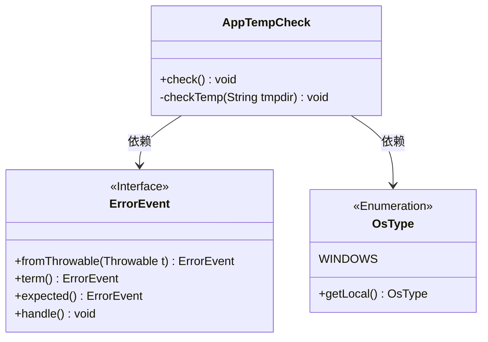
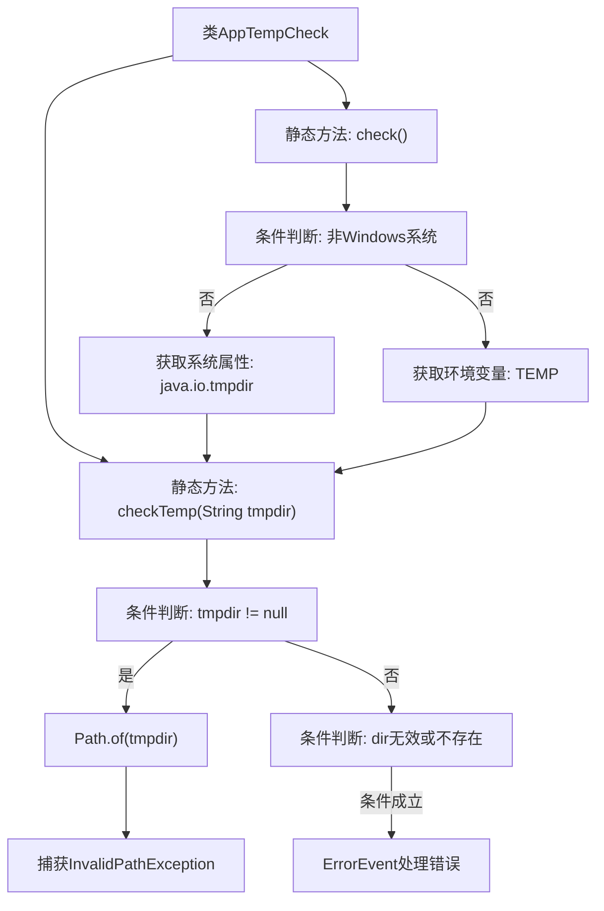

# 基础信息

|      |      |
|------|------|
| 名称 | AppTempCheck |
| 编码语言 | .java |
| 代码路径 | xpipe/app/src/main/java/io/xpipe/app/core/check/AppTempCheck.java |
| 包名 | io.xpipe.app.core.check |
| 依赖项 | ['io.xpipe.app.issue.ErrorEvent', 'io.xpipe.core.process.OsType', 'java.io.IOException', 'java.nio.file.Files', 'java.nio.file.InvalidPathException', 'java.nio.file.Path'] |
| 概述说明 | 检查临时目录有效性，无效则报错处理。 |

# 说明

该代码定义了一个名为AppTempCheck的类，包含两个方法用于检查临时目录有效性。checkTemp方法接收一个路径字符串参数，验证其是否为有效且存在的目录路径，若无效则抛出错误事件。check方法仅在Windows系统下运行，分别检查Java默认临时目录和系统环境变量TEMP指定的目录。错误处理包括生成错误事件并终止程序，确保临时目录可用性。

# 类列表 Class Summary

| 名称   | 类型  | 说明 |
|-------|------|-------------|
| AppTempCheck | class | 检查临时目录有效性，无效则报错终止程序。 |

## 类 AppTempCheck

|      |      |
|------|------|
| 访问范围 | public |
| 类型 | class |
| 名称 | AppTempCheck |
| 说明 | 检查临时目录有效性，无效则报错终止程序。 |

### UML类图

这段代码展示了一个温度检查工具类`AppTempCheck`，它通过`check()`方法验证Windows系统下的临时目录有效性。核心逻辑在私有方法`checkTemp()`中，当路径无效时会通过`ErrorEvent`接口处理异常。类图中包含三个主要元素：主工具类、错误事件接口和操作系统类型枚举，清晰地反映了代码的职责划分和依赖关系。错误处理采用链式调用设计，体现了良好的异常处理机制。

### 内部方法调用关系图

该流程图展示了AppTempCheck类的完整验证流程。首先通过check()方法检查操作系统类型，仅Windows系统会继续执行。随后分别验证java.io.tmpdir系统属性和TEMP环境变量指向的目录有效性。checkTemp方法中会先进行非空判断，尝试创建Path对象，若路径无效或目录不存在则通过ErrorEvent触发错误处理流程。整个流程包含多层条件判断和异常处理机制，确保临时目录验证的健壮性。

### 字段列表 Field List

| 名称  | 类型  | 说明 |
|-------|-------|------|

### 方法列表 Method List

| 名称  | 类型  | 说明 |
|-------|-------|------|
| checkTemp | void | 检查临时目录有效性，无效则报错处理。 |
| check | void | 检查Windows系统临时目录 |

