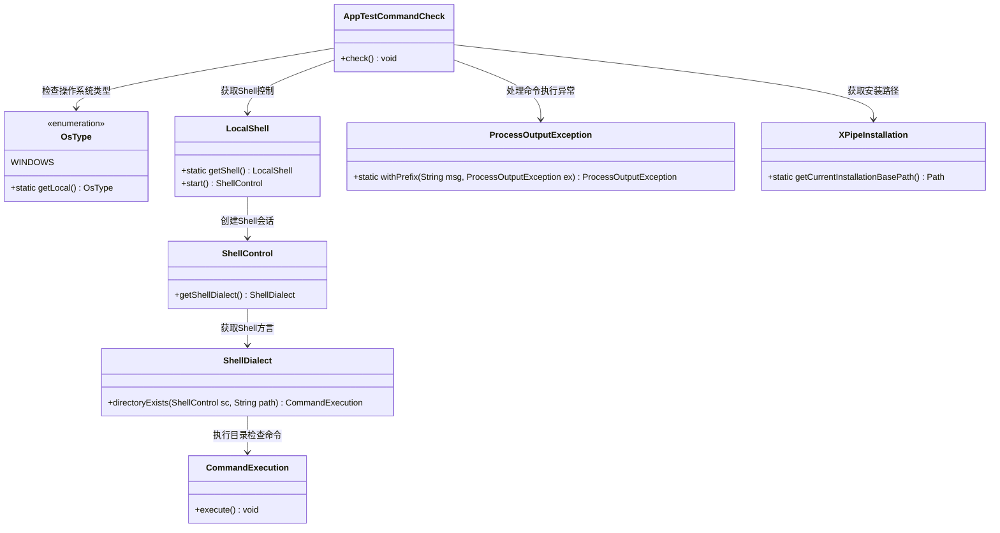
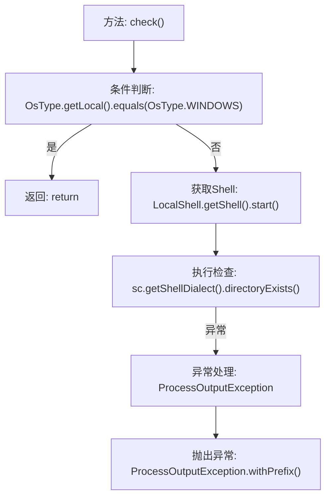

# 基础信息

|      |      |
|------|------|
| 名称 | AppTestCommandCheck |
| 编码语言 | .java |
| 代码路径 | xpipe/app/src/main/java/io/xpipe/app/core/check/AppTestCommandCheck.java |
| 包名 | io.xpipe.app.core.check |
| 依赖项 | ['io.xpipe.app.util.LocalShell', 'io.xpipe.core.process.OsType', 'io.xpipe.core.process.ProcessOutputException', 'io.xpipe.core.util.XPipeInstallation'] |
| 概述说明 | 检查测试命令功能，非Windows系统验证安装目录可访问性。 |

# 说明

该代码定义了一个名为AppTestCommandCheck的类，包含一个静态方法check用于检查系统环境。方法首先判断本地操作系统是否为Windows，若是则直接返回。对于非Windows系统，它会尝试通过Shell检查XPipe安装目录是否存在。若检查失败，抛出带有提示信息的异常，询问用户测试命令是否正常工作以及安装目录是否可访问。整个过程涉及操作系统类型判断、Shell命令执行和异常处理。

# 类列表 Class Summary

| 名称   | 类型  | 说明 |
|-------|------|-------------|
| AppTestCommandCheck | class | 检查测试命令功能，若非Windows系统则验证安装目录可访问。 |

## 类 AppTestCommandCheck

|      |      |
|------|------|
| 访问范围 | public |
| 类型 | class |
| 名称 | AppTestCommandCheck |
| 说明 | 检查测试命令功能，若非Windows系统则验证安装目录可访问。 |

### UML类图

这段代码实现了一个安装自检功能，主要检查非Windows系统下XPipe安装目录的可访问性。核心流程是：首先判断操作系统类型，如果是Windows则跳过检查；否则通过Shell命令验证安装目录是否存在。类图中包含8个关键类，涉及操作系统类型判断、Shell控制、命令执行和异常处理等组件，通过清晰的依赖关系展现了跨平台目录检查的实现逻辑。

### 内部方法调用关系图

这段代码流程图展示了XPipe安装自检的核心逻辑。首先检查操作系统类型，如果是Windows则直接返回；否则启动本地Shell并检查XPipe安装目录是否存在。若目录检查失败，会抛出带有友好错误提示的异常，指导用户排查test命令可用性和目录访问权限问题。流程清晰展现了正常路径和异常处理路径的分支逻辑。

### 字段列表 Field List

| 名称  | 类型  | 说明 |
|-------|-------|------|

### 方法列表 Method List

| 名称  | 类型  | 说明 |
|-------|-------|------|
| check | void | 检查系统是否为Windows，否则验证安装目录可访问性，失败则提示测试命令或目录权限问题。 |

