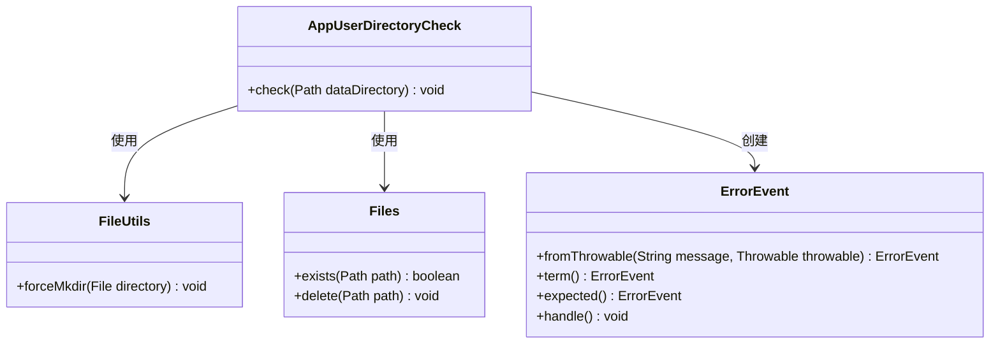
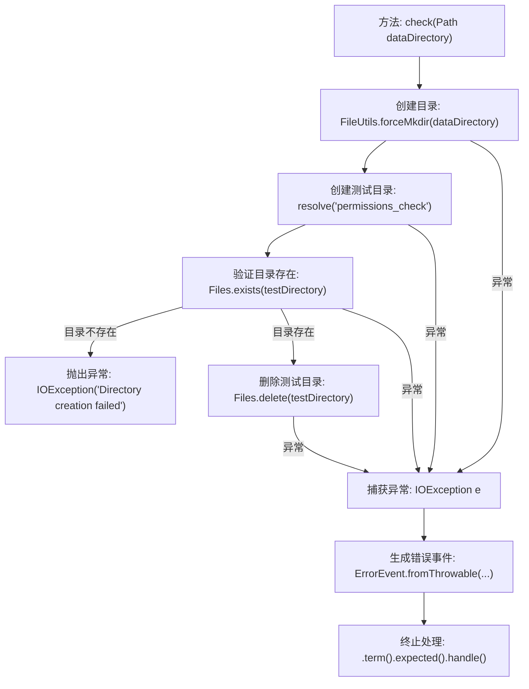

# 基础信息

|      |      |
|------|------|
| 名称 | AppUserDirectoryCheck |
| 编码语言 | .java |
| 代码路径 | xpipe/app/src/main/java/io/xpipe/app/core/check/AppUserDirectoryCheck.java |
| 包名 | io.xpipe.app.core.check |
| 依赖项 | ['io.xpipe.app.issue.ErrorEvent', 'org.apache.commons.io.FileUtils', 'java.io.IOException', 'java.nio.file.Files', 'java.nio.file.Path'] |
| 概述说明 | 检查用户目录权限，创建测试目录并删除，失败时提示权限或云存储问题。 |

# 说明

该代码定义了一个名为AppUserDirectoryCheck的类，包含一个静态方法check，用于检查指定目录的访问权限。方法首先尝试创建目标目录和一个测试子目录，若子目录创建失败则抛出异常。若成功则删除测试目录。捕获到IOException时，会生成包含详细错误信息的ErrorEvent，提示用户检查权限、防病毒软件或云存储状态，并终止程序。整个过程旨在验证用户目录的可写性和可访问性。

# 类列表 Class Summary

| 名称   | 类型  | 说明 |
|-------|------|-------------|
| AppUserDirectoryCheck | class | 检查用户目录权限，确保可创建删除文件，失败时提示权限或云存储问题。 |

## 类 AppUserDirectoryCheck

|      |      |
|------|------|
| 访问范围 | public |
| 类型 | class |
| 名称 | AppUserDirectoryCheck |
| 说明 | 检查用户目录权限，确保可创建删除文件，失败时提示权限或云存储问题。 |

### UML类图

该代码实现了一个目录权限检查工具，主要验证用户对指定目录的读写权限。AppUserDirectoryCheck类通过FileUtils创建测试目录，使用Files类检查目录存在性并清理测试文件。当出现IO异常时，会通过ErrorEvent生成友好的错误提示并终止程序。流程图展示了核心类之间的依赖关系，其中ErrorEvent负责异常处理和用户提示，体现了健壮的错误处理机制。

### 内部方法调用关系图

这段代码流程图描述了AppUserDirectoryCheck类中check方法的执行逻辑。该方法首先尝试创建指定数据目录和测试子目录，验证目录创建是否成功，无论成功与否都会清理测试目录。过程中任何IO异常都会触发错误事件处理流程，生成包含权限检查提示的友好错误信息，并终止程序预期执行。流程体现了对目录权限的严格验证和健壮的错误处理机制，特别关注了云存储和杀毒软件可能导致的静默失败场景。

### 字段列表 Field List

| 名称  | 类型  | 说明 |
|-------|-------|------|

### 方法列表 Method List

| 名称  | 类型  | 说明 |
|-------|-------|------|
| check | void | 检查目录权限并创建测试目录，失败时提示权限或防病毒软件问题。 |

