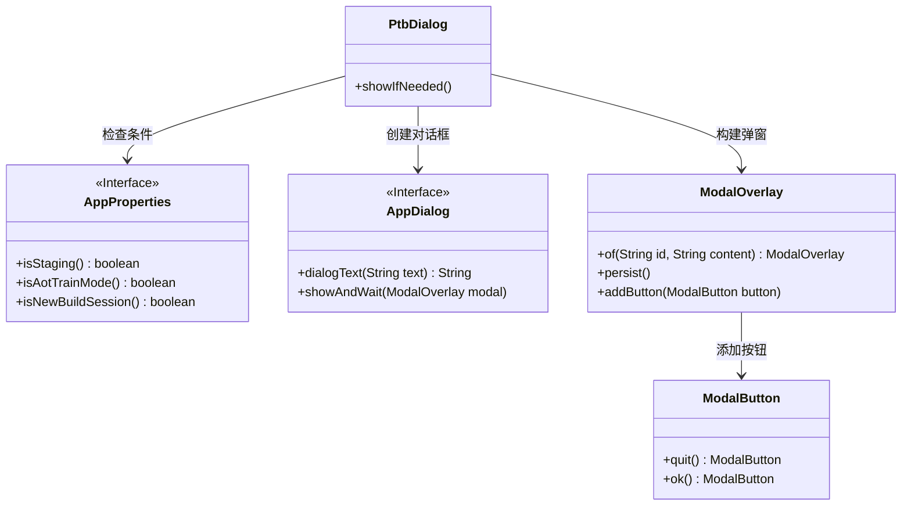
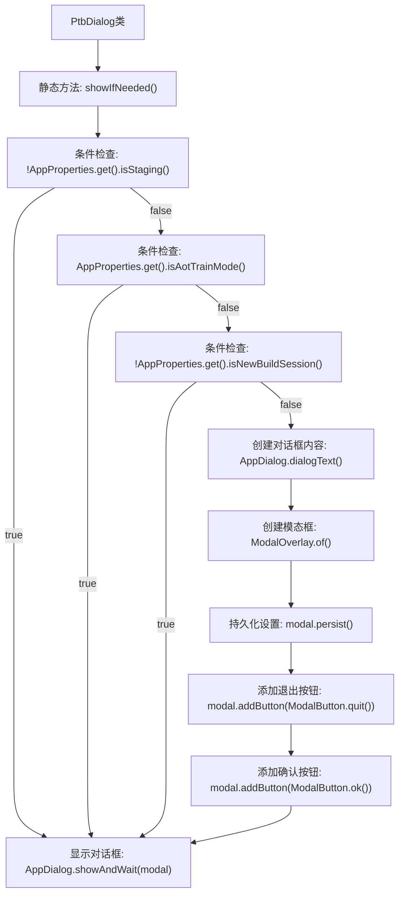

# 基础信息

|      |      |
|------|------|
| 名称 | PtbDialog |
| 编码语言 | .java |
| 代码路径 | xpipe/app/src/main/java/io/xpipe/app/core/check/PtbDialog.java |
| 包名 | io.xpipe.app.core.check |
| 依赖项 | ['io.xpipe.app.comp.base.ModalButton', 'io.xpipe.app.comp.base.ModalOverlay', 'io.xpipe.app.core.AppProperties', 'io.xpipe.app.core.window.AppDialog'] |
| 概述说明 | PTB构建检查，非正式版显示警告弹窗。 |

# 说明

PtbDialog类包含一个静态方法showIfNeeded，用于在特定条件下显示PTB版本警告对话框。该方法首先检查三个条件：当前环境不是生产环境、未处于AOT训练模式、是新构建会话。若任一条件不满足则直接返回。满足条件时，创建包含PTB版本警告文本的对话框内容，提示用户该版本不稳定、可能存在缺陷、不适合日常使用且不会定期更新。随后构建模态对话框，添加退出和确认按钮，并显示对话框等待用户响应。

# 类列表 Class Summary

| 名称   | 类型  | 说明 |
|-------|------|-------------|
| PtbDialog | class | PTB版本提示：非正式版，不稳定且无常规更新，需确认使用。 |

## 类 PtbDialog

|      |      |
|------|------|
| 访问范围 | public |
| 类型 | class |
| 名称 | PtbDialog |
| 说明 | PTB版本提示：非正式版，不稳定且无常规更新，需确认使用。 |

### UML类图

这段代码展示了一个PTB（Pre-Release Testing Build）版本提示对话框的实现逻辑。PtbDialog类通过检查AppProperties中的多个条件（是否测试环境、AOT训练模式、新构建会话）来决定是否显示警告对话框。该对话框通过AppDialog和ModalOverlay构建，包含退出和确认两个按钮，用于提醒用户当前使用的是不稳定的测试版本。类图清晰地展示了各组件间的依赖关系，包括条件检查、对话框构建和按钮添加等关键交互流程。

### 内部方法调用关系图

这段代码流程图展示了PtbDialog类中showIfNeeded()方法的完整执行逻辑。该方法首先进行三重条件检查（是否非预发布环境、是否AOT训练模式、是否新构建会话），任一条件满足则直接返回。只有当所有条件都不满足时，才会创建包含警告信息的PTB版本对话框，添加退出和确认按钮，最后显示模态对话框。流程图清晰呈现了方法的分支逻辑和对话框构建过程，突出了三个前置检查的短路特性。

### 字段列表 Field List

| 名称  | 类型  | 说明 |
|-------|-------|------|

### 方法列表 Method List

| 名称  | 类型  | 说明 |
|-------|-------|------|
| showIfNeeded | void | 若非正式版且新会话，显示PTB版本警告对话框，提示不稳定且无常规更新。 |

