# 基础信息

|      |      |
|------|------|
| 名称 | check |
| 编码语言 | .java |
| 代码路径 | xpipe/app/src/main/java/io/xpipe/app/core/check |
| 包名 | xpipe.app.src.main.java.io.xpipe.app.core.check |
| 概述说明 | AppShellChecker检查shell功能，异常回退处理。AppShellCheck检测系统shell问题。AppTempCheck验证临时目录。PtbDialog显示版本警告。AppTestCommandCheck检查系统环境。AppCertutilCheck检查certutil工具。AppJavaOptionsCheck检查环境变量。AppUserDirectoryCheck验证目录权限。AppDebugModeCheck打印调试警告。AppPathCorruptCheck检查PATH变量。AppRosettaCheck检测运行环境。AppAvCheck检测杀毒软件。AppGpuCheck检查GPU支持。AppHomebrewCoreutilsCheck检测coreutils。AppSystemFontCheck检查Linux字体。 |

# 说明

```markdown
## 概述
该代码模块是一个系统环境检查工具集，主要用于在应用启动时执行各类环境预检和兼容性验证。模块包含多个检查类，覆盖Shell环境、临时目录、系统工具、字体配置、杀毒软件检测等关键系统功能。核心设计采用抽象基类与平台特定实现相结合的方式，通过统一的错误处理机制和用户提示系统，确保应用运行环境的稳定性和兼容性。检查失败时会根据严重程度采取终止运行、回退机制或显示警告对话框等不同处理策略。

## 主要业务场景
1. **Shell环境验证**  
   - 检查主/备Shell可用性（`AppShellChecker`）
   - 检测Linux/MacOS权限限制、PATH损坏、工具缺失（`AppShellCheck`）
   - Windows特有检查：杀毒软件拦截、Applocker限制（`AppShellCheck`）

2. **系统目录检查**  
   - 验证临时目录可写性（`AppTempCheck`）
   - 检查用户目录访问权限（`AppUserDirectoryCheck`）
   - Windows PATH变量完整性检测（`AppPathCorruptCheck`）

3. **平台特定问题检测**  
   - macOS Rosetta转译警告（`AppRosettaCheck`）
   - Homebrew coreutils冲突检测（`AppHomebrewCoreutilsCheck`）
   - Linux系统字体缺失处理（`AppSystemFontCheck`）
   - Windows certutil工具可用性检查（`AppCertutilCheck`）

4. **安全与兼容性检查**  
   - 杀毒软件检测与警告（Bitdefender/Malwarebytes/McAfee）（`AppAvCheck`）
   - 调试模式敏感信息警告（`AppDebugModeCheck`）
   - _JAVA_OPTIONS环境变量冲突检测（`AppJavaOptionsCheck`）

5. **特殊场景处理**  
   - PTB版本警告对话框（非生产环境）（`PtbDialog`）
   - GPU支持检测与性能模式切换（`AppGpuCheck`）
   - 跨平台测试命令验证（`AppTestCommandCheck`）
```


### 包内部结构视图

```mermaid
graph TD
    check --> AppShellChecker.java
    check --> AppShellCheck.java
    check --> AppTempCheck.java
    check --> PtbDialog.java
    check --> AppTestCommandCheck.java
    check --> AppCertutilCheck.java
    check --> AppJavaOptionsCheck.java
    check --> AppUserDirectoryCheck.java
    check --> AppDebugModeCheck.java
    check --> AppPathCorruptCheck.java
    check --> AppRosettaCheck.java
    check --> AppAvCheck.java
    check --> AppGpuCheck.java
    check --> AppHomebrewCoreutilsCheck.java
    check --> AppSystemFontCheck.java
```



该流程图展示了xpipe项目中check目录下的所有文件结构。根节点为check文件夹，其下直接连接15个Java类文件，这些文件均为应用程序的核心检查功能模块，涵盖从系统环境检测（如GPU、Rosetta）、安全验证（如证书工具）到用户目录检查等多种功能，体现了模块化设计的清晰层次。

# 文件列表 File List

| 名称   | 类型  | 说明 |
|-------|------|-------------|
| [AppTestCommandCheck.java](AppTestCommandCheck.md) | file | 检查测试命令功能，非Windows系统验证安装目录可访问性。 |
| [PtbDialog.java](PtbDialog.md) | file | PTB构建检查，非正式版显示警告弹窗。 |
| [AppTempCheck.java](AppTempCheck.md) | file | 检查临时目录有效性，无效则报错处理。 |
| [AppShellCheck.java](AppShellCheck.md) | file | 检查系统shell问题的工具类，支持Linux、MacOS和Windows，列出常见错误原因。 |
| [AppShellChecker.java](AppShellChecker.md) | file | AppShellChecker检查shell自测错误，支持回退处理，失败时输出错误信息。 |
| [AppHomebrewCoreutilsCheck.java](AppHomebrewCoreutilsCheck.md) | file | 检查MacOS系统是否安装homebrew coreutils包，若存在则提示移除以避免与XPipe冲突。 |
| [AppGpuCheck.java](AppGpuCheck.md) | file | 检查GPU支持，若首次启动且不支持3D场景则启用性能模式。 |
| [AppAvCheck.java](AppAvCheck.md) | file | 检测Windows首次启动时的杀毒软件，显示警告信息。支持Bitdefender、Malwarebytes、McAfee。 |
| [AppRosettaCheck.java](AppRosettaCheck.md) | file | 检查MacOS系统是否为Apple Silicon运行Intel版XPipe，提示性能问题并推荐安装原生版本。 |
| [AppPathCorruptCheck.java](AppPathCorruptCheck.md) | file | 检查Windows系统PATH是否损坏，缺少关键工具则提示修复。 |
| [AppDebugModeCheck.java](AppDebugModeCheck.md) | file | 检查调试模式并输出警告信息，提示敏感数据风险。 |
| [AppUserDirectoryCheck.java](AppUserDirectoryCheck.md) | file | 检查用户目录权限，创建测试目录并删除，失败时提示权限或云存储问题。 |
| [AppJavaOptionsCheck.java](AppJavaOptionsCheck.md) | file | 检查全局环境变量_JAVA_OPTIONS，若存在则提示用户移除以避免问题。 |
| [AppCertutilCheck.java](AppCertutilCheck.md) | file | 检查Windows系统certutil工具可用性，不可用则禁用相关功能。 |
| [AppSystemFontCheck.java](AppSystemFontCheck.md) | file | 检查Linux系统字体，若无则设置默认字体路径。 |


