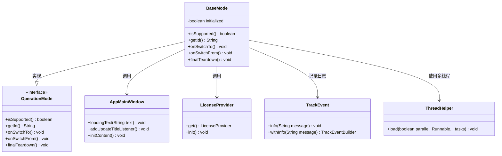
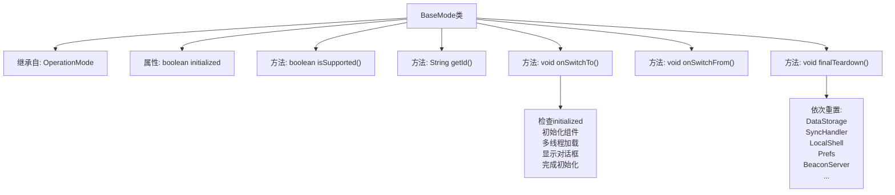
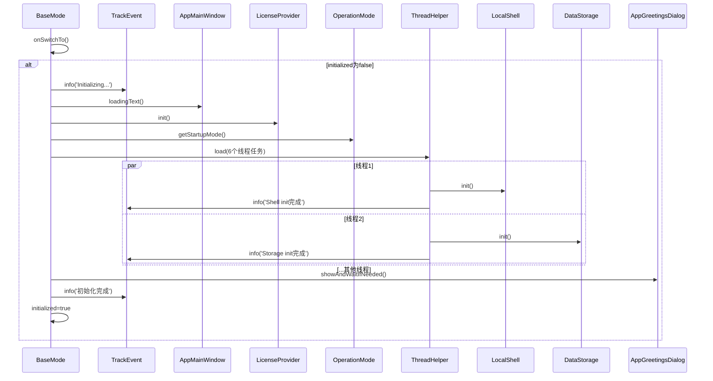

# 基础信息

|      |      |
|------|------|
| 名称 | BaseMode |
| 编码语言 | .java |
| 代码路径 | xpipe/app/src/main/java/io/xpipe/app/core/mode/BaseMode.java |
| 包名 | io.xpipe.app.core.mode |
| 依赖项 | ['io.xpipe.app.beacon.AppBeaconServer', 'io.xpipe.app.beacon.BlobManager', 'io.xpipe.app.browser.BrowserFullSessionModel', 'io.xpipe.app.browser.file.BrowserLocalFileSystem', 'io.xpipe.app.browser.icon.BrowserIconManager', 'io.xpipe.app.comp.store.StoreViewState', 'io.xpipe.app.core', 'io.xpipe.app.core.check', 'io.xpipe.app.core.window.AppDialog', 'io.xpipe.app.core.window.AppMainWindow', 'io.xpipe.app.ext.ActionProvider', 'io.xpipe.app.ext.DataStoreProviders', 'io.xpipe.app.ext.ProcessControlProvider', 'io.xpipe.app.icon.SystemIconManager', 'io.xpipe.app.issue.TrackEvent', 'io.xpipe.app.password.KeePassXcManager', 'io.xpipe.app.prefs.AppPrefs', 'io.xpipe.app.resources', 'io.xpipe.app.storage.DataStorage', 'io.xpipe.app.storage.DataStorageSyncHandler', 'io.xpipe.app.terminal.TerminalLauncherManager', 'io.xpipe.app.terminal.TerminalView', 'io.xpipe.app.update.UpdateAvailableDialog', 'io.xpipe.app.update.UpdateChangelogAlert', 'io.xpipe.app.update.UpdateNagDialog', 'io.xpipe.app.util', 'io.xpipe.core.util.XPipeDaemonMode', 'java.util.concurrent.CountDownLatch'] |
| 概述说明 | BaseMode类初始化组件并处理更新、存储、UI等，关闭时重置所有资源。 |

# 说明

BaseMode类继承自OperationMode，负责应用程序基础模式的初始化和关闭。初始化时检查许可证、路径、核心工具、AV设置等，并加载Shell、存储、用户界面等组件。支持多线程并行初始化，包括文件监视器、终端管理等。启动时显示更新提醒和欢迎对话框，关闭时按优先级重置数据存储、Shell、浏览器会话等组件，确保资源释放。整个过程通过TrackEvent记录关键步骤。

# 类列表 Class Summary

| 名称   | 类型  | 说明 |
|-------|------|-------------|
| BaseMode | class | BaseMode类初始化组件并执行检查，包括许可证、路径、更新等，多线程加载资源，管理数据存储和UI，提供关闭时的清理操作。 |

## 类 BaseMode

|      |      |
|------|------|
| 访问范围 | public |
| 类型 | class |
| 名称 | BaseMode |
| 说明 | BaseMode类初始化组件并执行检查，包括许可证、路径、更新等，多线程加载资源，管理数据存储和UI，提供关闭时的清理操作。 |

### UML类图

该代码展示了一个基础模式类`BaseMode`，它实现了`OperationMode`接口，负责应用程序启动时的初始化流程和关闭时的资源释放。类图中包含核心组件如`AppMainWindow`（主窗口控制）、`LicenseProvider`（许可证管理）、`TrackEvent`（事件跟踪）和`ThreadHelper`（多线程工具）。`BaseMode`通过多线程并行执行初始化任务，涉及文件系统检查、许可证验证、UI加载等关键操作，并在关闭时严格按优先级释放资源，确保系统稳定退出。

### 内部方法调用关系图

这段代码是BaseMode类的实现，继承自OperationMode，主要处理应用程序基础模式的初始化和关闭流程。流程图展示了类结构和两个核心方法：onSwitchTo()包含多阶段初始化过程，通过6个并行线程加载不同组件；finalTeardown()则按优先级顺序重置20多个系统组件。时序图详细描述了onSwitchTo()的执行过程，包括初始化检查、组件加载、多线程任务处理和完成标记设置，体现了复杂的初始化逻辑和资源管理机制。

### 字段列表 Field List

| 名称  | 类型  | 说明 |
|-------|-------|------|
| initialized | boolean | 私有布尔型初始化标志 |

### 方法列表 Method List

| 名称  | 类型  | 说明 |
|-------|-------|------|
| getId | String | 重写getId方法，返回字符串"background"。 |
| onSwitchFrom | void | 重写父类方法，切换时执行空操作。 |
| isSupported | boolean | 重写方法isSupported，始终返回true。 |
| finalTeardown | void | finalTeardown方法依次重置数据存储、SSH、浏览器会话等组件，完成基础模式关闭。 |
| onSwitchTo | void | 初始化基础组件，检查许可证、路径、安全等，加载数据、界面，处理更新和启动对话框。 |

