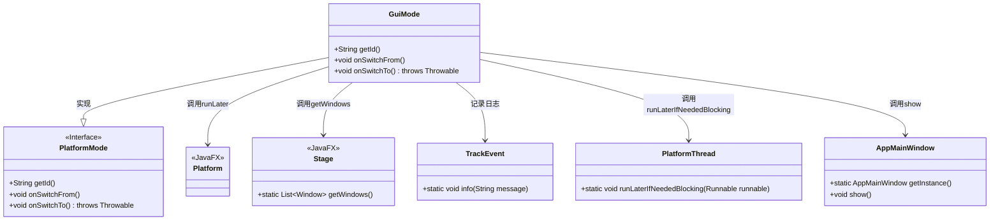
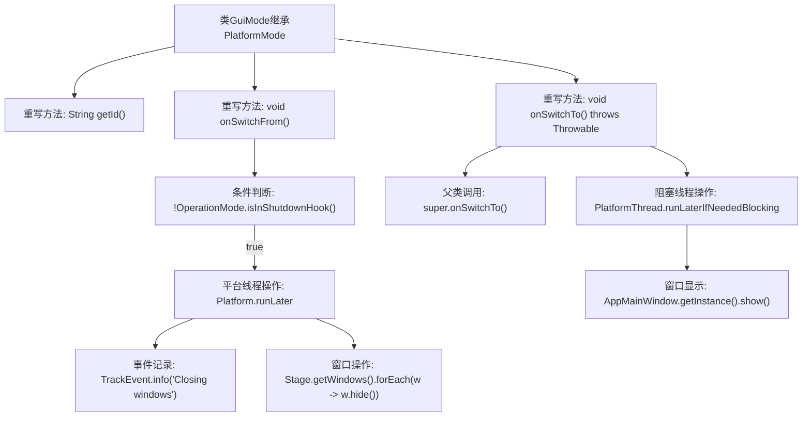

# 基础信息

|      |      |
|------|------|
| 名称 | GuiMode |
| 编码语言 | .java |
| 代码路径 | xpipe/app/src/main/java/io/xpipe/app/core/mode/GuiMode.java |
| 包名 | io.xpipe.app.core.mode |
| 依赖项 | ['io.xpipe.app.core.window.AppMainWindow', 'io.xpipe.app.issue.TrackEvent', 'io.xpipe.app.util.PlatformThread', 'javafx.application.Platform', 'javafx.stage.Stage'] |
| 概述说明 | GuiMode类继承PlatformMode，实现GUI模式切换逻辑，关闭或显示窗口。 |

# 说明

这段代码描述了一个名为GuiMode的类，继承自PlatformMode。它实现了三个关键方法：getId返回模式标识符"gui"；onSwitchFrom在非关机钩子状态下通过Platform.runLater关闭所有窗口；onSwitchTo调用父类方法后通过PlatformThread.runLaterIfNeededBlocking显示主应用窗口。类主要处理GUI模式的窗口切换逻辑。

# 类列表 Class Summary

| 名称   | 类型  | 说明 |
|-------|------|-------------|
| GuiMode | class | GuiMode类继承PlatformMode，切换时关闭或显示窗口。 |

## 类 GuiMode

|      |      |
|------|------|
| 访问范围 | public |
| 类型 | class |
| 名称 | GuiMode |
| 说明 | GuiMode类继承PlatformMode，切换时关闭或显示窗口。 |

### UML类图

该代码展示了一个GUI模式类`GuiMode`，它继承自接口`PlatformMode`，实现了模式切换时的窗口管理功能。当从GUI模式切换出去时，会关闭所有窗口（除非在关机钩子中）；当切换到GUI模式时，会显示主窗口。类图中清晰地展示了与JavaFX组件（Platform、Stage）、工具类（PlatformThread、TrackEvent）以及主窗口类（AppMainWindow）的交互关系，体现了GUI模式切换时的完整生命周期控制流程。

### 内部方法调用关系图

这段代码展示了一个GUI模式类，继承自平台模式基类。主要功能包括：1) 提供模式ID标识；2) 在模式切换时关闭所有窗口（除非在关机钩子中）；3) 切换到该模式时显示主窗口。流程图清晰地展示了方法调用层级和条件分支，特别是平台线程的异步操作和阻塞操作的区别处理，体现了GUI模式切换时的线程安全考虑和窗口管理逻辑。

### 字段列表 Field List

| 名称  | 类型  | 说明 |
|-------|-------|------|

### 方法列表 Method List

| 名称  | 类型  | 说明 |
|-------|-------|------|
| getId | String | 重写getId方法，返回字符串"gui"。 |
| onSwitchFrom | void | 覆盖方法，非关机钩子时隐藏所有窗口。 |
| onSwitchTo | void | 重写onSwitchTo方法，调用父类后显示主窗口。 |

