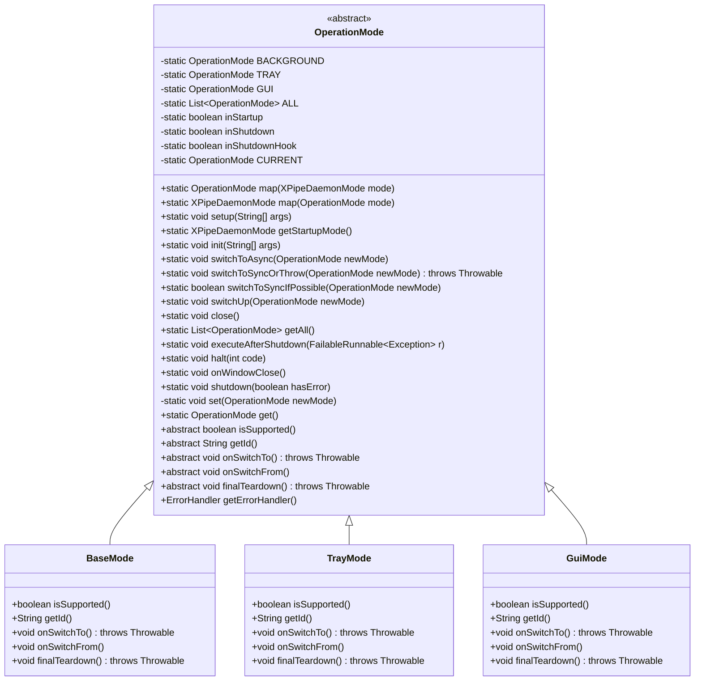
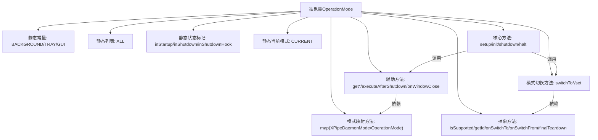
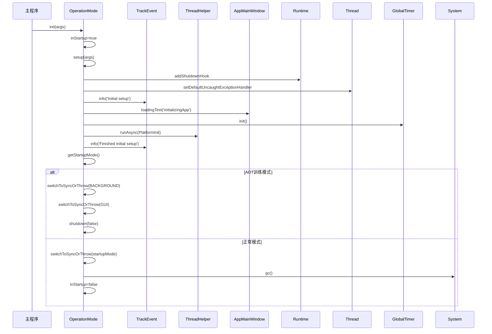

# 基础信息

|      |      |
|------|------|
| 名称 | OperationMode |
| 编码语言 | .java |
| 代码路径 | xpipe/app/src/main/java/io/xpipe/app/core/mode/OperationMode.java |
| 包名 | io.xpipe.app.core.mode |
| 依赖项 | ['io.xpipe.app.beacon.AppBeaconServer', 'io.xpipe.app.browser.BrowserFullSessionModel', 'io.xpipe.app.core', 'io.xpipe.app.core.check.AppDebugModeCheck', 'io.xpipe.app.core.check.AppTempCheck', 'io.xpipe.app.core.window.AppMainWindow', 'io.xpipe.app.issue', 'io.xpipe.app.prefs.AppPrefs', 'io.xpipe.app.prefs.CloseBehaviour', 'io.xpipe.app.storage.DataStorage', 'io.xpipe.app.util', 'io.xpipe.core.process.OsType', 'io.xpipe.core.util.FailableRunnable', 'io.xpipe.core.util.XPipeDaemonMode', 'javafx.application.Platform', 'lombok.Getter', 'lombok.SneakyThrows', 'java.time.Duration', 'java.util.List'] |
| 概述说明 | 抽象类OperationMode定义了后台、托盘和GUI三种运行模式，包含模式切换、初始化和关闭逻辑。 |

# 说明

OperationMode是一个抽象类，定义了三种运行模式（BACKGROUND、TRAY、GUI）及其管理逻辑。它包含模式切换、启动关闭控制、异常处理和状态跟踪等功能。类中提供了静态方法进行模式映射、初始化设置、同步/异步切换、优雅关闭等操作，并维护当前模式状态。通过钩子函数处理SIGTERM信号和未捕获异常，支持启动模式自动判断（根据窗口状态、属性配置或首选项）。关闭行为可配置为退出或保持后台运行，包含超时强制终止机制。抽象方法要求子类实现模式支持检查、切换处理和最终清理等逻辑。

# 类列表 Class Summary

| 名称   | 类型  | 说明 |
|-------|------|-------------|
| OperationMode | class | 操作模式类，含后台、托盘、GUI三种模式，支持模式切换、初始化和关闭处理。 |

## 类 OperationMode

|      |      |
|------|------|
| 访问范围 | public abstract |
| 类型 | class |
| 名称 | OperationMode |
| 说明 | 操作模式类，含后台、托盘、GUI三种模式，支持模式切换、初始化和关闭处理。 |

### UML类图

这段代码定义了一个抽象类`OperationMode`及其三个具体实现类`BaseMode`、`TrayMode`和`GuiMode`，用于管理应用程序的不同运行模式。`OperationMode`提供了静态方法来处理模式切换、初始化和关闭流程，包括错误处理、线程管理和系统信号处理等功能。类图展示了`OperationMode`作为基类与三个具体模式类之间的继承关系，以及类中定义的主要方法和属性。

### 内部方法调用关系图

这段代码实现了一个抽象的操作模式管理系统，包含BACKGROUND/TRAY/GUI三种运行模式。流程图展示了类结构关系，时序图描述了初始化过程的核心调用链。系统通过静态方法管理全局状态，支持模式切换、异常处理和优雅关闭，特别处理了启动阶段的状态跟踪和线程安全问题。抽象方法由具体模式实现，支持动态检测功能可用性（如系统托盘支持）。关键设计包括：双重模式映射机制、带超时的安全关闭流程、平台线程管理、以及启动/关闭状态跟踪。

### 字段列表 Field List

| 名称  | 类型  | 说明 |
|-------|-------|------|
| ALL = List.of(BACKGROUND, TRAY, GUI) | List<OperationMode> | 私有静态常量列表ALL包含BACKGROUND、TRAY、GUI三种操作模式。 |
| BACKGROUND = new BaseMode() | OperationMode | 定义静态常量BACKGROUND，类型为OperationMode，初始化为BaseMode实例。 |
| GUI = new GuiMode() | OperationMode | 定义GUI操作模式常量 |
| inShutdownHook | boolean | 私有静态布尔变量inShutdownHook |
| HALT_LOCK = new Object() | Object | 私有静态最终对象锁HALT_LOCK |
| CURRENT = null | OperationMode | 私有静态操作模式变量CURRENT初始为空。 |
| inShutdown | boolean | 私有静态布尔变量，标记是否处于关闭状态。 |
| inStartup | boolean | 私有静态布尔变量inStartup，使用Getter注解。 |
| TRAY = new TrayMode() | OperationMode | 静态常量TRAY，类型OperationMode，初始化为TrayMode实例。 |

### 方法列表 Method List

| 名称  | 类型  | 说明 |
|-------|-------|------|
| onSwitchTo | void | 抽象方法onSwitchTo()，执行时可能抛出异常。 |
| onSwitchFrom | void | 抽象方法：切换时调用 |
| executeAfterShutdown | void | 静态方法executeAfterShutdown在关闭后执行任务，确保非守护线程运行，处理异常并终止程序。 |
| switchToSyncIfPossible | boolean | 尝试切换操作模式，若目标模式不支持则回退到基础模式并返回失败，成功则返回成功。 |
| get | OperationMode | 获取当前操作模式。 |
| init | void | 初始化应用启动流程，设置模式并执行图形界面操作，非Linux系统下打开文件系统并切换视图，最后清理资源。 |
| shutdown | void | 系统关闭流程：启动时直接停止；防重复关闭；非守护线程执行清理；超时强制终止。 |
| finalTeardown | void | 抽象方法finalTeardown，可能抛出Throwable异常。 |
| getErrorHandler | ErrorHandler | 获取错误处理器，返回同步处理的GUI错误处理器。 |
| switchUp | void | 静态方法switchUp根据newMode切换操作模式：若为BACKGROUND则返回；支持TRAY且当前为BACKGROUND时切至TRAY；支持GUI时切至GUI。 |
| isSupported | boolean | 抽象方法，检查是否支持某功能。 |
| getStartupMode | XPipeDaemonMode | 方法确定启动模式：窗口显示则GUI，属性设置则按属性，偏好设置则按偏好，默认GUI。 |
| setup | void | 代码设置SIGTERM处理和未捕获异常处理，初始化应用组件并启动主窗口。 |
| map | XPipeDaemonMode | 静态方法将OperationMode映射为XPipeDaemonMode，对应关系为BACKGROUND/TRAY/GUI，不匹配返回null。 |
| set | void | 私有同步方法set用于更新操作模式，处理模式切换逻辑，确保异常时记录错误。 |
| onWindowClose | void | 方法onWindowClose处理窗口关闭行为：根据偏好设置执行退出或默认操作，异步运行。 |
| switchToSyncOrThrow | void | 切换操作模式，检查支持性，失败抛出异常。 |
| switchToAsync | void | 异步切换操作模式，启动新线程执行同步切换。 |
| close | void | 静态方法close，调用set(null)清空设置。 |
| halt | void | 静态方法halt(int code)同步执行：记录日志、关闭日志系统并强制终止JVM。 |
| getAll | List<OperationMode> | 获取所有操作模式的静态方法。 |
| map | OperationMode | 将XPipeDaemonMode转换为OperationMode的静态方法，包含BACKGROUND、TRAY、GUI三种模式映射。 |
| getId | String | 抽象方法，返回字符串类型的ID。 |

