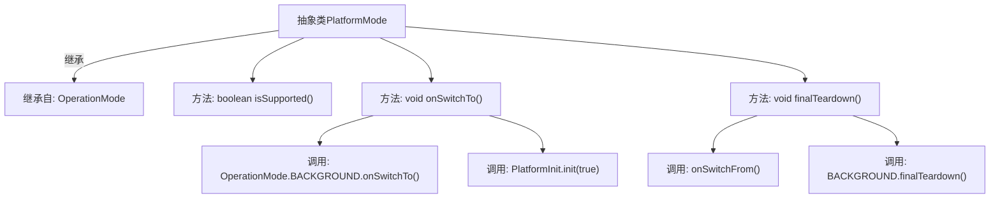

# 基础信息

|      |      |
|------|------|
| 名称 | PlatformMode |
| 编码语言 | .java |
| 代码路径 | xpipe/app/src/main/java/io/xpipe/app/core/mode/PlatformMode.java |
| 包名 | io.xpipe.app.core.mode |
| 依赖项 | ['io.xpipe.app.util.PlatformInit'] |
| 概述说明 | 抽象类PlatformMode继承OperationMode，重写支持状态和切换方法，调用父类及平台初始化。 |

# 说明

这是一个名为PlatformMode的抽象类，继承自OperationMode类。它重写了三个方法：isSupported始终返回true表示支持该模式；onSwitchTo方法在切换到此模式时先调用父类的BACKGROUND模式切换逻辑，再执行PlatformInit初始化；finalTeardown方法在最终销毁时先调用onSwitchFrom，再执行BACKGROUND模式的销毁逻辑。所有方法都可能抛出Throwable异常。

# 类列表 Class Summary

| 名称   | 类型  | 说明 |
|-------|------|-------------|
| PlatformMode | class | 抽象类PlatformMode继承OperationMode，重写支持判断和切换方法，包含初始化和清理逻辑。 |


## 类 PlatformMode

|      |      |
|------|------|
| 访问范围 | public abstract |
| 类型 | class |
| 名称 | PlatformMode |
| 说明 | 抽象类PlatformMode继承OperationMode，重写支持判断和切换方法，包含初始化和清理逻辑。 |


### UML类图

```mermaid
classDiagram
    class OperationMode {
        <<abstract>>
        +boolean isSupported()
        +void onSwitchTo() throws Throwable
        +void finalTeardown() throws Throwable
        +void onSwitchFrom()
    }

    class PlatformMode {
        <<abstract>>
        +boolean isSupported()
        +void onSwitchTo() throws Throwable
        +void finalTeardown() throws Throwable
    }
    
    OperationMode <|-- PlatformMode
    OperationMode o-- OperationMode : BACKGROUND
    PlatformMode ..> PlatformInit : : 依赖
```

这段类图展示了PlatformMode抽象类继承自OperationMode的关系。PlatformMode重写了父类的isSupported()、onSwitchTo()和finalTeardown()方法，其中onSwitchTo()会调用BACKGROUND实例的同名方法并触发PlatformInit初始化，finalTeardown()则先调用onSwitchFrom()再委托BACKGROUND处理。OperationMode包含一个指向自身的BACKGROUND静态成员，PlatformMode依赖于PlatformInit工具类。


### 内部方法调用关系图



这段流程图展示了PlatformMode抽象类的结构及其方法调用关系。PlatformMode继承自OperationMode，包含isSupported()、onSwitchTo()和finalTeardown()三个主要方法。其中onSwitchTo()会依次调用父类的BACKGROUND模式和PlatformInit初始化，finalTeardown()则会先调用onSwitchFrom()再执行父类的清理操作。该图清晰地呈现了类继承关系和方法间的调用链，特别突出了跨类调用的关键路径。

### 字段列表 Field List

| 名称  | 类型  | 说明 |
|-------|-------|------|

### 方法列表 Method List

| 名称  | 类型  | 说明 |
|-------|-------|------|
| isSupported | boolean | 方法重写，始终返回true。 |
| onSwitchTo | void | 后台模式切换时初始化平台。 |
| finalTeardown | void | 重写finalTeardown方法，先调用onSwitchFrom，再调用BACKGROUND的finalTeardown。 |


