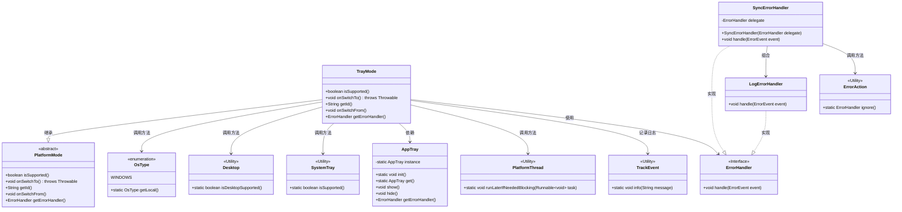
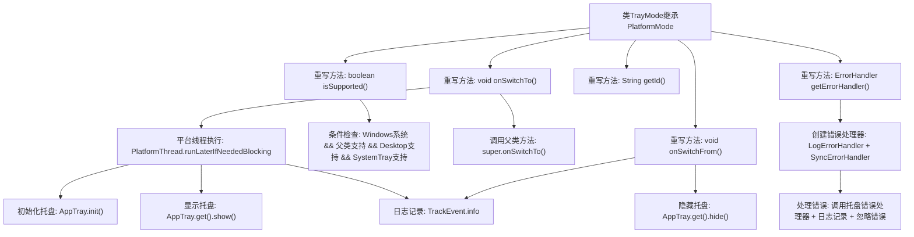

# 基础信息

|      |      |
|------|------|
| 名称 | TrayMode |
| 编码语言 | .java |
| 代码路径 | xpipe/app/src/main/java/io/xpipe/app/core/mode/TrayMode.java |
| 包名 | io.xpipe.app.core.mode |
| 依赖项 | ['io.xpipe.app.core.AppTray', 'io.xpipe.app.issue', 'io.xpipe.app.util.PlatformThread', 'io.xpipe.core.process.OsType', 'java.awt'] |
| 概述说明 | TrayMode类扩展PlatformMode，支持Windows系统托盘功能，包含初始化、切换和错误处理逻辑。 |

# 说明

TrayMode类继承PlatformMode，专为Windows系统设计，需满足桌面和系统托盘支持条件。切换至该模式时初始化并显示托盘图标，切换时隐藏托盘。提供唯一标识符"tray"，错误处理机制确保托盘初始化完成后处理异常，未完成则记录日志并忽略错误。整个过程包含事件跟踪和线程安全操作。

# 类列表 Class Summary

| 名称   | 类型  | 说明 |
|-------|------|-------------|
| TrayMode | class | TrayMode类扩展PlatformMode，支持Windows系统托盘功能，包含初始化、切换和错误处理逻辑。 |

## 类 TrayMode

|      |      |
|------|------|
| 访问范围 | public |
| 类型 | class |
| 名称 | TrayMode |
| 说明 | TrayMode类扩展PlatformMode，支持Windows系统托盘功能，包含初始化、切换和错误处理逻辑。 |

### UML类图

该类图展示了TrayMode继承自PlatformMode的实现细节，包含对系统托盘功能的支持检查、切换操作和错误处理机制。TrayMode通过OsType、Desktop和SystemTray验证Windows平台支持，依赖AppTray管理托盘图标，使用PlatformThread确保线程安全，并通过组合LogErrorHandler和SyncErrorHandler实现多层错误处理。整个设计体现了平台特定功能的模块化实现和健壮的错误处理策略。

### 内部方法调用关系图

这段代码是TrayMode类的实现，继承自PlatformMode基类。主要功能包括：检查系统托盘支持状态(isSupported)、切换至托盘模式时初始化并显示托盘(onSwitchTo)、退出时隐藏托盘(onSwitchFrom)、提供错误处理机制(getErrorHandler)。核心逻辑通过PlatformThread保证线程安全，使用AppTray管理托盘图标，并通过TrackEvent记录关键操作日志。错误处理采用组合模式，同时调用托盘专属处理器和基础日志处理器。

### 字段列表 Field List

| 名称  | 类型  | 说明 |
|-------|-------|------|

### 方法列表 Method List

| 名称  | 类型  | 说明 |
|-------|-------|------|
| getId | String | 重写getId方法，返回字符串"tray"。 |
| getErrorHandler | ErrorHandler | 重写getErrorHandler方法，返回同步错误处理器，处理事件时检查托盘初始化并记录日志。 |
| onSwitchTo | void | 切换时初始化托盘并显示，确保线程安全。 |
| onSwitchFrom | void | 重写方法：关闭托盘并记录日志 |
| isSupported | boolean | 检查Windows系统支持且满足父类及桌面、系统托盘支持条件。 |

