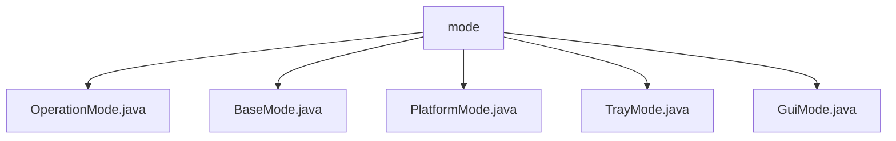

# 基础信息

|      |      |
|------|------|
| 名称 | mode |
| 编码语言 | .java |
| 代码路径 | xpipe/app/src/main/java/io/xpipe/app/core/mode |
| 包名 | xpipe.app.src.main.java.io.xpipe.app.core.mode |
| 概述说明 | OperationMode定义三种运行模式及管理逻辑，子类BaseMode、PlatformMode、TrayMode、GuiMode分别实现初始化、切换和关闭功能。 |

# 说明

```markdown
## 概述
该代码模块定义了应用程序的多模式运行框架，核心围绕`OperationMode`抽象类构建，支持`BACKGROUND`(后台)、`TRAY`(系统托盘)、`GUI`(图形界面)三种运行模式。通过继承体系实现分层控制：
- **OperationMode**：提供模式管理基础架构，包括状态跟踪、切换控制、信号处理和生命周期管理
- **BaseMode**：实现基础初始化/关闭流程，处理许可证、路径、核心组件加载等通用逻辑
- **PlatformMode**：作为平台相关模式的抽象基类，桥接通用逻辑与具体实现
- **TrayMode/GuiMode**：分别实现系统托盘和图形界面的具体行为

模块采用钩子函数+模板方法模式，支持同步/异步切换、优雅关闭、异常恢复等企业级特性。

## 主要业务场景
1. **多模式启动控制**
   - 根据系统环境自动选择初始模式（无窗口属性→BACKGROUND，有GUI能力→GUI）
   - 支持通过配置/首选项强制指定启动模式
   - 并行初始化核心组件（Shell、存储、UI框架等）

2. **运行时模式切换**
   - GUI↔TRAY模式切换时的窗口显隐控制
   - 跨模式状态同步（通过父类状态机维护）
   - 线程安全的异步切换实现

3. **优雅终止处理**
   - 响应SIGTERM信号执行分级关闭
   - 按优先级释放资源（浏览器会话→Shell→存储）
   - 超时强制终止保障（默认30秒）

4. **异常恢复机制**
   - 全局未捕获异常处理
   - 托盘模式下的静默错误降级
   - 关键操作跟踪日志（TrackEvent）

5. **平台适配**
   - Windows系统托盘集成（图标管理、消息处理）
   - JavaFX窗口生命周期控制
   - 平台特定初始化（PlatformInit）
```


### 包内部结构视图



该流程图展示了xpipe项目中mode目录下的文件结构关系。根节点"mode"包含5个直接子文件：OperationMode.java、BaseMode.java、PlatformMode.java、TrayMode.java和GuiMode.java。这些文件都位于同一层级，没有更深层次的嵌套结构，表明它们都是mode模块的核心实现类。每个文件名称都清晰地反映了其功能定位，如TrayMode.java可能处理系统托盘功能，GuiMode.java负责图形界面模式等。

# 文件列表 File List

| 名称   | 类型  | 说明 |
|-------|------|-------------|
| [OperationMode.java](OperationMode.md) | file | 抽象类OperationMode定义了后台、托盘和GUI三种运行模式，包含模式切换、初始化和关闭逻辑。 |
| [GuiMode.java](GuiMode.md) | file | GuiMode类继承PlatformMode，实现GUI模式切换逻辑，关闭或显示窗口。 |
| [TrayMode.java](TrayMode.md) | file | TrayMode类扩展PlatformMode，支持Windows系统托盘功能，包含初始化、切换和错误处理逻辑。 |
| [PlatformMode.java](PlatformMode.md) | file | 抽象类PlatformMode继承OperationMode，重写支持状态和切换方法，调用父类及平台初始化。 |
| [BaseMode.java](BaseMode.md) | file | BaseMode类初始化组件并处理更新、存储、UI等，关闭时重置所有资源。 |


