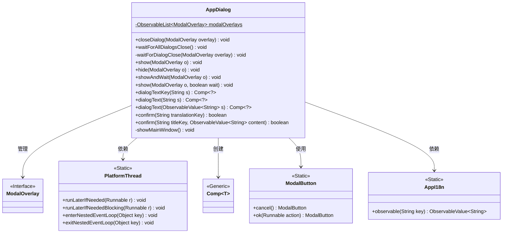
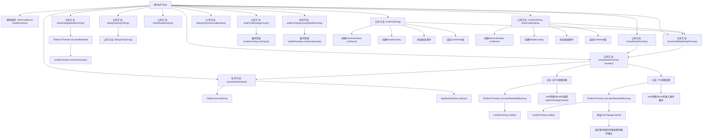

# 基础信息

|      |      |
|------|------|
| 名称 | AppDialog |
| 编码语言 | .java |
| 代码路径 | xpipe/app/src/main/java/io/xpipe/app/core/window/AppDialog.java |
| 包名 | io.xpipe.app.core.window |
| 依赖项 | ['io.xpipe.app.comp.Comp', 'io.xpipe.app.comp.base.ModalButton', 'io.xpipe.app.comp.base.ModalOverlay', 'io.xpipe.app.core.AppI18n', 'io.xpipe.app.util.PlatformInit', 'io.xpipe.app.util.PlatformThread', 'io.xpipe.app.util.ThreadHelper', 'javafx.animation.PauseTransition', 'javafx.application.Platform', 'javafx.beans.value.ObservableValue', 'javafx.collections.FXCollections', 'javafx.collections.ListChangeListener', 'javafx.collections.ObservableList', 'javafx.scene.layout.StackPane', 'javafx.scene.text.Text', 'javafx.util.Duration', 'lombok.Getter', 'java.util.concurrent.atomic.AtomicBoolean'] |
| 概述说明 | AppDialog类管理模态对话框，提供显示、关闭、确认等功能，支持多线程操作和国际化文本。 |

# 说明

该代码定义了一个AppDialog类，用于管理模态对话框的显示和交互。主要功能包括：维护一个模态对话框列表，提供显示、关闭、等待关闭等操作。支持同步和异步显示对话框，包含确认对话框功能，可绑定国际化文本。通过PlatformThread处理线程安全，使用ObservableList跟踪对话框状态，并提供文本对话框组件创建方法。

# 类列表 Class Summary

| 名称   | 类型  | 说明 |
|-------|------|-------------|
| AppDialog | class | JavaFX模态对话框工具类，提供显示、关闭、等待及确认功能。 |

## 类 AppDialog

|      |      |
|------|------|
| 访问范围 | public |
| 类型 | class |
| 名称 | AppDialog |
| 说明 | JavaFX模态对话框工具类，提供显示、关闭、等待及确认功能。 |

### UML类图

这段代码定义了一个`AppDialog`类，用于管理JavaFX中的模态对话框。它提供了显示/隐藏对话框、等待对话框关闭、创建对话框文本内容以及确认对话框等功能。类通过`PlatformThread`处理线程安全操作，使用`ModalOverlay`接口表示对话框，并通过`Comp`泛型类构建UI组件。`ModalButton`和`AppI18n`分别用于创建对话框按钮和国际化文本。整个设计采用观察者模式管理对话框状态，并确保线程安全的UI操作。

### 内部方法调用关系图

该流程图展示了AppDialog类的完整结构，包含12个主要方法和它们的调用关系。核心逻辑集中在模态对话框的显示/隐藏控制（show/hide/showAndWait方法）和确认对话框功能（confirm方法）。特别注意线程安全处理（synchronized块）和JavaFX线程调度（PlatformThread.runLaterIfNeeded），以及两种不同线程环境下的处理分支。对话框状态通过ObservableList进行监控，并采用事件循环机制实现同步等待功能。

### 字段列表 Field List

| 名称  | 类型  | 说明 |
|-------|-------|------|
| modalOverlays = FXCollections.observableArrayList() | ObservableList<ModalOverlay> | 私有静态可观察列表modalOverlays存储ModalOverlay实例。 |

### 方法列表 Method List

| 名称  | 类型  | 说明 |
|-------|-------|------|
| dialogTextKey | Comp<?> | 静态方法dialogTextKey返回Comp对象，参数s转换为可观察文本。 |
| show | void | 静态方法show展示模态覆盖层，默认不强制显示。 |
| confirm | boolean | 静态方法确认对话框，返回用户是否点击确认。 |
| show | void | 显示模态窗口，处理线程同步和关闭等待逻辑。 |
| waitForDialogClose | void | 等待模态对话框关闭，检查覆盖层存在时休眠10毫秒。 |
| closeDialog | void | 静态方法关闭模态对话框，移除覆盖层并同步线程。 |
| confirm | boolean | 静态方法确认对话框，返回用户点击确认结果。 |
| hide | void | 隐藏模态覆盖层，从列表中移除指定对象。 |
| waitForAllDialogsClose | void | 等待所有对话框关闭 |
| showMainWindow | void | 初始化平台和主窗口。 |
| showAndWait | void | 静态方法显示模态覆盖层并等待。 |
| dialogText | Comp<?> | 静态方法dialogText创建带样式的文本组件，宽度450。 |
| dialogText | Comp<?> | 静态方法创建绑定文本的对话框组件，宽度450。 |

