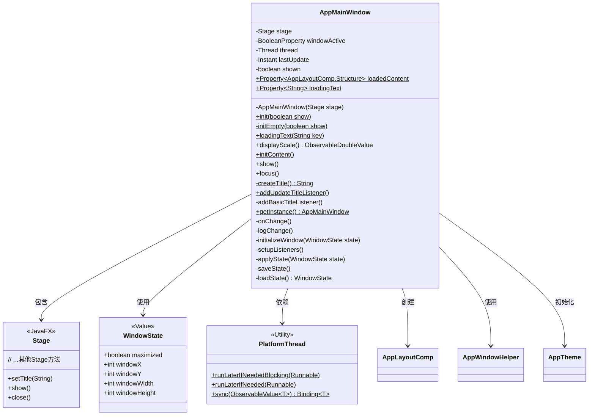

# 基础信息

|      |      |
|------|------|
| 名称 | AppMainWindow |
| 编码语言 | .java |
| 代码路径 | xpipe/app/src/main/java/io/xpipe/app/core/window/AppMainWindow.java |
| 包名 | io.xpipe.app.core.window |
| 依赖项 | ['io.xpipe.app.comp.base.AppLayoutComp', 'io.xpipe.app.comp.base.AppMainWindowContentComp', 'io.xpipe.app.core', 'io.xpipe.app.core.mode.OperationMode', 'io.xpipe.app.issue.ErrorEvent', 'io.xpipe.app.issue.TrackEvent', 'io.xpipe.app.prefs.AppPrefs', 'io.xpipe.app.prefs.CloseBehaviourDialog', 'io.xpipe.app.resources.AppImages', 'io.xpipe.app.util.LicenseProvider', 'io.xpipe.app.util.PlatformThread', 'io.xpipe.app.util.ThreadHelper', 'io.xpipe.core.process.OsType', 'javafx.beans.binding.Bindings', 'javafx.beans.property', 'javafx.beans.value.ObservableDoubleValue', 'javafx.geometry.Rectangle2D', 'javafx.scene.Scene', 'javafx.scene.input.KeyCode', 'javafx.scene.input.KeyCodeCombination', 'javafx.scene.input.KeyCombination', 'javafx.scene.input.KeyEvent', 'javafx.scene.paint.Color', 'javafx.stage.Screen', 'javafx.stage.Stage', 'lombok.Builder', 'lombok.Getter', 'lombok.Value', 'lombok.extern.jackson.Jacksonized', 'java.io.IOException', 'java.nio.file.Path', 'java.time.Duration', 'java.time.Instant', 'java.time.temporal.ChronoUnit', 'javax.imageio.ImageIO'] |
| 概述说明 | 主窗口类，管理界面状态、标题、尺寸及事件监听。 |

# 说明

该代码定义了一个JavaFX应用程序主窗口类AppMainWindow，采用单例模式管理窗口实例。主要功能包括：初始化窗口并设置最小尺寸、透明场景、标题监听、主题处理；支持窗口状态保存与恢复；实现窗口大小位置变化的延迟跟踪记录；处理窗口关闭事件及快捷键操作；提供多平台兼容性支持（Windows/macOS/Linux）；包含国际化标题生成、加载状态提示等功能。窗口还集成了调试日志、截图功能，并管理内容加载与布局。

# 类列表 Class Summary

| 名称   | 类型  | 说明 |
|-------|------|-------------|
| AppMainWindow | class | JavaFX主窗口类，管理窗口状态、标题、内容加载及事件监听。 |

## 类 AppMainWindow

|      |      |
|------|------|
| 访问范围 | public |
| 类型 | class |
| 名称 | AppMainWindow |
| 说明 | JavaFX主窗口类，管理窗口状态、标题、内容加载及事件监听。 |

### UML类图

类图描述：
AppMainWindow是一个JavaFX应用程序的主窗口类，采用单例模式设计，负责管理窗口状态、布局和生命周期。它包含Stage实例作为底层窗口对象，维护窗口位置、尺寸等状态信息（通过WindowState类），并与多个工具类（如PlatformThread、AppWindowHelper）协作实现线程安全操作、窗口样式设置等功能。该类实现了窗口标题更新、内容加载、状态持久化等核心功能，并通过监听器响应窗口事件，同时支持跨平台特性处理。

### 内部方法调用关系图

```mermaid
graph TD
    A["类AppMainWindow"]
    B["静态属性: INSTANCE"]
    C["属性: Stage stage"]
    D["属性: BooleanProperty windowActive"]
    E["属性: Thread thread"]
    F["属性: Instant lastUpdate"]
    G["静态属性: Property<Structure> loadedContent"]
    H["静态属性: Property<String> loadingText"]
    I["属性: boolean shown"]
    
    J["构造方法: AppMainWindow(Stage stage)"]
    K["静态方法: init(boolean show)"]
    L["私有静态方法: initEmpty(boolean show)"]
    M["方法: ObservableDoubleValue displayScale()"]
    N["静态方法: initContent()"]
    O["方法: show()"]
    P["方法: focus()"]
    Q["私有静态方法: createTitle()"]
    R["静态方法: addUpdateTitleListener()"]
    S["私有方法: addBasicTitleListener()"]
    T["静态方法: getInstance()"]
    U["私有方法: onChange()"]
    V["私有方法: logChange()"]
    W["私有方法: initializeWindow(WindowState state)"]
    X["私有方法: setupListeners()"]
    Y["私有方法: applyState(WindowState state)"]
    Z["私有方法: saveState()"]
    AA["私有方法: loadState()"]
    AB["内部类: WindowState"]

    A --> B
    A --> C
    A --> D
    A --> E
    A --> F
    A --> G
    A --> H
    A --> I
    A --> J
    A --> K
    K --> L
    A --> M
    A --> N
    A --> O
    A --> P
    A --> Q
    A --> R
    A --> S
    A --> T
    A --> U
    U --> V
    A --> W
    A --> X
    A --> Y
    A --> Z
    Z --> AA
    A --> AB
```

这段代码实现了一个JavaFX应用主窗口类AppMainWindow，采用单例模式管理窗口实例。主要功能包括：初始化窗口UI组件、管理窗口状态持久化、处理窗口事件监听、实现多平台兼容性适配等。通过静态方法init()和initContent()分别初始化窗口框架和内容，使用WindowState内部类保存窗口位置和尺寸状态，并提供了丰富的监听器来处理窗口移动、缩放、最大化等操作。代码还包含平台特定的处理逻辑，如Windows系统的原生窗口控制、macOS的透明度调整等，同时集成了多语言支持、主题管理和事件跟踪功能。

### 字段列表 Field List

| 名称  | 类型  | 说明 |
|-------|-------|------|
| thread | Thread | 私有线程变量 |
| shown = false | boolean | 私有布尔变量shown初始值为false。 |
| stage | Stage | 私有终态舞台变量，带Getter方法。 |
| windowActive = new SimpleBooleanProperty(false) | BooleanProperty | 私有布尔属性windowActive初始化为false。 |
| loadedContent = new SimpleObjectProperty<>() | Property<AppLayoutComp.Structure> | 私有静态属性loadedContent，类型为Property<AppLayoutComp.Structure>，初始化为SimpleObjectProperty。 |
| loadingText = new SimpleObjectProperty<>() | Property<String> | 私有静态字符串属性loadingText，使用SimpleObjectProperty封装。 |
| INSTANCE | AppMainWindow | 单例模式下的静态实例变量。 |
| lastUpdate | Instant | 私有易变时间戳变量 |

### 方法列表 Method List

| 名称  | 类型  | 说明 |
|-------|-------|------|
| initContent | void | 静态同步方法初始化窗口内容，创建布局组件并处理异常。 |
| displayScale | ObservableDoubleValue | 方法返回显示比例值，无舞台时默认1.0，否则返回舞台的X输出比例属性。 |
| getInstance | AppMainWindow | 获取AppMainWindow单例实例 |
| focus | void | Java方法：取消窗口最小化并请求焦点。 |
| initEmpty | void | 初始化应用窗口，设置尺寸、样式、透明度，加载状态并显示。 |
| show | void | 显示窗口并注册Windows系统关闭钩子。 |
| addUpdateTitleListener | void | 静态同步方法，检查实例和分发类型后，订阅更新并异步更新标题。 |
| addBasicTitleListener | void | 监听许可证标题和语言变化，动态更新窗口标题。 |
| createTitle | String | 生成XPipe标题，含版本号、许可标题，测试版加前缀，未知分发类型时检查更新状态。 |
| onChange | void | 私有同步方法onChange：更新lastUpdate时间戳，若无线程则启动新线程延迟1秒后执行logChange并清空线程引用。 |
| loadingText | void | 静态方法设置加载文本，根据键值获取国际化内容或显示"..."。 |
| init | void | 静态方法init检查实例状态，若无需显示则直接返回，否则调用initEmpty。 |
| logChange | void | 记录窗口位置、尺寸和最大化状态变更。 |
| initializeWindow | void | 初始化窗口并记录位置尺寸状态。 |
| setupListeners | void | 监听窗口位置、大小、最大化变化并触发回调，关闭时保存状态，处理快捷键和截图功能。 |
| applyState | void | 应用窗口状态：根据状态设置窗口大小和位置，无状态时按默认或展示模式设置。 |
| saveState | void | 保存窗口状态：检查设置后记录最大化、位置和尺寸到缓存。 |
| loadState | WindowState | 加载窗口状态，检查边界有效性后返回。 |

