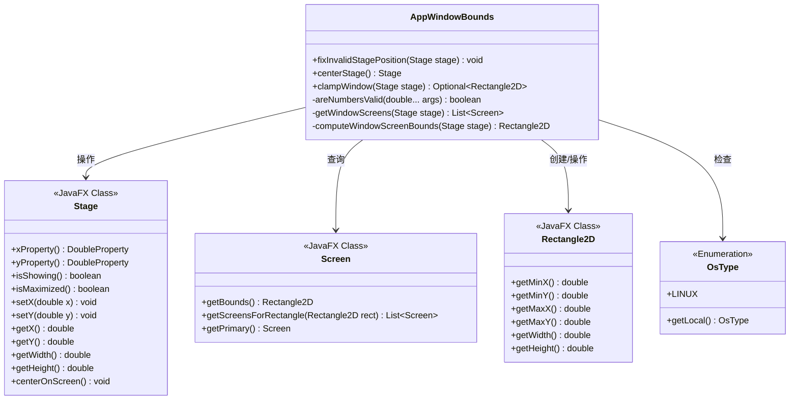
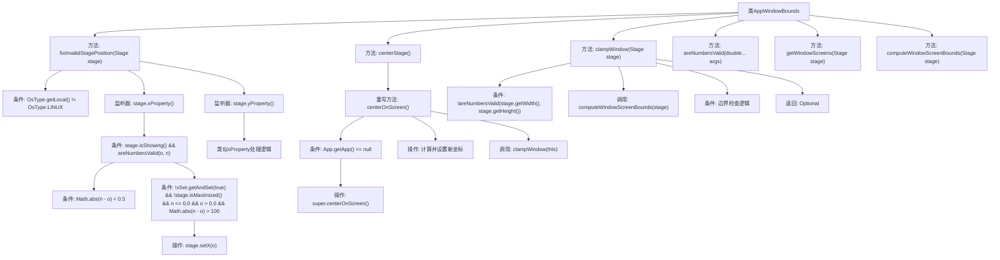

# 基础信息

|      |      |
|------|------|
| 名称 | AppWindowBounds |
| 编码语言 | .java |
| 代码路径 | xpipe/app/src/main/java/io/xpipe/app/core/window/AppWindowBounds.java |
| 包名 | io.xpipe.app.core.window |
| 依赖项 | ['io.xpipe.app.core.App', 'io.xpipe.core.process.OsType', 'javafx.geometry.Rectangle2D', 'javafx.stage.Screen', 'javafx.stage.Stage', 'java.util.Arrays', 'java.util.List', 'java.util.Optional', 'java.util.concurrent.atomic.AtomicBoolean'] |
| 概述说明 | Java类AppWindowBounds：修复无效窗口位置，居中窗口，确保窗口在屏幕内。 |

# 说明

该代码定义了一个AppWindowBounds类，主要用于处理JavaFX窗口位置和大小的调整。主要功能包括：修复Linux系统下无效的窗口位置，通过监听x和y属性变化来防止窗口移动到屏幕外；提供centerStage方法使新窗口居中显示在父窗口或屏幕上；clampWindow方法确保窗口完全显示在屏幕可视区域内；通过computeWindowScreenBounds计算窗口所在屏幕的边界范围，并考虑任务栏高度进行调整。所有方法都包含数值有效性检查，确保处理的是有效的坐标和尺寸。

# 类列表 Class Summary

| 名称   | 类型  | 说明 |
|-------|------|-------------|
| AppWindowBounds | class | Java类AppWindowBounds提供窗口位置修正、居中及边界限制功能，仅限Linux系统。 |

## 类 AppWindowBounds

|      |      |
|------|------|
| 访问范围 | public |
| 类型 | class |
| 名称 | AppWindowBounds |
| 说明 | Java类AppWindowBounds提供窗口位置修正、居中及边界限制功能，仅限Linux系统。 |

### UML类图

这段代码展示了一个JavaFX窗口边界处理工具类AppWindowBounds，主要用于处理窗口位置和尺寸的异常情况。该类包含四个主要方法：fixInvalidStagePosition()用于修复Linux系统下窗口位置异常，centerStage()创建居中窗口，clampWindow()确保窗口在屏幕可视范围内，以及多个辅助方法。通过监听窗口坐标变化、计算屏幕边界和验证数值有效性，该类实现了跨平台的窗口位置管理功能，特别针对Linux系统做了特殊处理。

### 内部方法调用关系图

这段代码主要处理JavaFX窗口位置和大小的调整逻辑。流程图展示了AppWindowBounds类的核心方法调用关系，包括fixInvalidStagePosition方法对Linux系统窗口位置的修正逻辑，centerStage方法实现窗口居中功能，以及clampWindow方法确保窗口不超出屏幕边界。辅助方法areNumbersValid用于数值验证，getWindowScreens和computeWindowScreenBounds处理多显示器环境下的屏幕边界计算。整体流程体现了对窗口位置、大小和跨平台兼容性的精细控制。

### 字段列表 Field List

| 名称  | 类型  | 说明 |
|-------|-------|------|

### 方法列表 Method List

| 名称  | 类型  | 说明 |
|-------|-------|------|
| getWindowScreens | List<Screen> | 获取窗口所在屏幕列表，无效时检查所有者或返回主屏，有效时返回对应矩形区域的屏幕列表。 |
| centerStage | Stage | 静态方法创建居中舞台，若应用存在则相对主窗口居中，否则屏幕居中，并确保窗口不超出屏幕。 |
| areNumbersValid | boolean | 检查所有双精度数是否有效（非无限）。 |
| clampWindow | Optional<Rectangle2D> | 检查并调整窗口位置大小，确保在屏幕范围内。 |
| fixInvalidStagePosition | void | 修复Linux下Stage窗口位置异常的静态方法。 |
| computeWindowScreenBounds | Rectangle2D | 计算窗口屏幕边界，调整任务栏高度，处理异常返回默认值。 |

