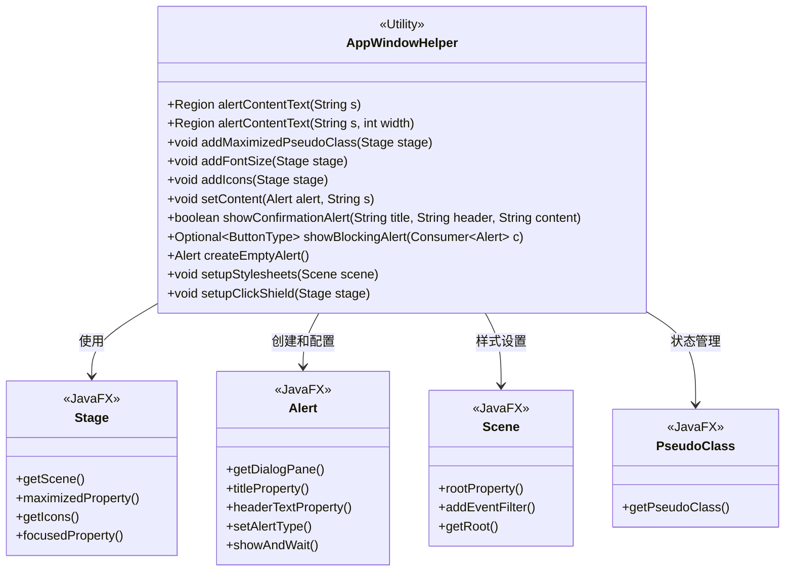
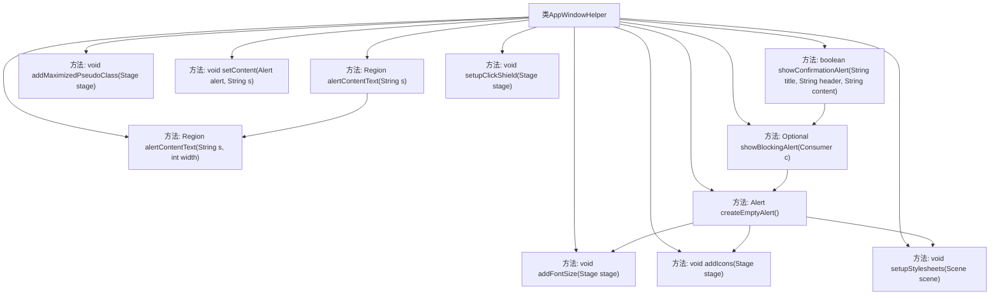

# 基础信息

|      |      |
|------|------|
| 名称 | AppWindowHelper |
| 编码语言 | .java |
| 代码路径 | xpipe/app/src/main/java/io/xpipe/app/core/window/AppWindowHelper.java |
| 包名 | io.xpipe.app.core.window |
| 依赖项 | ['io.xpipe.app.core', 'io.xpipe.app.issue.TrackEvent', 'io.xpipe.app.resources.AppImages', 'io.xpipe.app.resources.AppResources', 'io.xpipe.app.util.InputHelper', 'io.xpipe.app.util.PlatformInit', 'io.xpipe.core.process.OsType', 'javafx.application.Platform', 'javafx.beans.property.SimpleBooleanProperty', 'javafx.beans.property.SimpleObjectProperty', 'javafx.css.PseudoClass', 'javafx.geometry.Insets', 'javafx.scene.Scene', 'javafx.scene.control.Alert', 'javafx.scene.control.ButtonType', 'javafx.scene.input', 'javafx.scene.layout.Region', 'javafx.scene.layout.StackPane', 'javafx.scene.paint.Color', 'javafx.scene.text.Text', 'javafx.stage.Stage', 'lombok.SneakyThrows', 'java.time.Duration', 'java.time.Instant', 'java.util.Optional', 'java.util.concurrent.CountDownLatch', 'java.util.concurrent.atomic.AtomicReference', 'java.util.function.Consumer', 'java.util.function.Supplier'] |
| 概述说明 | JavaFX工具类，提供弹窗、图标、样式等UI辅助功能。 |

# 说明

AppWindowHelper是一个JavaFX工具类，提供窗口和对话框相关功能。主要功能包括：创建带文本换行的警告对话框内容区域；为窗口添加最大化伪类状态；设置窗口字体大小；加载不同操作系统适配的窗口图标；配置对话框内容并固定尺寸；显示阻塞式确认对话框，支持多线程安全调用；创建透明背景的空白对话框；管理样式表动态加载；处理键盘导航和辅助功能状态；针对macOS系统实现点击屏蔽逻辑以防止误操作。该类还包含窗口位置修正、快捷键处理等功能，并与应用国际化、样式管理等模块集成。

# 类列表 Class Summary

| 名称   | 类型  | 说明 |
|-------|------|-------------|
| AppWindowHelper | class | JavaFX工具类，提供弹窗、图标、样式等UI辅助功能。 |

## 类 AppWindowHelper

|      |      |
|------|------|
| 访问范围 | public |
| 类型 | class |
| 名称 | AppWindowHelper |
| 说明 | JavaFX工具类，提供弹窗、图标、样式等UI辅助功能。 |

### UML类图

类图描述：AppWindowHelper是一个工具类，提供多种静态方法来处理JavaFX窗口和对话框的UI相关操作，包括内容区域设置、最大化状态管理、字体大小调整、图标添加、样式表配置和点击屏蔽等功能。该类与JavaFX核心组件如Stage、Alert、Scene和PseudoClass有紧密交互，通过属性绑定和事件监听实现动态UI效果。特别包含了对跨平台特性的处理，如不同操作系统的图标尺寸适配。

### 内部方法调用关系图

这段代码定义了一个名为AppWindowHelper的工具类，主要用于处理JavaFX应用程序窗口相关的辅助功能。类中包含多个静态方法，功能包括创建带文本内容的区域、添加最大化伪类状态、设置字体大小、添加图标、设置对话框内容、显示确认对话框、创建空白对话框、设置样式表以及设置点击屏蔽等。这些方法相互之间存在调用关系，例如showConfirmationAlert会调用showBlockingAlert，而后者又会调用createEmptyAlert等。整体设计采用分层调用结构，实现了窗口管理的各种常见需求。

### 字段列表 Field List

| 名称  | 类型  | 说明 |
|-------|-------|------|

### 方法列表 Method List

| 名称  | 类型  | 说明 |
|-------|-------|------|
| alertContentText | Region | 静态方法alertContentText接收字符串参数，返回Region对象，默认宽度450。 |
| setContent | void | 静态方法设置弹窗内容，固定宽度505并填充文本。 |
| showConfirmationAlert | boolean | 静态方法显示确认弹窗，绑定标题、头部和内容，返回用户是否点击默认按钮。 |
| showBlockingAlert | Optional<ButtonType> | 创建阻塞式弹窗，支持自定义位置、大小和快捷键关闭。 |
| createEmptyAlert | Alert | 创建透明无类型弹窗，设置所有者、图标和样式表。 |
| alertContentText | Region | 静态方法创建文本区域，设置宽度和内边距。 |
| addFontSize | void | 静态方法addFontSize监听Stage场景根节点变化并应用基础字体大小。 |
| addMaximizedPseudoClass | void | 为Stage添加最大化伪类监听，动态更新根节点状态。 |
| addIcons | void | 静态方法`addIcons`根据操作系统类型加载不同尺寸的图标到Stage。 |
| setupStylesheets | void | 为场景设置样式表，开发者模式下按F3重载样式表，并处理导航输入状态。 |
| setupClickShield | void | 为MacOS窗口设置点击屏蔽，防止聚焦后误触。 |

