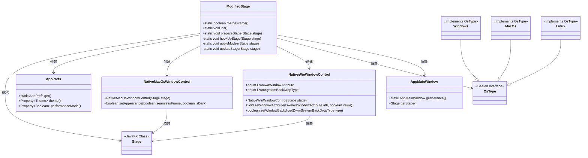
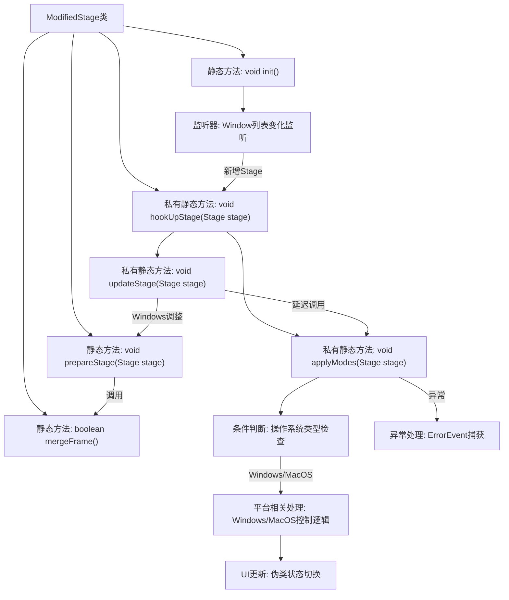
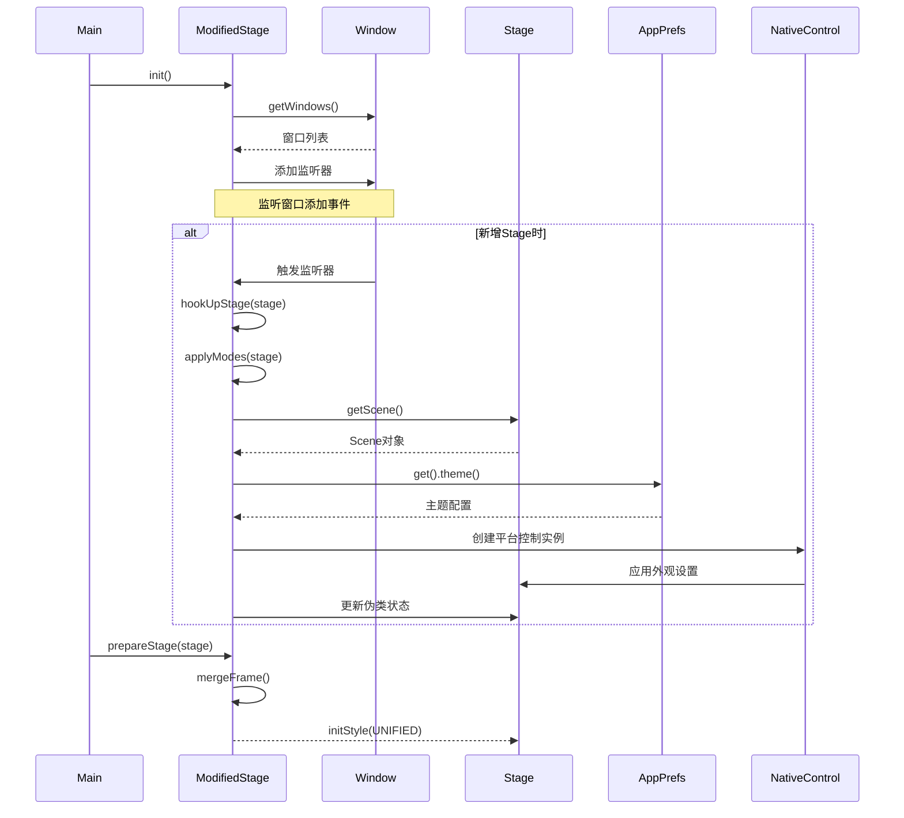

# 基础信息

|      |      |
|------|------|
| 名称 | ModifiedStage |
| 编码语言 | .java |
| 代码路径 | xpipe/app/src/main/java/io/xpipe/app/core/window/ModifiedStage.java |
| 包名 | io.xpipe.app.core.window |
| 依赖项 | ['io.xpipe.app.issue.ErrorEvent', 'io.xpipe.app.prefs.AppPrefs', 'io.xpipe.app.util.PlatformThread', 'io.xpipe.core.process.OsType', 'javafx.animation.PauseTransition', 'javafx.application.Platform', 'javafx.collections.ListChangeListener', 'javafx.collections.ObservableList', 'javafx.css.PseudoClass', 'javafx.stage.Stage', 'javafx.stage.StageStyle', 'javafx.stage.Window', 'javafx.util.Duration', 'lombok.SneakyThrows', 'org.apache.commons.lang3.SystemUtils', 'java.awt'] |
| 概述说明 | ModifiedStage类处理窗口样式和主题更新，支持Windows和MacOS的无缝框架合并。 |

# 说明

ModifiedStage类扩展了Stage类，提供跨平台窗口样式管理功能。mergeFrame方法检测系统是否为Win10/Win11/Mac。init方法监听窗口添加事件并调用hookUpStage。prepareStage根据mergeFrame结果设置窗口样式。hookUpStage绑定主题和性能模式监听器，触发applyModes更新窗口样式。applyModes方法处理不同操作系统下的窗口外观：MacOS使用NativeMacOsWindowControl设置无缝框架和主题，Windows使用NativeWinWindowControl设置深色模式和MICA_ALT背景。updateStage方法延迟300毫秒后刷新窗口样式，Windows平台通过微调窗口尺寸强制重绘。所有操作均考虑性能模式和主题偏好设置。

# 类列表 Class Summary

| 名称   | 类型  | 说明 |
|-------|------|-------------|
| ModifiedStage | class | ModifiedStage类处理窗口样式和主题，支持Windows和MacOS的无缝框架合并，监听主题和性能模式变化，动态更新窗口外观。 |

## 类 ModifiedStage

|      |      |
|------|------|
| 访问范围 | public |
| 类型 | class |
| 名称 | ModifiedStage |
| 说明 | ModifiedStage类处理窗口样式和主题，支持Windows和MacOS的无缝框架合并，监听主题和性能模式变化，动态更新窗口外观。 |

### UML类图

这段代码定义了一个ModifiedStage类，继承自JavaFX的Stage类，主要用于处理窗口样式和主题相关的功能。它提供了静态方法来初始化窗口监听、准备舞台样式、挂钩舞台事件，并根据操作系统类型应用不同的窗口模式。类中使用了AppPrefs来获取用户偏好设置，根据不同的操作系统(Windows/MacOS/Linux)创建对应的原生窗口控制器，并处理主题切换和性能模式变化时的界面更新。代码通过伪类状态改变来实现无缝边框效果，并在Windows系统下通过调整窗口大小来触发重绘。

### 内部方法调用关系图

流程图描述：该流程图展示了ModifiedStage类的核心方法调用关系，主要包含窗口初始化、阶段准备和模式应用三个主要流程。init()方法建立窗口监听，prepareStage()设置初始样式，hookUpStage()通过applyModes()实现平台特定的窗口外观控制。处理过程包含操作系统检测、主题应用、异常捕获等关键步骤，最终通过伪类状态更新UI表现。时序图则具体呈现了从初始化到窗口添加事件处理的完整调用链，特别是平台相关控制器的动态创建过程。

### 字段列表 Field List

| 名称  | 类型  | 说明 |
|-------|-------|------|

### 方法列表 Method List

| 名称  | 类型  | 说明 |
|-------|-------|------|
| prepareStage | void | 静态方法prepareStage设置舞台样式，若mergeFrame为真则使用UNIFIED风格。 |
| hookUpStage | void | 私有方法hookUpStage为Stage绑定主题和性能模式监听器，并在场景根节点变化时更新模式。 |
| applyModes | void | 根据场景和系统类型设置窗口样式和主题。 |
| mergeFrame | boolean | 检查系统是否为Win10、Win11或Mac。 |
| init | void | 静态方法初始化窗口监听，添加新窗口时挂钩处理。 |
| updateStage | void | 更新舞台显示状态，若未显示则返回。延迟300毫秒后应用模式，Windows下微调宽度以刷新界面。 |

