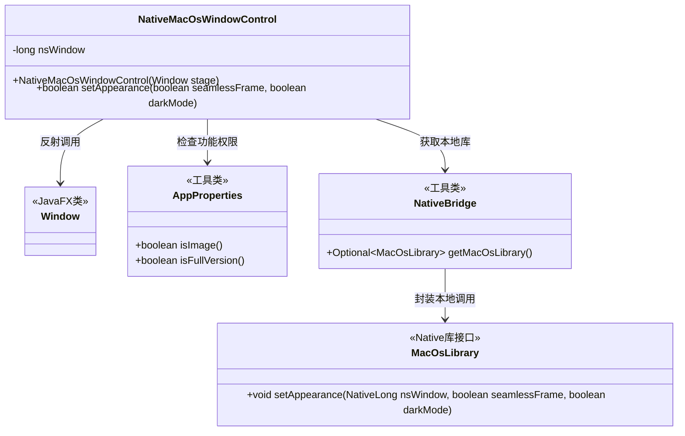
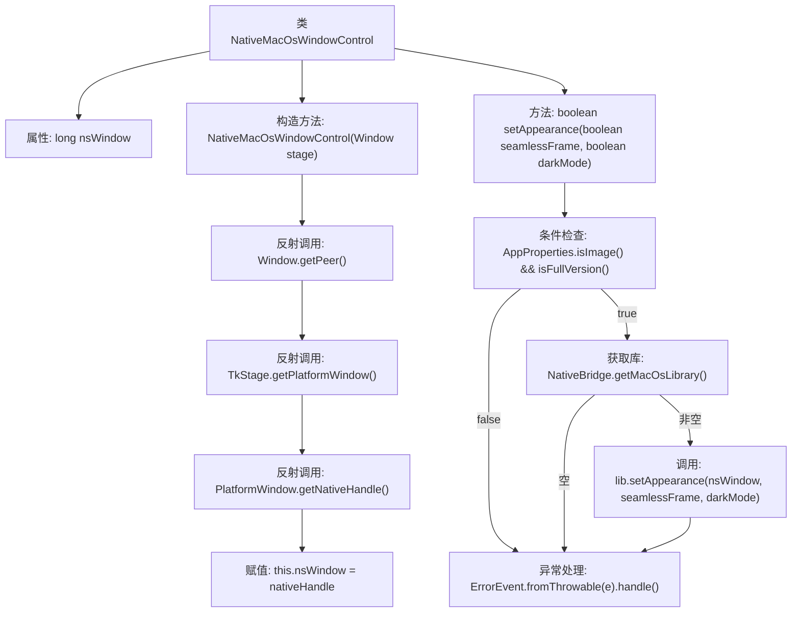

# 基础信息

|      |      |
|------|------|
| 名称 | NativeMacOsWindowControl |
| 编码语言 | .java |
| 代码路径 | xpipe/app/src/main/java/io/xpipe/app/core/window/NativeMacOsWindowControl.java |
| 包名 | io.xpipe.app.core.window |
| 依赖项 | ['io.xpipe.app.core.AppProperties', 'io.xpipe.app.issue.ErrorEvent', 'io.xpipe.app.util.NativeBridge', 'javafx.stage.Window', 'com.sun.jna.NativeLong', 'lombok.Getter', 'lombok.SneakyThrows', 'java.lang.reflect.Method'] |
| 概述说明 | 获取MacOS窗口句柄并控制外观的类，支持无缝框架和暗黑模式切换。 |

# 说明

这是一个用于控制MacOS窗口外观的Java类。类名为NativeMacOsWindowControl，通过反射获取窗口底层句柄nsWindow。构造函数接收JavaFX的Window对象，通过多层反射调用最终获取原生窗口句柄。setAppearance方法用于设置窗口外观，支持无缝边框和暗黑模式，但需要满足应用属性检查并通过NativeBridge加载原生库。操作失败会返回false，异常会被ErrorEvent处理。该类使用了Lombok的@Getter和@SneakyThrows注解。

# 类列表 Class Summary

| 名称   | 类型  | 说明 |
|-------|------|-------------|
| NativeMacOsWindowControl | class | 获取MacOS窗口句柄并控制外观的类，支持无缝框架和暗黑模式。 |

## 类 NativeMacOsWindowControl

|      |      |
|------|------|
| 访问范围 | @Getter;public |
| 类型 | class |
| 名称 | NativeMacOsWindowControl |
| 说明 | 获取MacOS窗口句柄并控制外观的类，支持无缝框架和暗黑模式。 |

### UML类图

这段代码展示了一个通过Java反射机制获取MacOS原生窗口句柄，并通过JNI调用修改窗口外观的控制器类。核心流程包括：1) 通过多级反射获取底层nsWindow句柄；2) 检查应用权限和本地库可用性；3) 调用Native方法设置窗口外观。类图清晰地反映了该模块与JavaFX窗口系统、应用配置中心及本地库的交互关系，体现了跨平台GUI控制的关键技术路径。

### 内部方法调用关系图

这段代码描述了一个用于控制MacOS窗口外观的类，通过反射获取底层窗口句柄，并调用本地库修改窗口样式。流程图展示了从构造方法中通过三级反射调用获取nsWindow，到setAppearance方法中先验证许可证再调用本地库的完整流程，包含异常处理路径。核心是通过JNI桥接实现跨平台窗口控制，涉及反射、本地方法调用和错误处理机制。

### 字段列表 Field List

| 名称  | 类型  | 说明 |
|-------|-------|------|
| nsWindow | long | 私有长整型变量nsWindow |

### 方法列表 Method List

| 名称  | 类型  | 说明 |
|-------|-------|------|
| setAppearance | boolean | 方法设置外观，需满足图像和完整版条件，调用原生库实现，失败返回false。 |

