# 基础信息

|      |      |
|------|------|
| 名称 | NativeWinWindowControl |
| 编码语言 | .java |
| 代码路径 | xpipe/app/src/main/java/io/xpipe/app/core/window/NativeWinWindowControl.java |
| 包名 | io.xpipe.app.core.window |
| 依赖项 | ['io.xpipe.app.util.Rect', 'javafx.stage.Window', 'com.sun.jna.Library', 'com.sun.jna.Native', 'com.sun.jna.Pointer', 'com.sun.jna.PointerType', 'com.sun.jna.platform.win32.User32', 'com.sun.jna.platform.win32.WinDef', 'com.sun.jna.platform.win32.WinNT', 'com.sun.jna.ptr.IntByReference', 'lombok.EqualsAndHashCode', 'lombok.Getter', 'lombok.SneakyThrows', 'java.lang.reflect.Method', 'java.util.ArrayList', 'java.util.List'] |
| 概述说明 | Java类NativeWinWindowControl提供Windows窗口控制功能，包括边框移除、置顶、移动等操作。 |

# 说明

该Java类提供Windows原生窗口控制功能，包含窗口句柄获取、边框移除、窗口排序、最小化/最大化、位置调整、属性设置等操作。主要方法包括通过窗口对象获取句柄、根据进程ID查找窗口、设置窗口置顶/默认顺序、调整窗口边框样式、管理窗口可见性及状态。同时支持DWM特性如暗色模式、Mica/Acrylic材质背景设置。通过JNA调用User32和Dwmapi库实现底层API交互，封装了常见的窗口管理需求。

# 类列表 Class Summary

| 名称   | 类型  | 说明 |
|-------|------|-------------|
| NativeWinWindowControl | class | Java类NativeWinWindowControl封装Windows窗口操作，提供边框控制、窗口排序、属性设置等功能。 |


## 类 NativeWinWindowControl

|      |      |
|------|------|
| 访问范围 | @Getter;@EqualsAndHashCode;public |
| 类型 | class |
| 名称 | NativeWinWindowControl |
| 说明 | Java类NativeWinWindowControl封装Windows窗口操作，提供边框控制、窗口排序、属性设置等功能。 |


### UML类图

```mermaid
classDiagram
    class NativeWinWindowControl {
        +WinDef.HWND windowHandle
        +static NativeWinWindowControl MAIN_WINDOW
        +NativeWinWindowControl(Window stage)
        +NativeWinWindowControl(WinDef.HWND windowHandle)
        +static WinDef.HWND byWindow(Window window)
        +static List~NativeWinWindowControl~ byPid(long pid)
        +void removeBorders()
        +boolean isIconified()
        +boolean isVisible()
        +void alwaysInFront()
        +void defaultOrder()
        +void orderRelative(WinDef.HWND predecessor)
        +void show()
        +void close()
        +void minimize()
        +void move(Rect bounds)
        +Rect getBounds()
        +boolean setWindowAttribute(int attribute, boolean attributeValue)
        +void activate()
        +boolean setWindowBackdrop(DwmSystemBackDropType backdrop)
    }

    <<interface>> NativeWinWindowControl.Dwm {
        +static Dwm INSTANCE
        +WinNT.HRESULT DwmSetWindowAttribute(WinDef.HWND hwnd, int dwAttribute, PointerType pvAttribute, int cbAttribute)
    }

    class NativeWinWindowControl.DmwaWindowAttribute {
        <<enumeration>>
        +DWMWA_USE_IMMERSIVE_DARK_MODE(20)
        +DWMWA_SYSTEMBACKDROP_TYPE(38)
        -int value
        +int get()
    }

    class NativeWinWindowControl.DwmSystemBackDropType {
        <<enumeration>>
        +NONE(1)
        +MICA(2)
        +ACRYLIC(3)
        +MICA_ALT(4)
        -int value
        +int get()
    }

    NativeWinWindowControl --> NativeWinWindowControl.Dwm : 使用
    NativeWinWindowControl --> NativeWinWindowControl.DmwaWindowAttribute : 使用
    NativeWinWindowControl --> NativeWinWindowControl.DwmSystemBackDropType : 使用
```

这段代码定义了一个`NativeWinWindowControl`类，用于操作Windows原生窗口。它通过JNA调用Windows API实现窗口控制功能，包括窗口边框处理、窗口排序、显示状态管理、位置调整和视觉特效设置。类中包含两个枚举类型(DmwaWindowAttribute和DwmSystemBackDropType)用于定义窗口属性，以及一个Dwm接口用于调用DWM API。该类提供了丰富的窗口操作方法，如移除边框、最小化/恢复窗口、设置窗口位置和大小、激活窗口以及设置窗口背景特效等。


### 内部方法调用关系图

```mermaid
graph TD
    A["类NativeWinWindowControl"]
    B["静态方法: byWindow(Window window)"]
    C["静态方法: byPid(long pid)"]
    D["静态字段: MAIN_WINDOW"]
    E["构造方法: NativeWinWindowControl(Window stage)"]
    F["构造方法: NativeWinWindowControl(WinDef.HWND windowHandle)"]
    G["方法: removeBorders()"]
    H["方法: isIconified()"]
    I["方法: isVisible()"]
    J["方法: alwaysInFront()"]
    K["方法: defaultOrder()"]
    L["方法: orderRelative(WinDef.HWND predecessor)"]
    M["方法: show()"]
    N["方法: close()"]
    O["方法: minimize()"]
    P["方法: move(Rect bounds)"]
    Q["方法: getBounds()"]
    R["方法: setWindowAttribute(int attribute, bool attributeValue)"]
    S["方法: activate()"]
    T["方法: setWindowBackdrop(DwmSystemBackDropType backdrop)"]
    U["接口: Dwm"]
    V["枚举: DmwaWindowAttribute"]
    W["枚举: DwmSystemBackDropType"]

    A --> B
    A --> C
    A --> D
    A --> E
    A --> F
    A --> G
    A --> H
    A --> I
    A --> J
    A --> K
    A --> L
    A --> M
    A --> N
    A --> O
    A --> P
    A --> Q
    A --> R
    A --> S
    A --> T
    A --> U
    A --> V
    A --> W
```



该流程图展示了NativeWinWindowControl类的完整结构，包括两个核心静态方法(byWindow/byPid)、13个实例方法(从边框处理到窗口排序)、3个构造方法以及嵌套的Dwm接口和两个枚举类型。类主要通过JNA调用Windows API实现窗口控制功能，涉及窗口句柄获取、样式修改、Z序调整等操作，流程图清晰呈现了方法间的平行关系，特别突出了对User32和DwmAPI两个系统库的调用层级。

### 字段列表 Field List

| 名称  | 类型  | 说明 |
|-------|-------|------|
| MAIN_WINDOW | NativeWinWindowControl | 静态主窗口控件变量 |
| windowHandle | WinDef.HWND | 私有常量窗口句柄HWND类型。 |

### 方法列表 Method List

| 名称  | 类型  | 说明 |
|-------|-------|------|
| minimize | void | 最小化窗口函数，调用User32接口实现。 |
| removeBorders | void | 移除窗口边框和标题栏的代码片段。 |
| orderRelative | void | 调用User32设置窗口相对位置，不激活、不移动、不调整大小。 |
| byPid | List<NativeWinWindowControl> | 通过进程ID获取可见窗口列表，返回NativeWinWindowControl集合。 |
| defaultOrder | void | 方法defaultOrder调用orderRelative，参数为HWND指针-2和0。 |
| show | void | 显示窗口方法：调用User32恢复指定窗口句柄。 |
| isIconified | boolean | 检查窗口是否最小化。 |
| alwaysInFront | void | 方法alwaysInFront设置窗口置顶。 |
| close | void | 关闭窗口：发送WM_CLOSE消息到指定句柄。 |
| isVisible | boolean | 检查窗口是否可见的方法。 |
| move | void | 移动窗口到指定位置和大小，不激活窗口。 |
| byWindow | WinDef.HWND | 通过反射获取JavaFX窗口的Windows原生句柄。 |
| getBounds | Rect | 获取窗口边界坐标和尺寸。 |
| setWindowAttribute | boolean | 设置窗口属性方法，调用Dwm接口，返回操作结果。 |
| activate | void | 激活窗口：调用User32函数将指定窗口置于前台。 |
| setWindowBackdrop | boolean | 设置窗口背景类型，返回操作是否成功。 |


