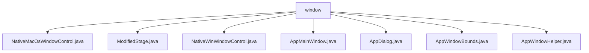

# 基础信息

|      |      |
|------|------|
| 名称 | window |
| 编码语言 | .java |
| 代码路径 | xpipe/app/src/main/java/io/xpipe/app/core/window |
| 包名 | xpipe.app.src.main.java.io.xpipe.app.core.window |
| 概述说明 | 跨平台窗口管理工具集，含Mac/Win原生控制、样式调整、对话框管理、边界处理等功能，支持多主题和国际化。 |

# 说明

## 概述

该代码模块是一个跨平台的JavaFX窗口管理工具集，主要用于提供统一的窗口外观控制、对话框管理和窗口布局调整功能。模块通过封装不同操作系统（Windows、macOS、Linux）的原生API调用，实现了以下核心能力：

1. **原生窗口控制**：通过`NativeMacOsWindowControl`和`NativeWinWindowControl`类分别处理macOS和Windows系统的底层窗口操作，包括外观样式设置、窗口句柄获取、DWM特效管理等
2. **增强型窗口组件**：`ModifiedStage`扩展JavaFX标准Stage，提供跨平台样式管理；`AppMainWindow`实现主窗口单例管理
3. **对话框系统**：`AppDialog`提供模态对话框的线程安全管理和国际化支持
4. **布局辅助工具**：`AppWindowBounds`处理多显示器环境下的窗口定位，`AppWindowHelper`提供各类窗口工具方法

模块采用反射和JNA技术实现原生API调用，集成Lombok简化代码，并全面支持暗黑模式、Mica/Acrylic材质等现代UI特性。

## 主要业务场景

1. **跨平台窗口样式管理**
   - 自动适配Windows 10/11的MICA_ALT背景和macOS无缝边框
   - 实现操作系统原生暗黑模式同步
   - 处理Linux系统下的窗口位置校正

2. **主窗口生命周期控制**
   - 单例模式保证全局唯一主窗口
   - 持久化保存/恢复窗口状态（位置、尺寸）
   - 处理多显示器环境下的窗口约束

3. **对话框系统**
   - 模态对话框的队列管理
   - 线程安全的对话框显示/关闭操作
   - 国际化文本的确认对话框

4. **原生特性集成**
   - Windows平台DWM特效（亚克力/Mica材质）
   - macOS原生窗口句柄操作
   - 全平台窗口置顶/最小化控制

5. **用户体验增强**
   - 窗口动画性能优化
   - 防止窗口移出可视区域
   - 快捷键和辅助功能支持
   - macOS点击屏蔽防误触

### 包内部结构视图

该流程图展示了xpipe项目中窗口控制模块的层级结构，根节点为window目录，包含7个直接子文件：NativeMacOsWindowControl.java、ModifiedStage.java等，这些文件分别实现不同平台窗口控制功能、窗口边界管理及辅助工具类，共同构成完整的窗口管理系统。

# 文件列表 File List

| 名称   | 类型  | 说明 |
|-------|------|-------------|
| [AppMainWindow.java](AppMainWindow.md) | file | 主窗口类，管理界面状态、标题、尺寸及事件监听。 |
| [NativeWinWindowControl.java](NativeWinWindowControl.md) | file | Java类NativeWinWindowControl提供Windows窗口控制功能，包括边框移除、置顶、移动等操作。 |
| [NativeMacOsWindowControl.java](NativeMacOsWindowControl.md) | file | 获取MacOS窗口句柄并控制外观的类，支持无缝框架和暗黑模式切换。 |
| [AppWindowHelper.java](AppWindowHelper.md) | file | JavaFX工具类，提供弹窗、图标、样式等UI辅助功能。 |
| [AppWindowBounds.java](AppWindowBounds.md) | file | Java类AppWindowBounds：修复无效窗口位置，居中窗口，确保窗口在屏幕内。 |
| [AppDialog.java](AppDialog.md) | file | AppDialog类管理模态对话框，提供显示、关闭、确认等功能，支持多线程操作和国际化文本。 |
| [ModifiedStage.java](ModifiedStage.md) | file | ModifiedStage类处理窗口样式和主题更新，支持Windows和MacOS的无缝框架合并。 |

